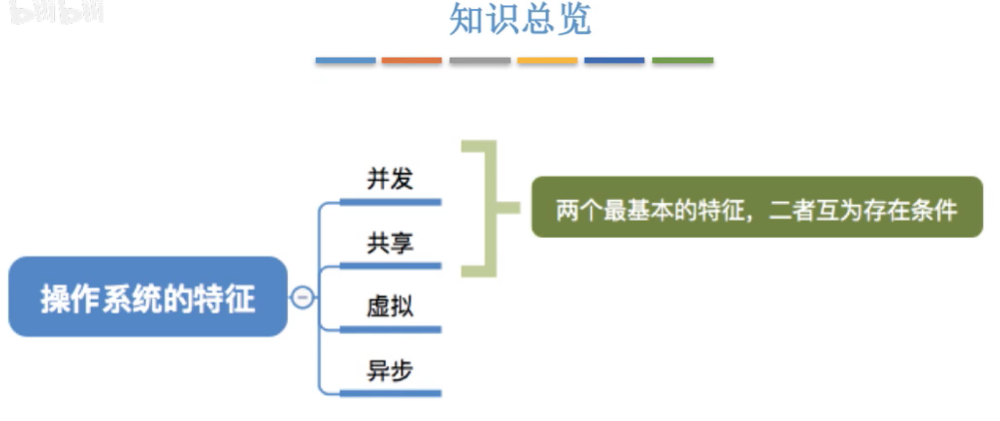
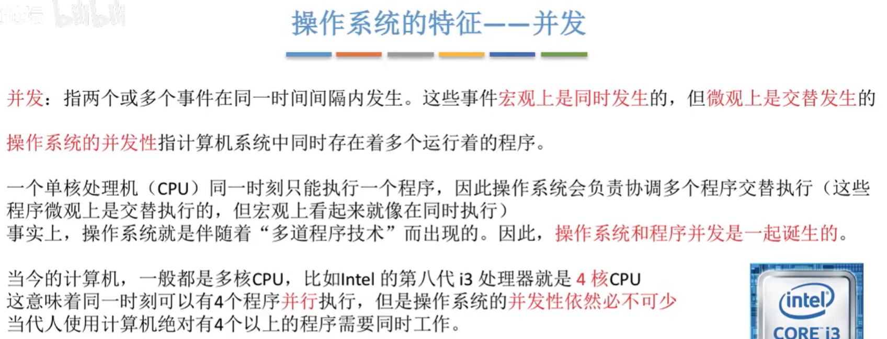
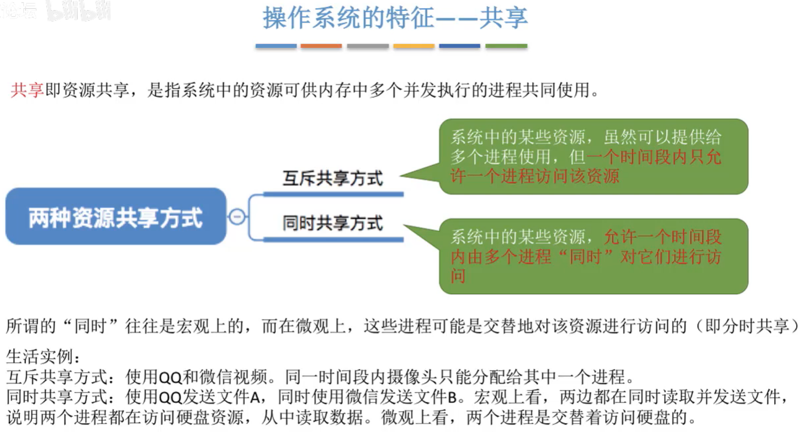
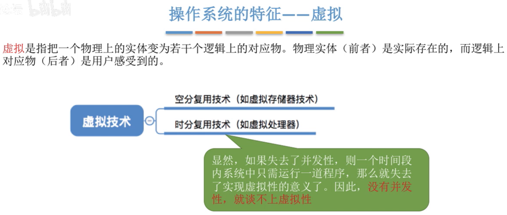
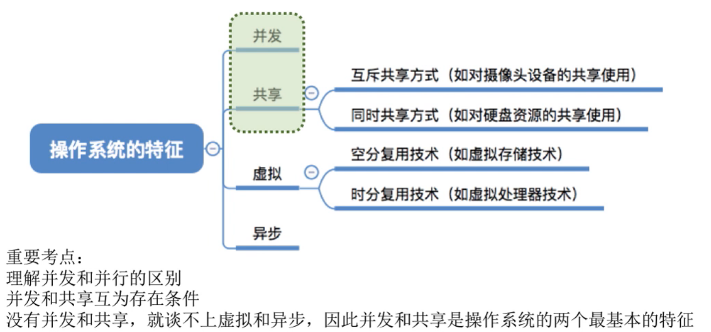

# 操作系统的四个特征

图1.并发、共享、虚拟、异步

## 一. 并发

图2.并发

**并发**，指两个或多个事件在同一时间间隔内发生。
这些时间在宏观上是同时发生的，但在微观上是交替发生的。

**操作系统的并发性**，是指计算机系统中同时存在着多个运行着的程序。

注意区别并发与并行。

并行是指，两个或多个程序同时在执行，在一个时刻是多个程序在执行。
而并发是，两个或多个程序，宏观来看在一个时间段内，都是在执行的，但是在微观上，每一个时刻，或一个小时间段，只有一个程序在运行。本质上是多个程序在交替执行。

虽然现在普遍都是多核CPU了，但是同时需要运行的程序远远多于CPU的数量，所以操作系统的并发性仍然是必不可少的。

## 二. 共享

图3.共享

共享，是指系统中的资源可供内存中多个并发执行的进程共同使用。

共享分为：

1. 互斥共享方式

   一段时间内只允许一个进程访问该资源。
   如打印机、磁带机，为了使得其打印或记录的数据不造成混淆。

   这种资源称为临界资源或独占资源。

2. 同时共享方式

   一段时间内允许多个进程"同时"访问该资源。
   这里的"同时"，有可能是并发的那种同时，交替访问，也可能是真的同时，同时访问。

**并发与共享的关系**

并发与共享是操作系统两个最基本的特征，二者之间互为存在的条件。

毕竟没了并发，就不用共享了；没了共享，并发很可能出问题，比如遇到同时访问同一资源。

## 三. 虚拟

图4.虚拟

虚拟，是指把物理上的实体，变为若干逻辑上的对应物。

用于实现虚拟的技术称为虚拟技术，虚拟技术分为：

1. 空分复用技术

   比如在<计算机组成原理>中的虚拟存储器，对用户来说，直接用虚拟存储器来理解，使用计算机好了。

2. 时分复用技术

   比如，原本运行6个程序，需要6个CPU，但实际上只用1个CPU也行。但是对用户来说，可以当作6个CPU来看待。

   **时分复用技术与并发性的关系**：如果没有并发性，也就不用虚拟性了。本身虚拟性也就是把时间分给不同程序交替用。

## 四. 异步

异步，指多道程序环境运行多个程序并发执行，但是由于资源有限，进程的执行并非一贯到底，而是走走停停的，它以不可预知的速度向前推进，这就是进程的异步性。

比如进程A正在访问一个资源，该资源是互斥共享的，此时进程B也要访问该资源，就只好等待A使用完毕，于是进程B的执行就停滞了。

**异步与并发的关系**：显然没有并发，就不用异步了；有并发，才可能导致异步。

## 五. 本节回顾

图5.本节回顾

2020.09.28

