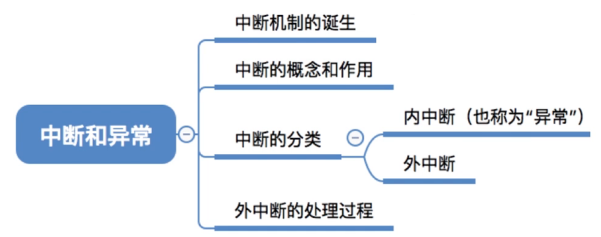
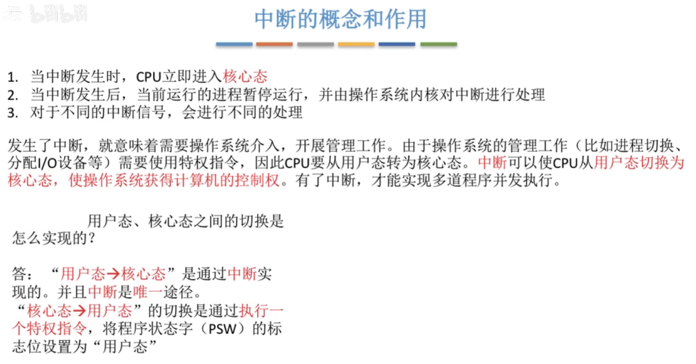
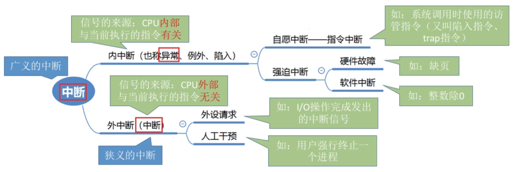
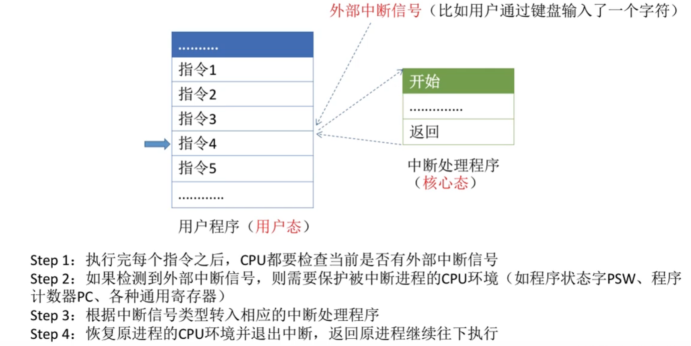
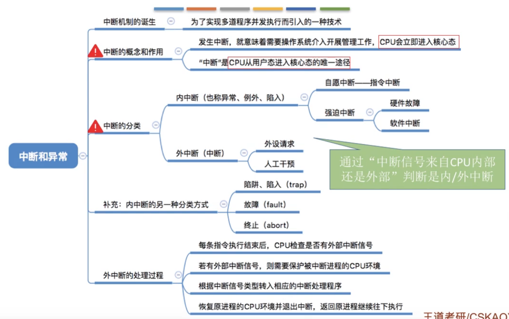

# 中断和异常

图1.本节总览

这一节，可以配合<计算机组成原理>1206中断系统来看。

## 一. 中断机制的诞生

发明了操作系统，引入了中断机制，才实现了多道程序并发执行。

注意，**发生中断**就意味着需要**操作系统介入，开展管理工作**。

举一个例子：

比如，CPU接收到计时部件发出的中断信号，切换为核心态对中断进行处理，

操作系统内核负责对中断信号进行处理，操作系统发现刚才的信号意思是进程1的时间片已到，于是换进程2运行，

然后操作系统把CPU的使用全交还给用户进程，也切换为用户态，接下来进程2开始运行。

（以上就算管理工作）

进程2可能发出系统调用（内中断），比如请求输出。

CPU又切换为核心态，对中断进行处理；

操作系统对中断信号进程处理，要求打印机开始工作，

在此期间进程2需要等待打印机运行完成，于是换进程3运行，

切换为用户态，进程3运行。

（这就是操作系统介入工作）

打印机完成后，对CPU发出中断信号，

CPU又进入核心态，操作系统对中断信号进行处理，

使进程2恢复运行，

切换为用户态，进程2恢复运行。

## 二. 中断的概念和作用

图2.中断的概念与作用

简单归纳刚才说的一长串流程：

1. 当中断发生时，CPU立即进入核心态；
2. 当中断发生后，当前运行的进程暂停运行，并由操作系统内核对中断进行处理；
3. 对于不同的中断信号，会进行不同的处理。

发生了中断，就意味着需要操作系统介入，开展管理工作。

由于操作系统的管理工作（比如进程切换、分配I/O设备等）需要使用特权指令，因此CPU要从用户态转为核心态。

中断可以使CPU从用户态切换为核心态，使操作系统获得计算机的控制权。
有了中断，才能实现多道程序并发执行。

用户态和核心态是怎么实现切换的呢？

从用户态到核心态，通过中断实现，并且中断是唯一途径。
从核心态到用户态，通过执行一个特权指令实现，该特权指令的作用是将程序状态字寄存器PSW中对应的标志位设置为用户态。

## 三. 中断的分类

图3.中断的分类

这里分类，在<计算机组成原理>1206中断系统中写得更详细。

## 四. 外中断的处理过程

图4.外中断的处理过程

每个指令在执行阶段结束后，CPU会查询有没有外部中断信号（感觉在复习<计组>，CPU响应中断只能是在执行阶段结束）。

如果有外部中断信号，则需要保护被中断进程的CPU环境。

根据中断信号类型，转入响应的中断处理程序。

恢复原进程的CPU环境并退出中断，返回原有进程继续往下执行。

（真就复习计组，详细建议看<计算机组成原理>1206中断系统）

## 五. 本节回顾

图5.本节回顾

2020.09.29