# 进程的定义、组成、组织方式、特征

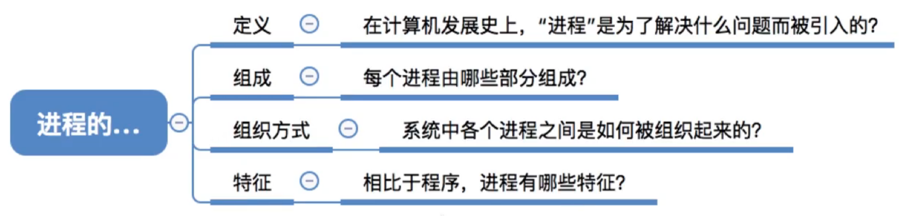

图1.本节总览

## 一. 进程的定义

**程序**：一个指令序列。

**进程**：进程是一个程序的一次执行过程。

当需要运行某程序时，会将程序调入内存，而调入内存的程序会分为**程序段**和**数据段**存在内存。

在早期计算机是中只能运行一个进程的，内存中只放入一个程序，所以程序段和数据段可以以固定的位置存放。

在引入多道程序技术后，计算机允许多个进程并发运行，内存中放入多个程序，即有多个程序各自的指令段和数据段。

于是为了方便操作系统管理，以完成各程序的并发运行，操作系统为每个进程配置一个数据结构，称为**进程控制块**（Process Control Block，PCB），也存在内存中，其中内容为对应进程的各种信息，比如该进程程序段、数据段的存放位置。用于管理这些进程。

由**程序段、数据段、进程控制块PCB**，就构成了**进程实体（进程映像）**。

一般情况下，我们把进程实体简称为进程。
创建进程，实质上是创建进程映像中的进程控制块PCB；撤销进程，实质上是撤销进程的进程控制块PCB。
**进程控制块PCB是进程存在的唯一标志。**

但本质上，进程并不等同于进程实体，进程实体是指程序段+数据段+进程控制块，是内存中静态存储着的信息，是**静态的**概念；而进程是指在执行的的指令序列，是**动态的**概念。

当然通常可以把进程实体说成进程，但是如果题目明显有问进程和进程实体的区别，那就不是一个东西。

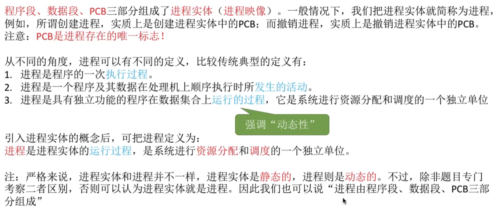

图2.进程的定义

从不同的角度，进程还有着不同的定义。
但都是在强调其动态性，执行过程、发生的活动、运行的过程。

引入了进程实体的概念后，可将上述定义总结为：
进程是进程实体的运行过程，**是系统进行资源和调度的一个独立单位**。

## 二. 进程的组成

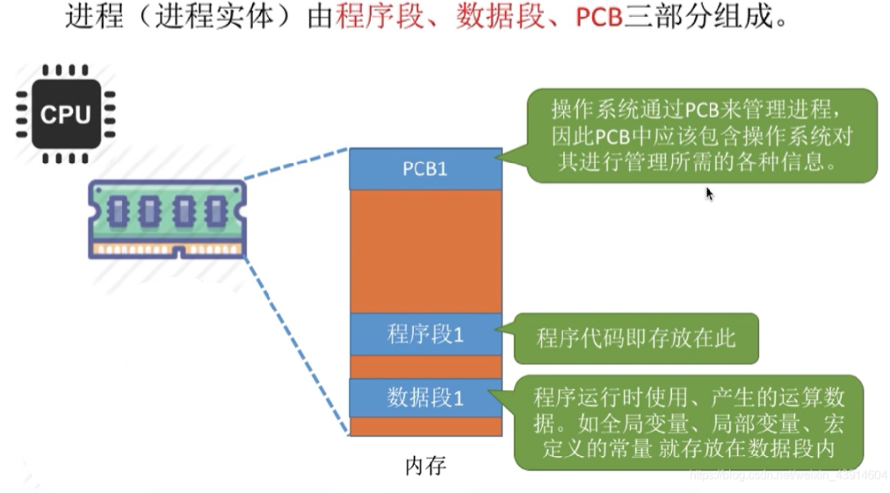

图3.进程（进程实体）的组成

进程（进程实体）由程序段、数据段、进程控制块PCB组成。

程序段就是指令序列嘛，数据段就是这个程序运行时会用到的数据都存放在这段里。

主要说程序控制块PCB的组成，也就是程序控制块PCB里的内容。

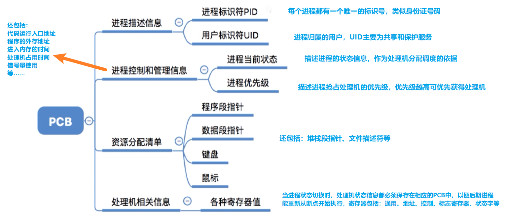

图4.PCB里的内容

进程控制块PCB里的内容：

1. 进程描述信息：

   1.1 进程标识符PID
   	当进程被创建时，操作系统为其分配的一个唯一的、不重复的编号，用于区分不同进程。

   1.2 用户标识符UID
   	用于区分该进程归属的用户，主要为了共享和保护服务。

2. 进程控制和管理信息：

   2.1 进程当前状态：
   	描述进程的状态信息，作为处理机分配调度的依据。

   2.2 进程优先级：
   	描述进程抢占处理机的优先级，优先级越高课优先获得处理机。

   还包括代码运行入口地址、程序外村地址、进入内存的时间、处理机占用时间、信息量适用等。

3. 资源分配清单：

   3.1 程序段指针：
   	用以指出该进程程序段位置。

   3.2 数据段指针
   	用以指出该进程数据段位置。

   3.3 其他资源：
   	其他分配给该进程的资源，比如鼠标、键盘。

   还包括堆栈段指针、文件描述符等。

4. 处理机相关信息：

   4.1 各种寄存器值：
   	当进程切换时，保存现场和保存PC的值。（也就是<计组>中中断程序时的保存操作存到这里。）

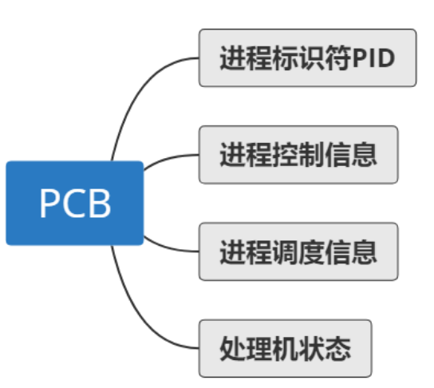

图5.另一种分类方式

程序控制块PCB还有另一种分类方式。

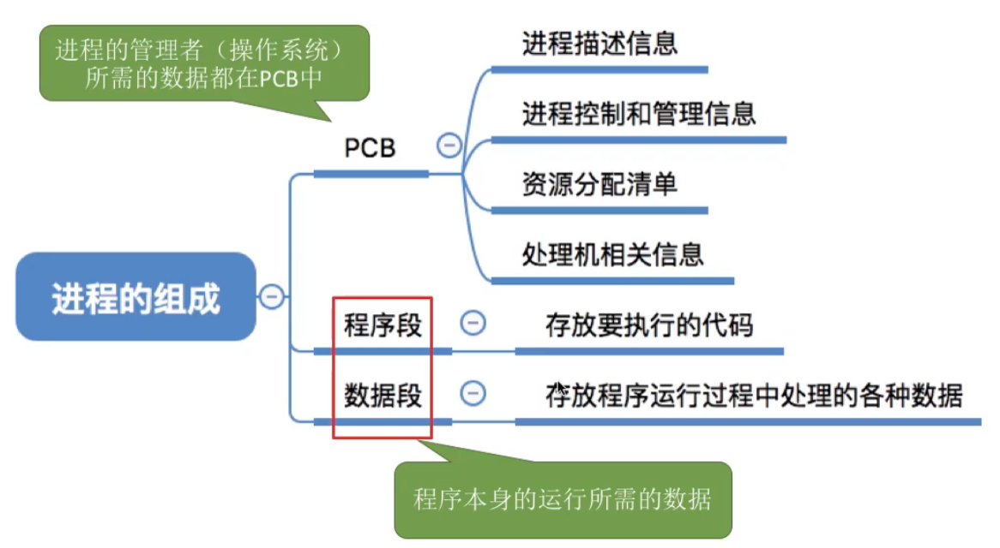

图6.进程的组成

考试可能问你，XXX信息是否是保存在程序控制块PCB中的，只要区分，PCB中是存储进程的管理者-操作系统所需要的数据，就很简单。

## 三. 进程间的组织方式

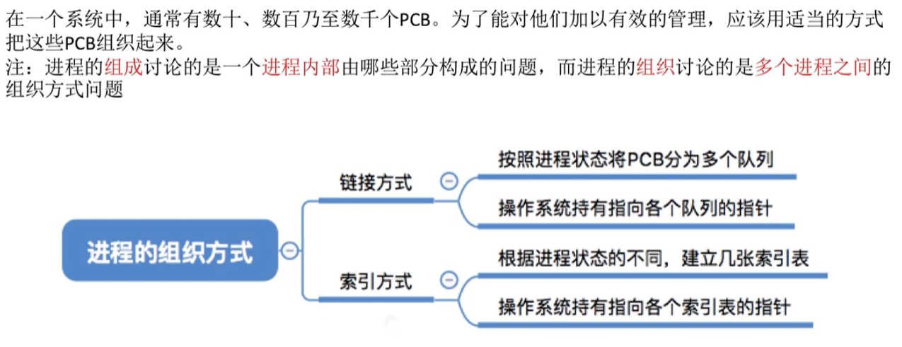

图7.进程间的组织方式

如何对多个进程进行管理。

分为两种方式：

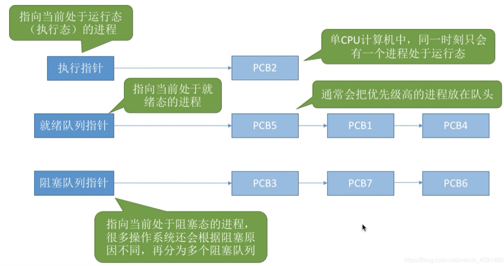

图8.链接方式

**链接方式**：

按照进程状态将进程控制块PCB分为多个队列，操作系统持有指向各个队列的指针。

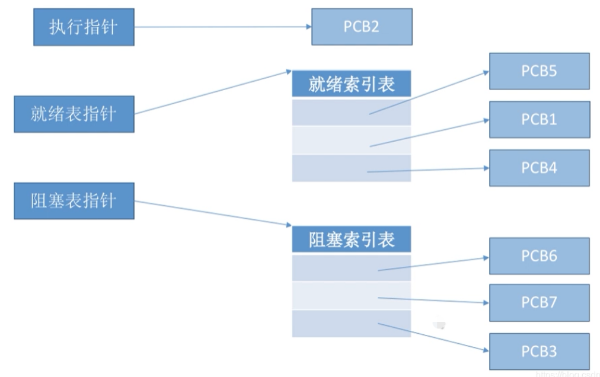

图9.索引方式

**索引方式**：

根据进程状态的不同，建立几张索引表，操作系统持有指向各个索引表的指针。

以上两种方式所有信息都存储在内存中。

## 四. 进程的特征

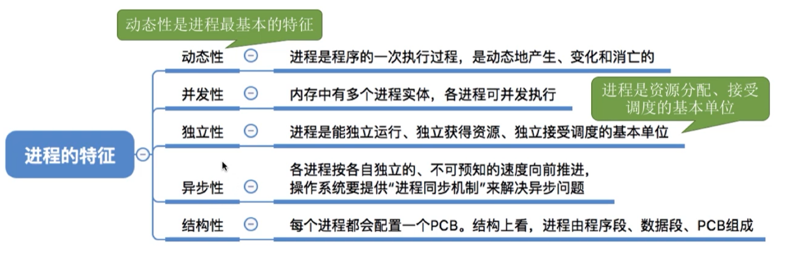

图10.进程的特征

进程的特征有：

1. 动态性：

   动态性是进程最基本的特征，进程是程序的一次执行过程，是动态的产生、变化和消亡的。

2. 并发性：

   内存中有多个进程实体，各程序可并发执行。

3. 独立性：

   **进程是系统进行资源分配和调度的基本单位**，独立运行、独立获得资源、独立接收调度。

4. 异步性：

   各进程以不可预知的速度向前推进。（就是可能要等别的进程不占用资源嘛）
   由于异步性会导致并发进程执行结果的不确定性，所以需要操作系统提供"进程同步"机制来解决异步问题。

5. 结构性：

   进程是由程序段、数据段和程序控制块PCB组成的。

## 五. 本节回顾

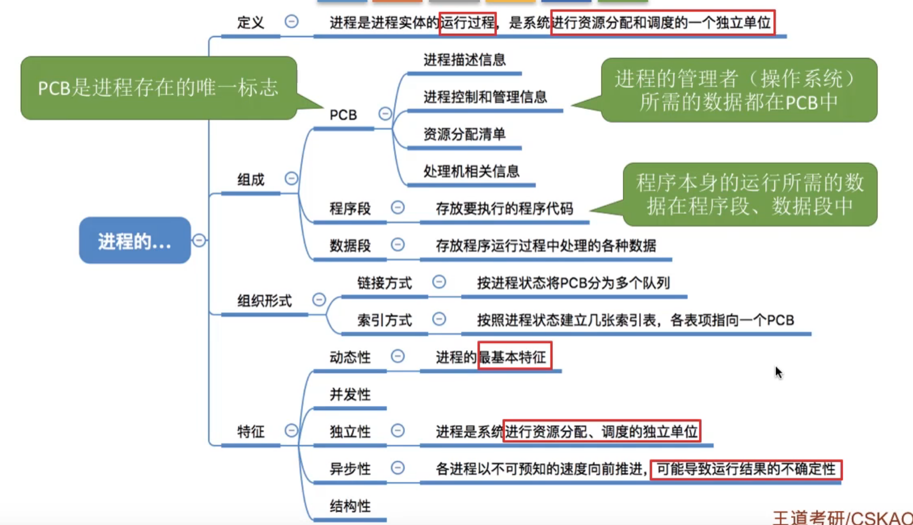

图11.本节回顾

2020.09.30