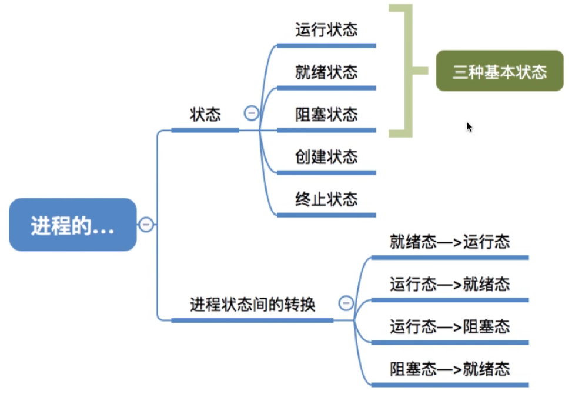
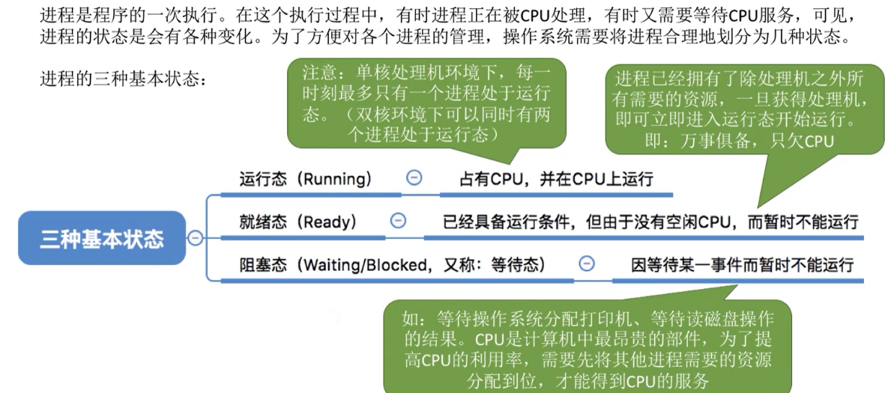
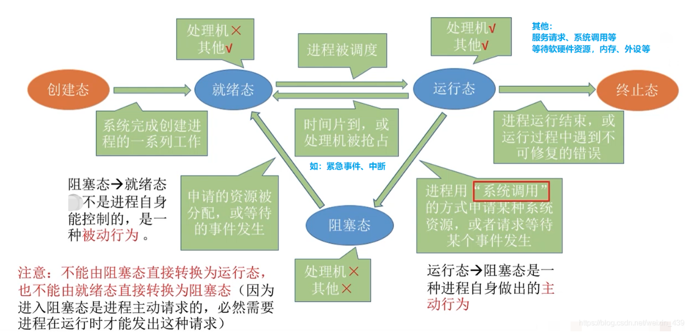
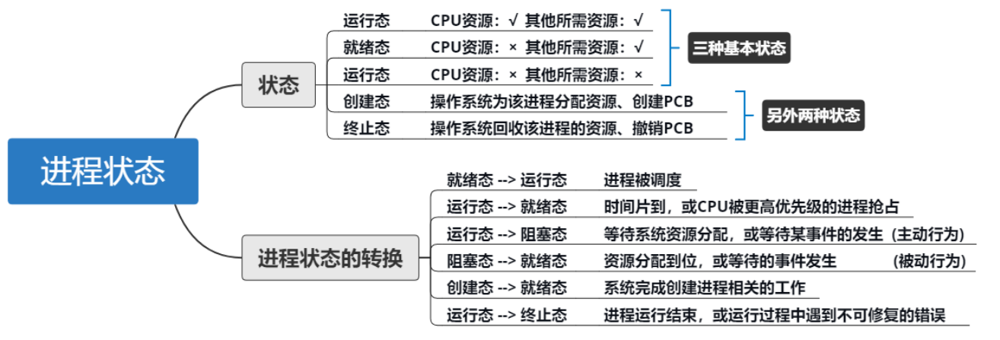

## 进程的状态与转换

图1.本节总览

## 一. 进程的状态

图2.进程的三种基本状态

进程的三种基本状态：

1. 运行态：

   占有CPU，在CPU上运行。

   注意，单核CPU最多只会有一个进程处于运行态。双核CPU那就最多同时两个进程处于运行态。

2. 就绪态：

   已经具备运行条件，比如该进程已经拥有了除了CPU以外的所有资源，但是因为没有空闲CPU所以暂时无法运行。

3. 阻塞态：

   因为等待某一事件而暂时无法运行。比如进程需要等待操作系统分配打印机、等待读磁盘操作的结果，在此期间所需要的资源未准备好，进程为阻塞态。

图3.进程的另外两种状态

进程的另外两种状态：

4. 创建态（新建态）：

   在进程运行前，将程序调入内存，操作系统为其系统资源，比如分配内存空间等，并为其创建、初始化进程控制块PCB，这就是创建态。

5. 终止态（结束态）：

   进程运行结束（或因BUG无法继续执行，比如整数除以0），操作系统需要完成撤销进程相关工作，比如回收该进程的系统资源以及撤销该进程的进程控制块PCB，这就是终止态。

## 二. 进程状态间的转换

图4.进程状态间的转换

创建态，系统完成创建进程的一系列工作，

当进程拥有了除处理机以外的所需资源后，就是就绪态。

当进程用了处理机，和所需资源后，就是运行态。
如果时间片到了，或处理机被抢占，又变为就绪态。
如果进程申请了系统调用，或者请求等待某个事件发生，则进入阻塞态。

阻塞态所需要的资源分配到了，或者等待的事件发生了，转变为就绪态。

程序运行过程中，如果运行完毕或遇到不可修复的错误，就到终止态，**就绪态/阻塞态/运行态都能直接到终止态**。

可知：

由运行态到阻塞态是进程的主动行为；
由阻塞态到就绪态是被动行为（系统分配给我，我就就绪）。

不能由阻塞态直接转变为运行态，也不能由就绪态直接转变为阻塞态。

## 三. 本节回顾

图5.本节回顾

2020.09.30