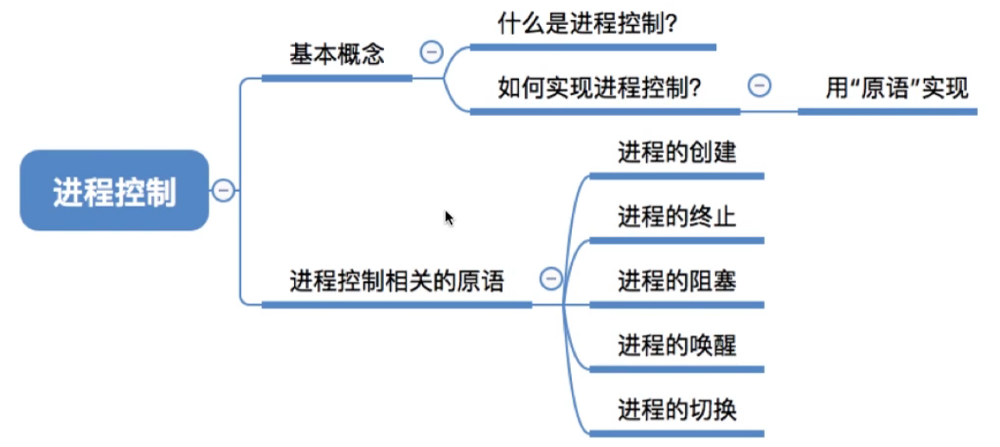
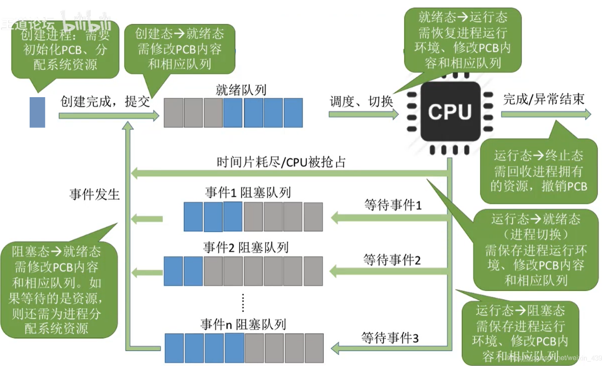
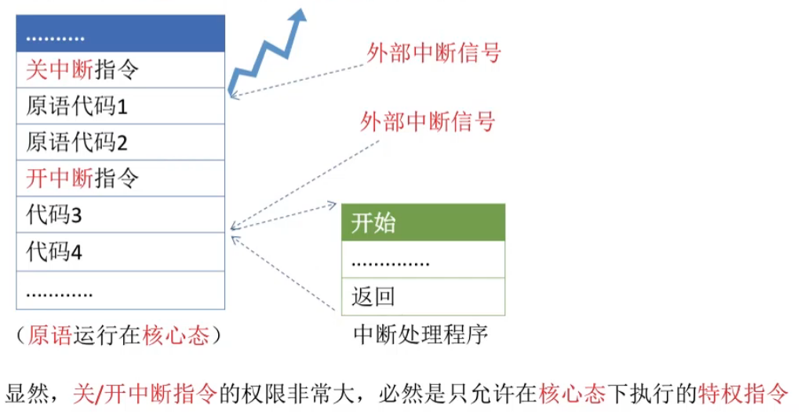
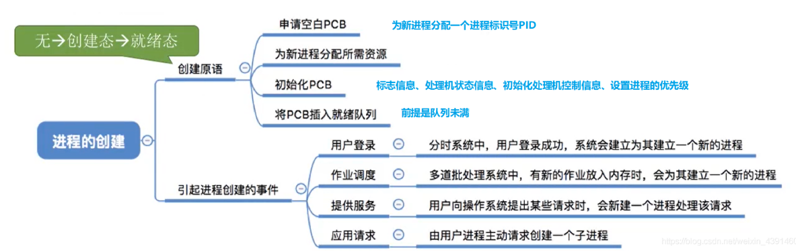
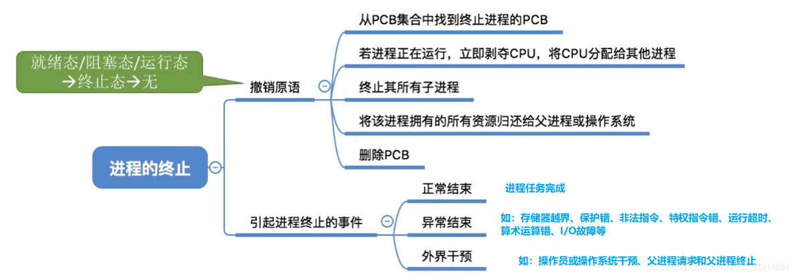
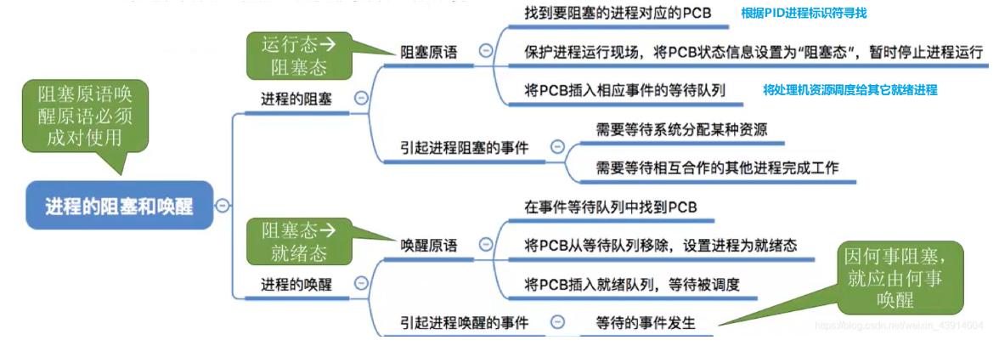
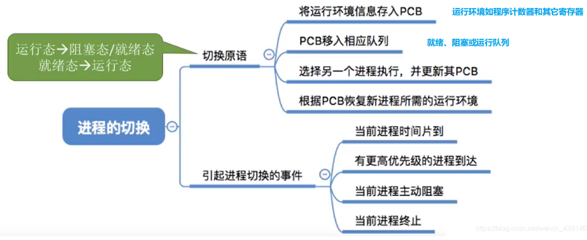
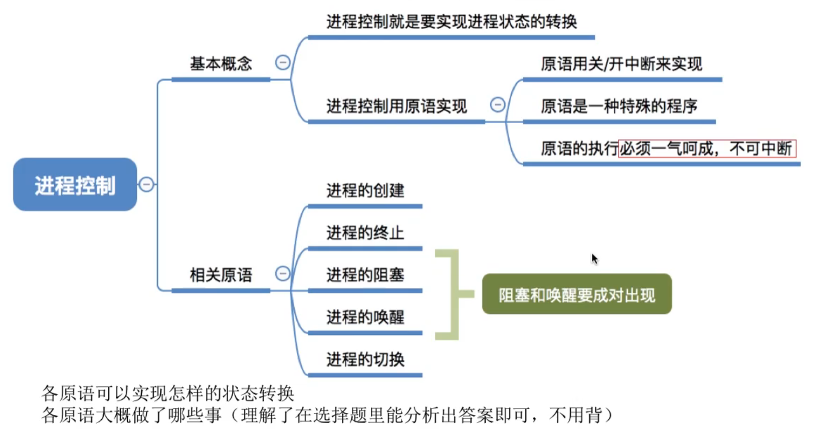

# 进程控制

图1.本节总览

## 一. 基本概念

### 1.1 什么是进程控制

进程控制的主要功能就是对系统中的所有进程实施有效的管理，它具有创建新进程、撤销已有进程、实现进程状态转换等功能。

简化理解，就是要实现进程状态转换。

在此前，讲述了操作系统是通过链接方式或索引方式来组织进程的进程控制块PCB。

图2.进程控制图解

一个进程被创建，创建态，初始化PCB，分配系统资源。

创建态 $\rightarrow$ 就绪态，修改PCB内容和相应队列，当该进程PCB放入就绪队列进行排队。

就绪态 $\rightarrow$ 运行态，需要恢复进程运行的环境（因为进程可能之前没运行完进入阻塞态的），修改PCB内容和相应队列。

运行态 $\rightarrow$ 就绪态，需保存进程运行环境，需要修改PCB内容和相应队列。

运行态 $\rightarrow$ 阻塞态，需保存进程运行环境，将等待相同资源或相同事件的进程分为同一阻塞队列，修改PCB内容和相应队列。

阻塞态 $\rightarrow$ 就绪态，获得了对应资源或发生了等待的事件，转变为就绪态，进入就绪队列，修改PCB内容和相应队列。

就绪态/阻塞态/运行态 $\rightarrow$ 终止态，回收进程的资源，撤销PCB。

### 1.2 如何实现进程控制

使用原语来实现进程控制，也就是实现上述操作。

原语的特点是具有原子性，其执行期间不允许中断，只能一气呵成。
这种不可被中断的操作称为原子操作。

原语采用"关中断"指令和"开中断"指令来实现不会被中断。

图3.原语的不被中断

当原语的指令执行前，会先执行关中断指令，
原语代码执行完毕后，才会执行开中断指令，
在此期间即便有外部中断信号，也不会响应。

显然，关中断和开中断指令的权限非常大，是只运行在核心态下执行的特权指令。
原语也是运行在核心态。

## 二. 进程控制相关的原语

下面介绍原语。

原语的共同点，无论是什么原语，要做的事情都是：

1. 更新PCB中的信息（如修改进程状态标志、将运行环境保存到PCB，从PCB恢复运行环境）

   1.1 所有的进程控制原语一定都会修改进程状态标志。

   1.2 剥夺当前运行进程的CPU使用权，必然需要保存其运行环境。

   1.3 某进程开始运行前必然要恢复其运行环境。

2. 将PCB插入合适的队列

3. 分配/回收资源。

### 2.1 进程的创建

图4.进程的创建

无 $\rightarrow$ 创建态 $\rightarrow$ 就绪态，创建原语的过程：

1. 申请空白PCB（PCB是有限的），为新进程分配一个唯一的进程标识号PID。若PCB申请失败，则创建失败。
2. 为新进程分配所需资源。若资源不足，并非创建失败，而是处于阻塞态，等待资源分配。
3. 初始化PCB。
4. 将PCB插入就绪队列，等待被调度运行（当然前提是就绪队列未满）。

会引起进程创建的事件：

1. 用户登录：

   分式系统中，用户登录成功，系统会为其建立一个新的进程。

2. 作业调度：

   多道批处理系统中，有新的作业放入内存时，会为其建立一个新的进程。

3. 提供服务：

   用户向操作系统提出某些请求时，会新建一个进程处理该请求。

4. 应用请求：

   由用户进程主动请求创建一个子进程。

### 2.2 进程的终止

图5.进程的终止

就绪态/阻塞态/运行态 $\rightarrow$ 终止态 $\rightarrow$ 无，撤销原语的过程：

1. 根据被终止进程的标识符，从PCB集合中找到终止进程的PCB，从中读出该进程的当前状态。
2. 若该进程正在进行，立即剥夺CPU，将CPU分配给其他进程。
3. 若该进程还有子孙进程，则会终止其所有子进程。
4. 将该进程拥有的所有资源归还给父进程或操作系统。
5. 将其PCB从所在队列中删除。

会引起进程终止的事件：

1. 正常结束。
2. 异常结束，如存储器越界、非法指令。
3. 外界干预，如操作系统干预，父进程终止。

### 2.3 进程的阻塞与唤醒

图6.进程的阻塞与唤醒

**进程的阻塞原语和唤醒原语是成对存在的，必须成对使用。**

阻塞原语是被阻塞进程自我调用实现的。

唤醒原语是由一个与被唤醒进程合作的进程，或被其他相关的进程调用实现的。

运行态 $\rightarrow$ 阻塞态，阻塞原语的过程：

1. 找到要阻塞的进程的标识号对应的PCB。
2. 若该进程为运行态，则保护现场，将其状态转为阻塞态，停止运行。
3. 把该PCB插入相应事件的等待队列，将处理机资源调度给其他就绪进程。

会引起进程阻塞的事件：

1. 需要等待系统分配某种资源。
2. 需要等待互相合作的其他进程完成工作。

阻塞态 $\rightarrow$ 就绪态，唤醒原语的过程：

1. 在该事件的等待队列中找到相应进程的PCB。
2. 将其从等待队列中移出，并置其状态为就绪态。
3. 把该PCB插入就绪队列，等待调度程序调度。

会引起进程唤醒的事件：

1. 等待的事件发生。

### 2.4 进程的切换

图7.进程的切换

运行态 $\rightarrow$ 阻塞态/就绪态，就绪态 $\rightarrow$ 运行态，切换的过程：

1. 保存现场，存入PCB。
2. 将PCB以入相应队列。
3. 选择另一个进程执行，并更新其PCB。
4. 根据该进程的PCB恢复其所需的运行环境。

会引起进程切换的事件：

1. 当前进程时间片到。
2. 有更高优先级的进程达到。
3. 当前进程主动阻塞。
4. 当前进程终止。

## 三. 本节回顾

图8.本节回顾

2020.09.30