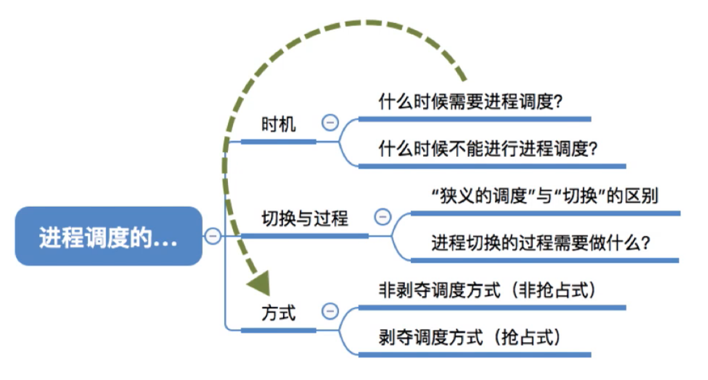
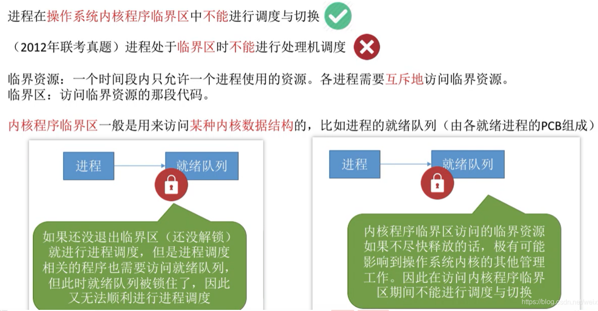
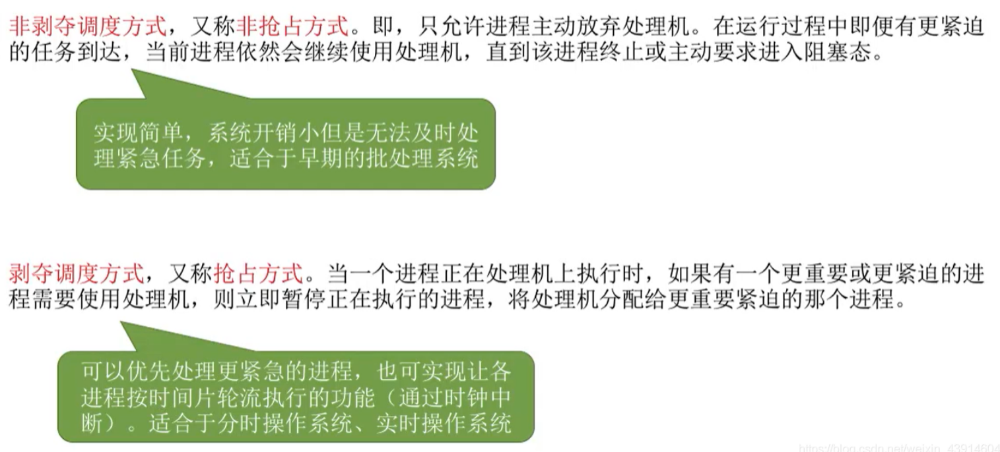
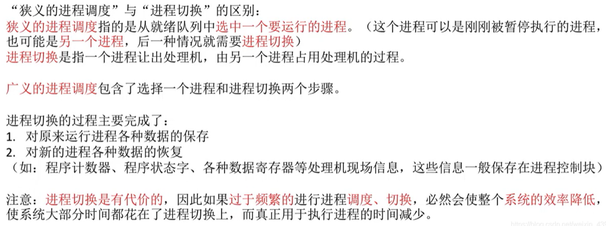
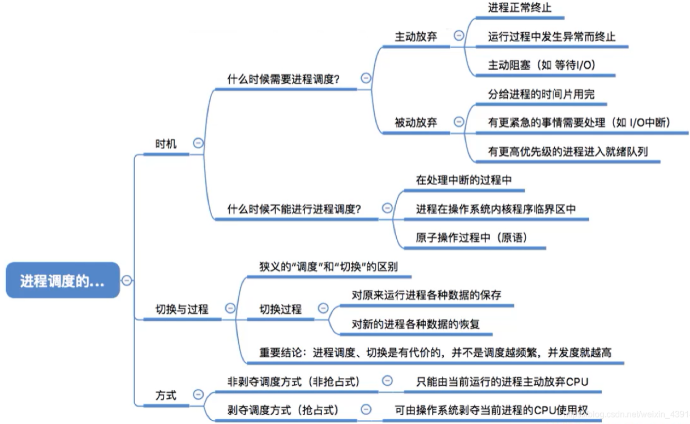

# 进程调度的时机、切换及过程、调度方式

图1.本节总览

虽然上一节我在小标题里写的都是高级、中级、低级调度，但实际上更常使用作业、内存、进程调度的叫法。

## 一. 进程调度的时机

图2.需要进行进程调度与切换的情况

需要进行进程调度与切换的情况：

1. 当前运行的进程主动放弃处理机：

   1.1 进程正常终止。

   1.2 运行过程中发生异常而终止。

   1.3 进程主动请求阻塞。

2. 当前运行的进程被动放弃处理机：

   2.1 分给进程的时间片用完。

   2.2 有更紧急的事需要处理。

   2.3 有更高优先级的进程进入就绪队列。

图3.不能进行进程调度与切换的情况

不能进行进程调度与切换的情况：

1. 处理中断的过程中，不可。

   因为中断处理过程复杂，与硬件密切相关，比如处理中断首先就得保存现场，这个时候不能再去中断它。（感觉这里处理中断的过程中，就是指保存现场这些操作。）

2. 进程在操作系统内核程序临界区中，不可。

   但在普通临界区中可以切换。

3. 在原子操作过程中（原语），不可。

   原语的操作不可中断。

## 二. 临界资源、临界区。

**临界资源**：一个时间段内只允许一个进程使用的资源。各进程需要互斥地访问临界资源。

**临界区**：访问临界资源的那段代码。

各个进程都可能有需要访问某个临界资源的代码，这些访问临界资源的代码就叫临界区。
So，只能够一个进程进入临界区，也就是临界资源同时只能被一个进程访问。
（为什么要说的这么复杂，就是互斥资源同时只能执行一个使用该资源的代码。）

~~~c
// 为了保证临界资源的正确使用，可以将临界资源的访问分为4个部分
do {
  entry section;    // 进入区（检查进程是否可以进入临界区）
  critical section; // 临界区（访问临界资源）
  exit section;     // 退出区（清除正在访问临界区的标志）
  remainder section;// 剩余区（剩余代码）
} while(true)
~~~

实际上对临界资源的访问分为四段代码：

进入区 $\rightarrow$ 临界区 $\rightarrow$ 退出区 $\rightarrow$ 剩余区。

1. 进入区：检查该进程是否可以进入临界区，比如如果欲访问的临界资源正被使用着，就不会进入临界区；如果空闲，进入临界区，并设置标志，表面该进程正在访问临界资源。
2. 临界区：访问临界资源。
3. 退出区：清楚正在访问临界区的标志。
4. 剩余区：剩余的一些代码

图4.辨析普通/内核程序临界区

**普通程序临界区**：一般访问如打印机这些不涉及内核的资源。

**内核程序临界区**：一般是用来访问某种内核数据结构，比如进程的就绪队列。

可知，当内核程序进入了临界区，比如访问就绪队列，此时其他内核程序也是无法使用就绪队列的，而要进行进程的调度与切换，是需要修改就绪队列的信息的，但此时无法使用，所以内核程序处于临界区时，无法进行调度与切换。

但普通程序进入临界区，比如访问打印机，打印机的速度很慢，CPU也不会闲着等你，所以是可以进行进程的调度与切换的。

## 三. 进程调度的方式

图5.进程调度的方式

进程调度的方式：

1. 非剥夺调度方式：

   又称非抢占方式。即只允许进程主动放弃处理。在运行过程中即便有更紧迫的任务到达，当前进程依然灰继续使用处理机，直到该进程终止或主动要求进入阻塞态。

   系统开销小，但无法及时处理紧急任务，适合早期的批处理系统。

2. 剥夺调度方式：

   又称抢占方式。当一个进程正在处理机上执行时，如果有一个更重要或更紧迫的进程需要使用处理机，则立即在暂停正在执行的进程，将处理机分配给更重要紧迫的那个进程。

   可以优先处理更紧急的进程，也可让各进程按时间片轮流执行。适合分时、实时操作系统。

## 四. 进程调度的切换与过程

图6.狭义与广义的调度

首先辨析一下狭义/广义的进程调度。

把进程的切换分为两步：从就绪队列中选中一个欲运行的进程，进行切换。

狭义的进程调度，就指从就绪队列中选中一个欲运行的进程。
广义的进程调度，包含了这两步：从就绪队列中选中一个欲运行的进程，进行切换。

可能在题目出现不同含义，注意一下。

进程切换的过程主要完成了：

1. 对原来运行进程各种数据的保存。
2. 对新的进程各种数据的恢复。（一般都保存在程序控制块PCB中。）

## 五. 本节回顾

图7.本节回顾

2020.10.06

