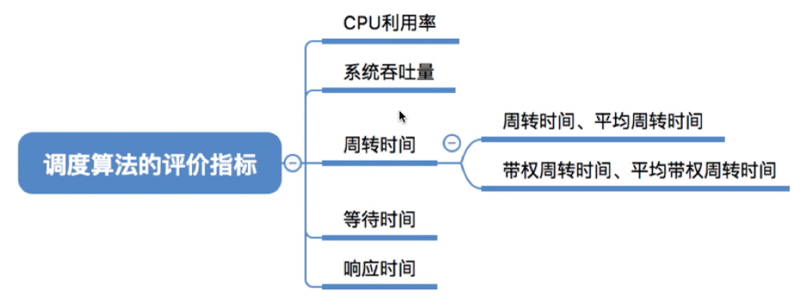
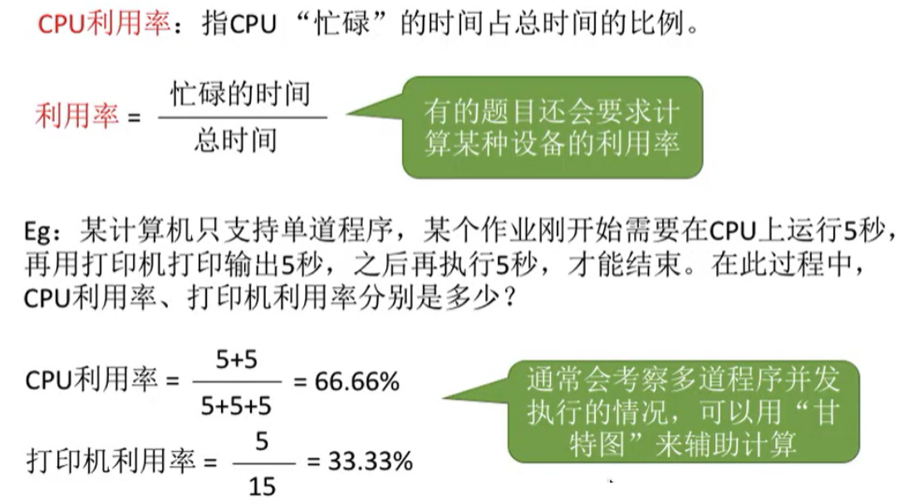
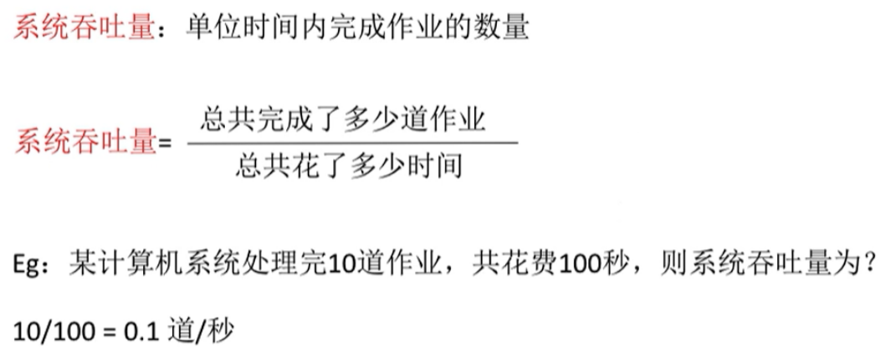
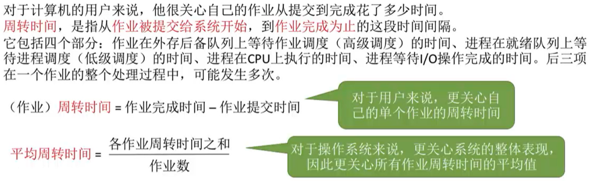
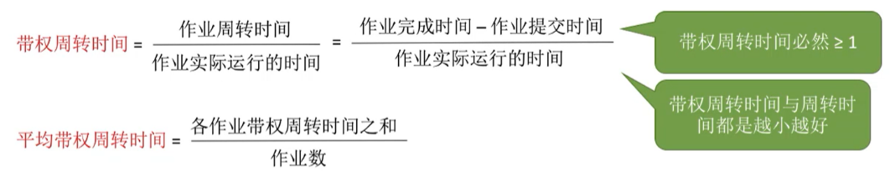
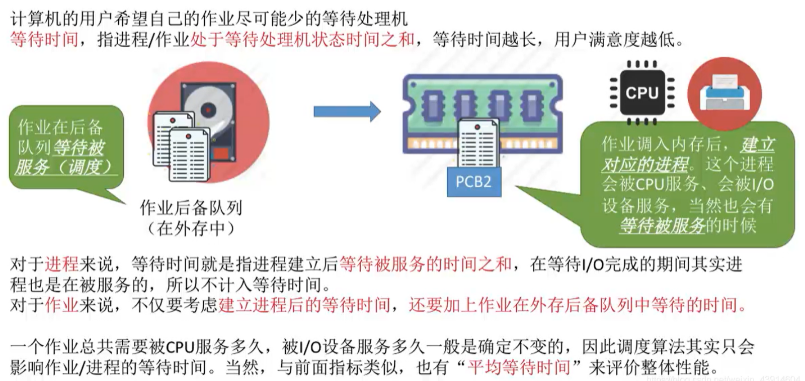
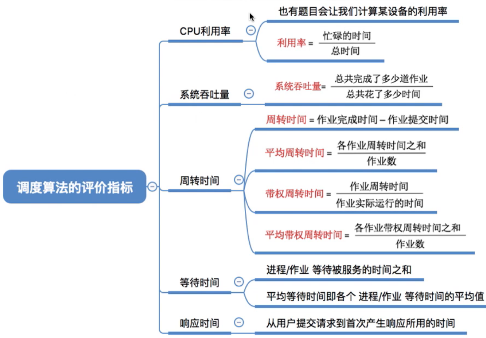

# 调度算法的评价指标

图1.本节总览

## 一. CPU利用率

图2.CPU利用率

## 二. 系统吞吐量

图3.系统吞吐量

## 三. 周转时间

图4.周转时间

周转时间，从作业提交给系统，到作业完成的时间。

但提交给系统，系统并不一定立即就开始执行该作业，所以周转时间大于等于作业执行时间。

图5.带权周转时间

## 四. 等待时间

图6.等地时间

等待时间，

作业提交给系统，系统并不一定立即就开始执行该作业，
执行作业的过程中，也可能是间断的执行的，比如多个作业交替执行，作业中途也会等待。

对进程来说，虽然在等待如I/O设备期间也是等待，但本质是在被服务的，所以不能算在等待时间中。
对作业来说，要考虑这段时间，而且要考虑创建进程后的等待时间，和在外存后备队列中等待的时间。

## 五. 响应时间

图7.响应时间

## 六. 本节回顾

图8.本节回顾

2020.10.06