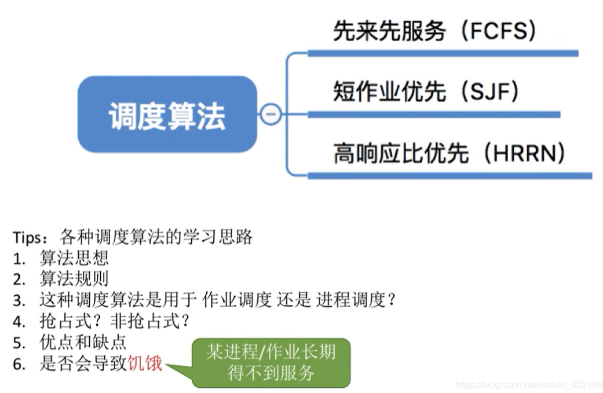
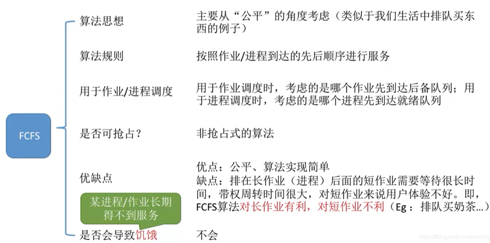
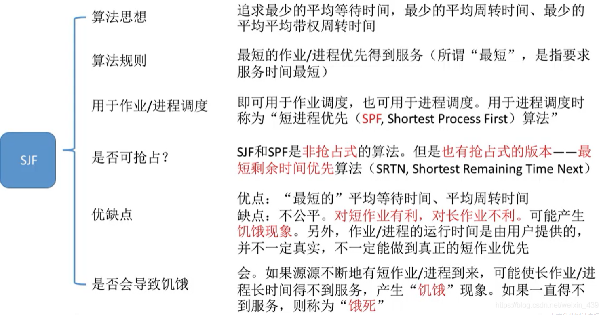
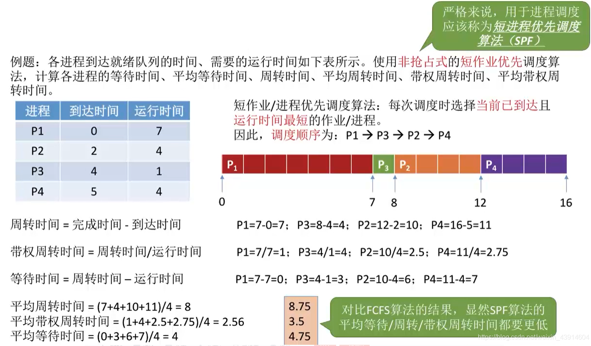
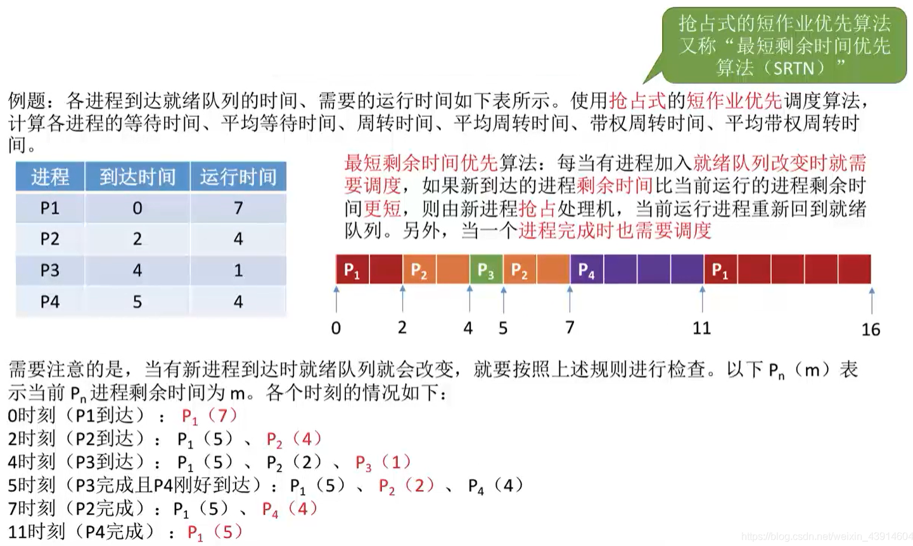
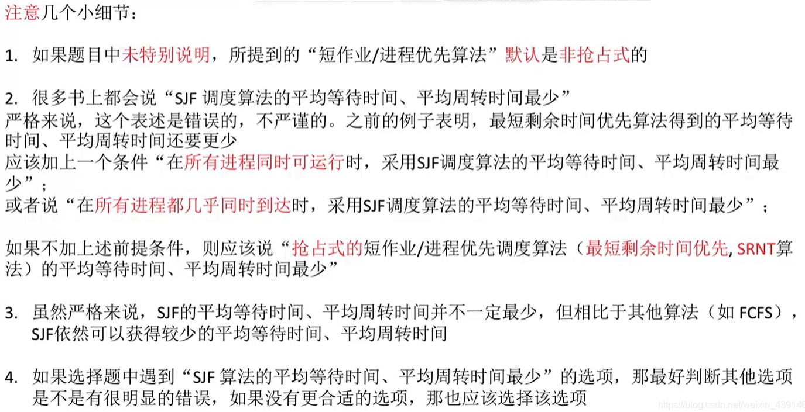
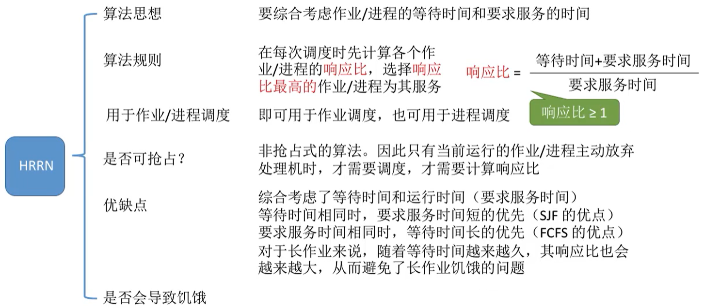
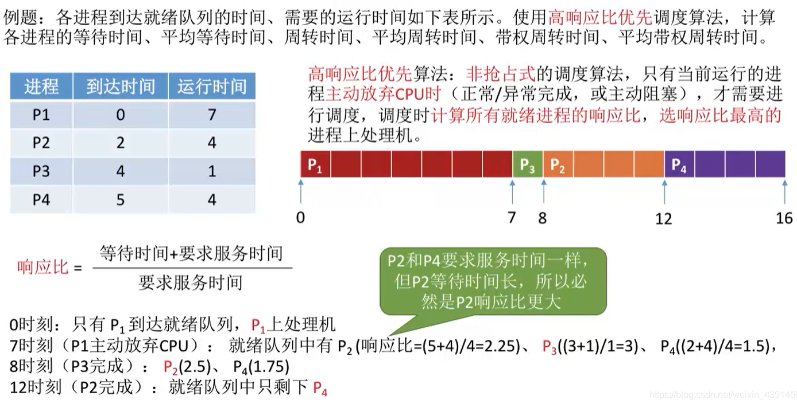

# 调度算法：FCFS、SJF、HRRN

图1.本节总览

## 一. 先来先服务（fitst-come first-serverd,FCFS）

图2.先来先服务FCFS

先来先服务FCFS。

算法规则：
按照作业/进程到达的先后顺序进行服务。

用于作业调度时，考虑的是哪个作业先到达后备队列；
用于进程调度时，考虑的是哪个进程先到达就绪队列。

非抢占式的算法。

优点：公平，实现简单。
缺点：在耗时长的作业/进程后的耗时短的作业/进程，需要等待很长时间，带权周转时间大，对短作业来说用户体验不好。即FCFS对长作业有利，短作业不利。

不会导致饥饿。
一个一个排队依次运行，不会出现某个作业/进程长期得不到服务。

图3.FCFS例题

很简单的例题，不解释。

## 二. 短作业优先（short job first,SJF）

图4.短作业优先SJF

短作业优先SJF。

追求最少的平均等待时间，最少的平均周转时间，最少的平均带权周转时间。

算法规则：
最短的作业/进程优先得到服务，最短指服务时间最短。

用于作业调度；
用于进程调度时，成为短进程优先SPF算法。

短作业优先SJF和短进程优先SPF都是非抢占式算法。
但也有抢占式的版本，最短剩余时间优先SRTN算法，在下面例题里有。

优点：最短的平均等待时间、平均周转时间。
缺点：不公平，对短作业有利，对长作业不利。可能产生饥饿现象。另外，作业/进程的运行时间由用户提供，并不一定真实，不一定能做到真正的短作业优先。

饥饿：
会导致饥饿。可能使长作业一直被短作业插队，长期得不到服务。
如果一直得不到服务，则称为饿死。

图5.短作业优先SJF非抢占式例题

 $P_1$ 在0秒到达，开始执行 $P_1$ ；
因为是非抢占式，所以一直执行 $P_1$ ，到第7秒执行完 $P_1$ ，此时 $P_2,P_3,P_4$ 都已经到达，从中选择最短的 $P_3$ 执行。
 $P_3$ 执行完， $P_2,P_4$ 运行时间都是4，因为 $P_2$ 先到达，所以运行 $P_2$ 。

图6.短作业优先SJF抢占式例题

 $P_1$ 在0秒到达，开始执行 $P_1$ ；
因为是抢占式，
第2秒时 $P_2$ 到达， $P_1$ 剩余运行时间5秒， $P_2$ 剩余运行时间4秒，所以运行 $P_2$ 。
第4秒时 $P_3$ 到达， $P_1$ 剩余5秒， $P_2$ 剩余2秒， $P_3$ 剩余1秒，所以运行 $P_3$ 。
第5秒时 $P_3$ 完成， $P_4$ 到达， $P_1$ 剩余5秒， $P_2$ 剩余2秒， $P_4$ 剩余4秒，所以运行 $P_2$ 。
第7秒时 $P_2$ 完成， $P_1$ 剩余5秒， $P_4$ 剩余4秒，所以运行 $P_4$ 。
第11秒时 $P_4$ 完成， $P_1$ 剩余5秒，所以运行 $P_1$ 。
第16秒时 $P_1$ 完成。

图7.一些小细节

注意几点：

1. 如果题目没有特别说明，默认为非抢占式短作业/进程优先算法。

2. "SJF算法的平均等待时间、平均周转时间最少。"

   显然的，如果每个作业/进程都是上一个作业/进程刚好完成时到达，那用什么算法都一样啦。

   所以要加上条件，在所有进程几乎同时到达，或所有进程同时都可运行时，采用SJF算法的平均等待时间、平均周转时间最少。

   没有加上条件，应该说采用抢占式的SJF算法的平均等待时间、平均周转时间最少。

3. 如果选择题遇到这句话，就先看看别的选项吧。

## 三. 高响应比优先（Highest Response Ratio Next,HRRN）

图8.高响应比优先HRRN

高响应比优先。

综合考虑作业/进程的等待时间和要求服务的时间。

算法规则：
每次调度时先计算各个作业/进程的响应比，选择响应比最高的作业/进程为其服务。

可用于作业调度；
可用于进程调度。

非抢占式算法。

优点：
综合考虑了等待时间和运行时间（要求服务时间），
等待时间相同时，要求服务时间短的优先（SJF的优点）；
要求服务时间相同时，等待时间长的优先（FCFS的优点）。
对于长作业来说，随着等待时间越来越久，其响应比也会越来越大，从而避免了长作业饥饿的问题。

不会导致饥饿。

高响应比优先HRRN例题

 $P_1$ 在0秒到达，开始执行 $P_1$ ；
非抢占式，
第7秒时 $P_1$ 完成， $P_2$ 响应比 $\frac{4+5}{4}=2.25$ 秒， $P_3$ 响应比 $\frac{1+3}{1}=4$ 秒， $P_4$ 响应比 $\frac{4+2}{4}=1.5$ 秒，所以运行 $P_3$ 。
第8秒时 $P_3$ 完成， $P_2$ 响应比 $\frac{4+6}{4}=2.5$ 秒， $P_4$ 响应比 $\frac{4+3}{4}=1.75$ 秒，所以运行 $P_2$ 。
第12秒时 $P_2$ 完成，所以运行 $P_4$ 。
第16秒时 $P_4$ 完成。

## 四. 三种调度算法对比

图10.三种调度算法对比

这三种算法，并不关注响应时间，所以对用户来说，交互性很差。通常适用于早期的批处理系统。

2020.10.07

