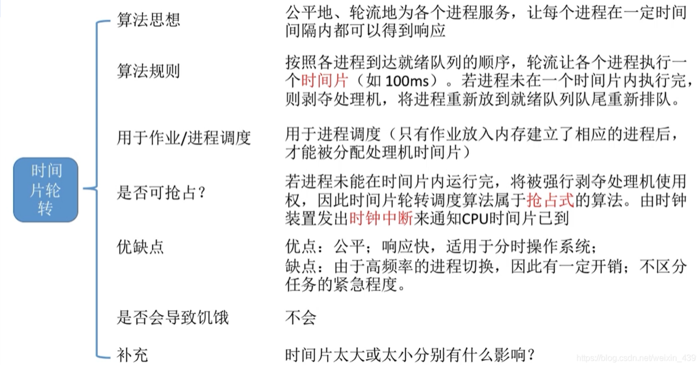
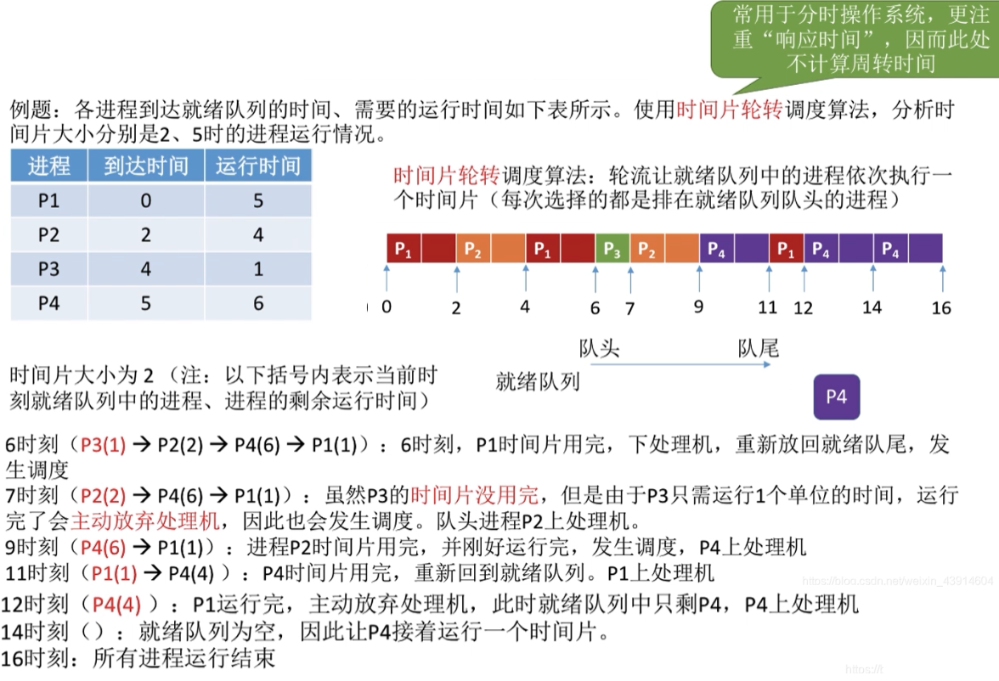
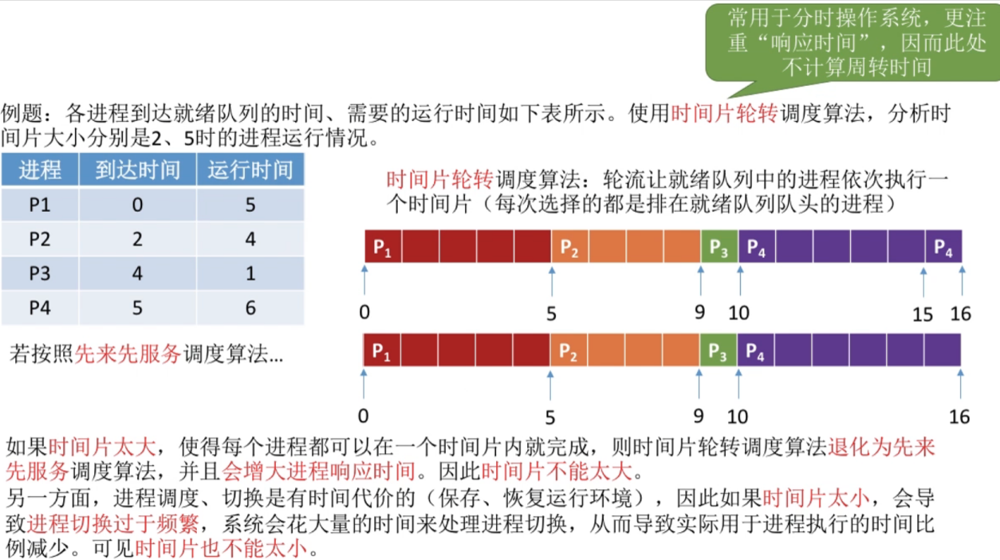
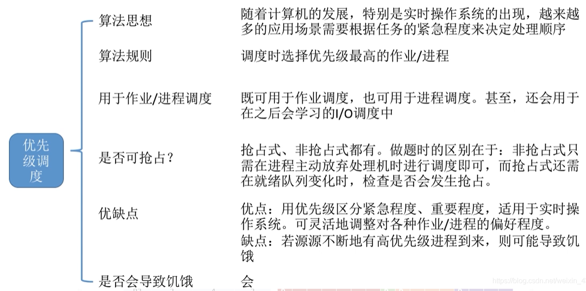
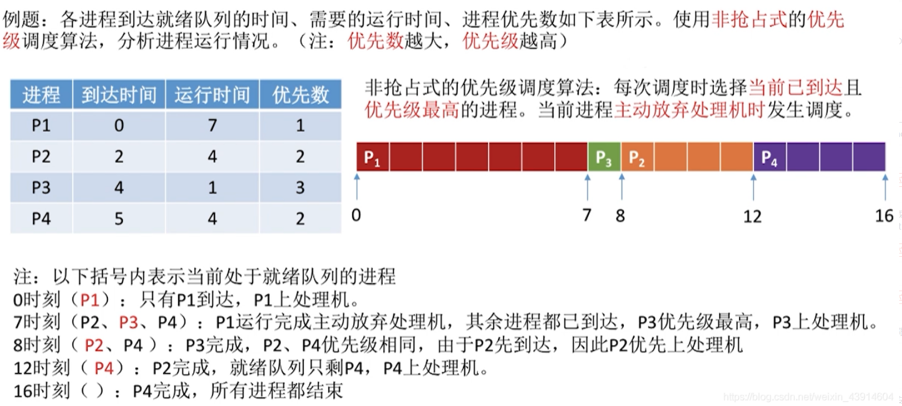
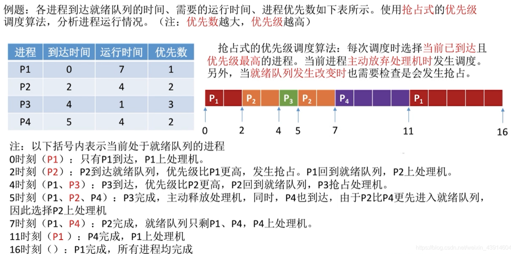
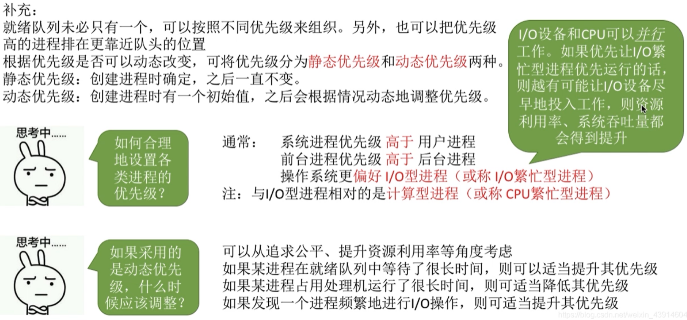
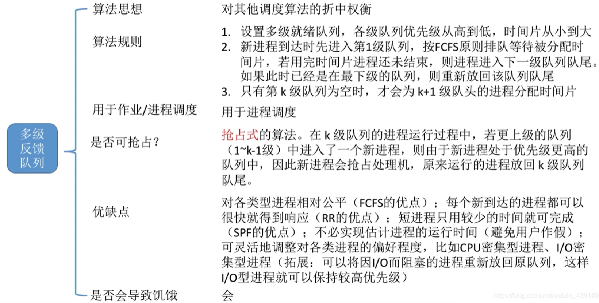
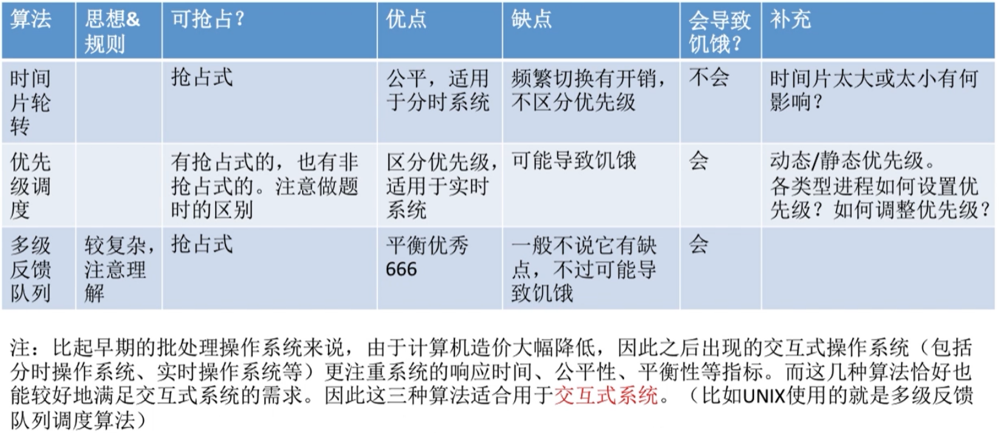

# 调度算法：时间片轮转、优先级、多级反馈队列

图1.本节总览

## 一. 时间片轮转调度算法（RR,round robin）

图2.时间片轮转调度算法

时间片轮转调度算法。

算法思想：
公平地、轮流地为各个进程服务，让每个进程在一定时间间隔内都可以得到响应。

算法规则：
按照各进程到达就绪队列的顺序，轮流让各个进程执行一个时间片。若进程围在一个时间片内执行完，则剥夺处理机，将进程重新放到就绪队列队尾重新排队。

用于进程调度，只有作业放入内存建立了响应的进程后才能被分配处理机时间片。

抢占式算法。
由时钟装置发出时钟中断来通知CPU时间片已到。

优点：公平，响应快，适用于分时操作系统。
缺点：由于高频率的进程切换，因此有一定开销。不区分任务的紧急程度。

不会导致饥饿。

图3.时间片调度算法例子

假设时间片为2：

0时，运行 $P_1$ ，
2时， $P_1$ 时间片用完，返回就绪队列， $P_2$ 到达，运行 $P_2$ ，此时就绪队列： $P_1$ ，
4时， $P_2$ 时间片用完，返回就绪队列， $P_3$ 到达，运行 $P_1$ ，此时就绪队列： $P_3,P_2$ ，
6时， $P_1$ 时间片用完，返回就绪队列，运行 $P_3$ ，5时 $P_4$ 到达，此时就绪队列： $P_2,P_4,P_1$ ，
7时， $P_3$ 运行完毕，主动放弃处理机，运行 $P_2$ ，此时就绪队列： $P_4,P_1$ ，
9时， $P_2$ 运行完毕，时间片刚好到了，运行 $P_4$ ，此时就绪队列： $P_1$ ，
11时， $P_4$ 时间片用完，返回就绪队列，运行 $P_1$ ，此时就绪队列： $P_4$ ，
12时， $P_1$ 运行完毕，主动放弃处理机，运行 $P_4$ ，此时就绪队列：空。
16时， $P_1$ 运行完毕。

图4.时间片的长度设置

时间片太长：

如图4，时间片设置为5（其实可以再大一点），可能导致每个进程都能在时间片内完成，于是就变成了先来先服务FCFS调度算法。
而且时间片太长，响应时间也会变长，原本时间片为2的时候，用户最多也就等待2，现在为5，用户等待时间最长就是5了。时间片越长，则用户等待的响应时间就越长。

时间片太短：

太短会导致进程切换过于频繁，而进程切换是有代价的。所以时间片也不能太小。
通常要求时间片的长度设计，要让程序切换的开销占比不超过1%。

## 二. 优先级调度算法（PSA,priority-scheduling algorithm）

图5.优先级调度算法

算法思想：
根据任务的紧急程度来决定处理顺序。

算法规则：
调度时选择优先级最高的作业/进程。

可用于作业调度，
可用于进程调度，
甚至，还可以用于后面的I/O调度。

有抢占式、非抢占式，

优点：用优先级区分紧急程度、重要程度，适用于实时操作系统。可灵活地调整对各种作业/进程的偏好程度。
缺点：若有源源不断的高优先级的进程到来，可能导致饥饿。

会导致饥饿。

图6.高优先级非抢占式例子

可以注意到，每一个进程现在多出了一个优先数，这里题目是优先数越大，优先级越高。

偷懒就不写了。

非抢占式，就是当进程运行完毕或者主动放弃时，才去选择高优先级的进程来运行。

图7.高优先级抢占式例子

偷懒也不写了。

抢占式，除了非抢占式的进程完毕或主动放弃外，当就绪队列发生变化时，也要检查是否发生抢占。

图8.几个注意点

几个注意点：

就绪队列不一定只有一个队列。
可以按优先级分成多个就绪队列，优先运行优先级高的就绪队列的进程，如果为空，就去优先级次一级的就绪队列找。

关于优先级的设置：

系统进程高于用户进程，
前台进程高于后台进程。
操作系统更偏好I/O型进程（因为先运行I/O型进程可以使CPU和I/O设备早点并行运行嘛。），与I/O进程相对的是计算型进程（就是相对的用CPU的）。

优先级可以分为静态优先级和动态优先级：

1. 静态优先级：创建进程时确定，之后一直不变。

2. 动态优先级：创建进程时有一个初始值，之后会根据情况动态地调整优先级。

   如果一个进程长时间占用CPU，则可以适当降低优先级，
   如果一个进程长时间等待，则可以适当提高优先级，
   如果一个进程频繁进行I/O操作，则可以适当提高优先级。

## 三. 多级反馈队列调度算法（multileved feedback queue）

图9.多级反馈队列调度算法

多级反馈队列调度算法。

算法思想：
对其他调度算法的折中。

算法规则：

1. 设置多级就绪队列，各级队列优先级从高到低，时间片从小到大。
   例如，优先级低一级的就绪队列的时间片为该级就绪队列的时间片的两倍，只是一个例子。
2. 新进程到达时先进入最高优先级队列，按FCFS原则排队等待被分配时间片，若用完时间片进程还未结束，则进程进入次一级就绪队列队尾。如果原本已经是最低优先级的队列，则放回最低优先级的队尾。
3. 只有更高优先级队列都为空时，才会为该优先级队列队头的进程分配时间片。

用于进程调度。

抢占式算法。
当更高优先级就绪队列进入新进程时，会抢占正在运行的低优先级的进程。
**被抢占的进程放回原队列**。

优点：
对各类型进程相对公平（FCFS的优点），
每个新到达的进程都可以很快就得到响应（RR的优点），
短进程只用较少时间就可完成（SRF的优点），
不必实现估计进程的运行时间（避免用户造假），
可灵活地调整对各类进程的偏好程度，比如CPU密集型进程、I/O密集型进程（比如，可以将I/O密集型进程放回原队列，由此保留优先级）。

会导致饥饿。

## 四. 本节回顾

图10.三种调度方式对比

这三种方式更注重系统的响应时间、公平性、平衡性等指标。
更适合用于交互式系统（包括分时、实时操作系统等）。

2020.10.07