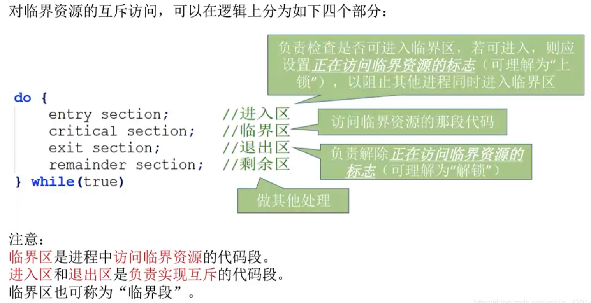
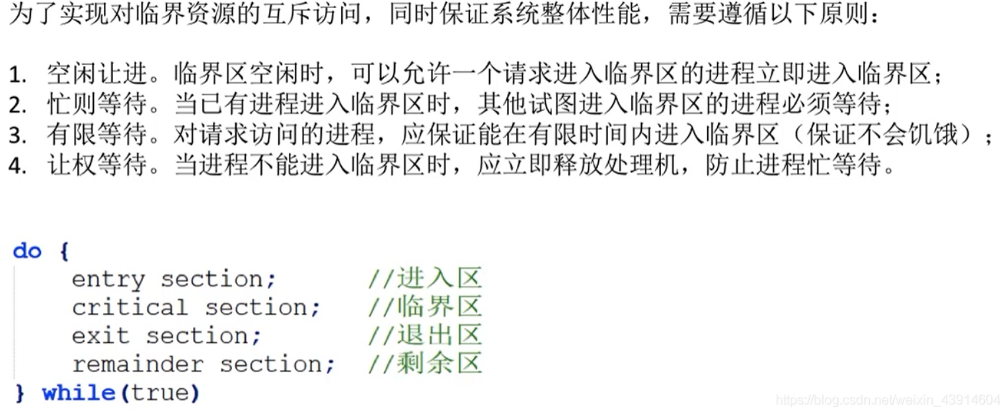
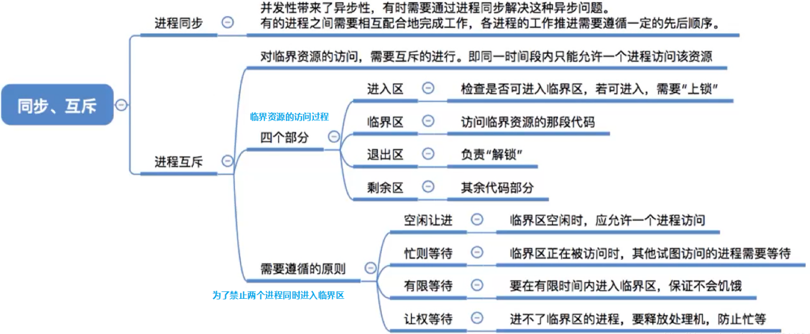

# 进程的同步、互斥

在多道程序环境下，进程是并发执行的，不同进程之间存在着不同的相互制约关系。

比如进程之间，可能存在着具有先后顺序才能正常运行的操作。
比如管道通信，两个进程的读和写是并发执行的，但写显然应该在读之后才能进行。

又比如两个进程争用同一临界资源，但显然不能同时给两个进程同时使用该临界资源。

进程同步的主要任务，就是对多个相关进程在执行次序上进行协调，使并发执行的程序能够按照一定的规则或时序共享系统资源，并且能够很好的相互合作。

也就是我们要想办法实现进程的同步与互斥，使之正常工作。

## 一. 两种形式的制约关系

### 1.1 同步

同步，又称直接制约关系。

进程之间，可能存在着具有先后顺序才能正常运行的操作。
比如管道通信，两个进程的读和写是并发执行的，但写显然应该在读之后才能进行。

直接制约关系，也就是源于进程间的相互合作。

所以进程同步就是为了解决进程的异步问题，按照正确的先后顺序来执行以正常地完成操作。

### 1.2 互斥

互斥，又称间接制约关系。

是指当一个进程欲访问某个临界资源时，需要等待正在使用该临界资源的进程使用完毕，退出后，才能访问。

图1.对临界资源的访问流程

在302中我已经讲过了临界资源、临界区。

图2.互斥访问的准则

为了实现对临界资源的互斥访问，应该遵循以下准则：

1. 空闲让进：临界区空闲时，可以运行一个请求临界区的进程立即进入临界区。
2. 忙则等待：当已有进程进入临界区时，其他试图进入临界区的进程必须等待。
3. 有限等待：对请求访问的进程，应该保证能在有限时间内进入临界区（保证不会饥饿）。
4. 让权等待：当进程不能进入临界区时，应立即释放处理机，防止进程忙等待。
   （忙等待就是指，该进程在等待，暂时无法继续执行下去了，但还占用着处理机。）

## 二. 本节回顾

图3.本节回顾

2020.10.07