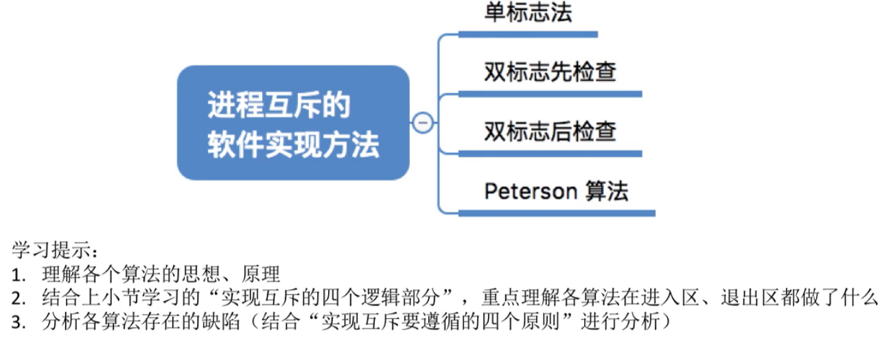
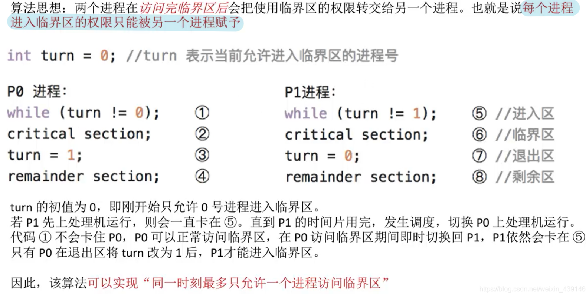
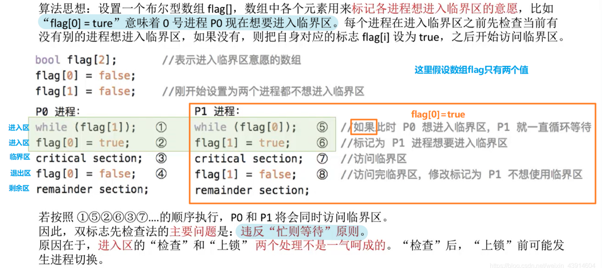
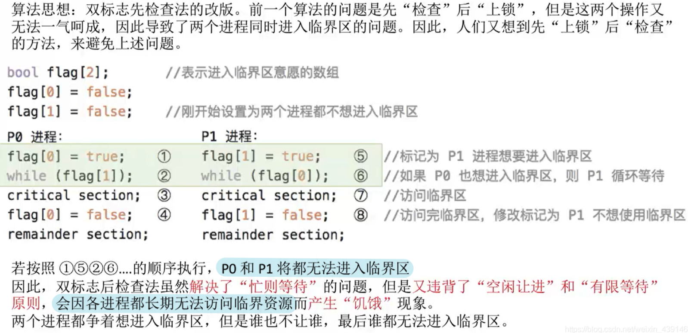
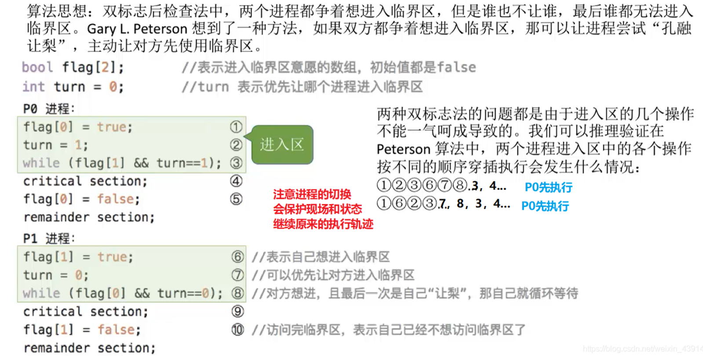
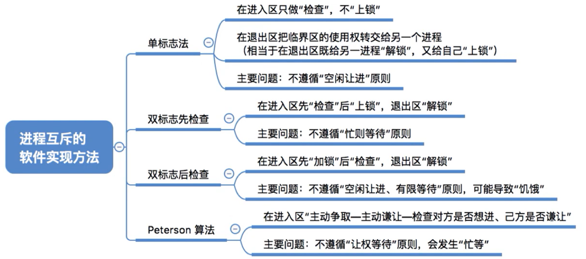

# 进程互斥的软件实现方法

图1.本节总览

## 一. 单标志法

图2.单标志法

看图2， $P_0,P_1$ 都想要访问临界资源，但只能够互斥访问。

于是设置变量turn=0，给每个进程的进入区的判断条件设置为不同的turn的值。

在这里以两个进程 $P_0,P_1$ 访问临界资源为例。

 $P_0$ 的进入区判断条件为0， $P_1$ 的进入区判断条件为1，一开始的turn=0，所以就算 $P_1$ 先运行，也不会进入临界区，在进入区循环判断，等到时间片使用完，切换到 $P_0$ ， $P_0$ 的可以进入临界区。

而 $P_0$ 的进入临界区，turn的值还未改变，比如 $P_0$ 进行的是I/O操作，在 $P_0$ 的临界区中，CPU又切换成 $P_1$ ，此时turn=0， $P_1$ 还是无法进入临界区。

由此实现了对临界资源的互斥访问。

在 $P_0$ 的退出区，才修改turn=1，这样 $P_1$ 就能够进入临界区，而期间 $P_0$ 无法进入了。

 $P_0$ 又在退出区修改turn=0......

图3.单标志法的问题

单标志法的问题是，在刚才的例子中，只举了两个进程 $P_0,P_1$ 互斥访问的情况，而实际上是有多个进程的。

如果 $P_0$ 长时间不访问临界区，或者 $P_0$ 长时间未被CPU调用。那么就会导致该临界资源长期空闲，但 $P_1$ 也无法使用。

违背了"空闲让进"的准则（也就是利用率不高）。

## 二. 双标志先检查

图4.双标志先检查

设置一个布尔型数组flag[]，通过数组中各元素来标记各进程是否有正在临界区的。
如果flag[]中有元素的值为true，说明有进程正在临界区。
如果flag[]中的元素的值都为false，说明没有进程在访问临界资源。

但注意，图4所示，双标志法中，进入区有判断和修改两个步骤。
所以如果一个进程判断可以进入临界区，但还未来得及修改flag[]，就切换为另一个欲访问同一临界资源的进程，那么切换到的进程判断也是可以进入临界区的。
这样就会导致多个进程同时访问临界资源的问题出现，违背了"忙则等待"准则。

主要问题在于判断（检查）和修改（上锁）可能不是连续完成的。

## 三. 双标志后检查

图5.双标志后检查

就是把顺序换了，变成先修改再判断。

先修改，即先把该进程对应的flag[]中的元素的值修改为true，在判断除了该元素外，其他元素有没有值为true的。
如果没有，则该进程进入临界区。
如果有，则一直等待到正在访问临界资源的进程退出，修改了true为false后，该进程才会通过判断。

但是，双标志后检查法会出现，可能一个进程只运行了先修改，还未来得及进行判断，就切换了，而切换到的欲访问同一临界资源的进程也会先进行修改，但判断无法进入临界区，会等待正在使用临界资源的进程退出，但实际上，此时并没有在访问临界资源的进程。而且这种情况下，原进程也无法通过判断，进入临界区了。

违背了"空闲让进"和"有限等待"的准则，可能会导致各个进程都长期无法访问临界资源，导致饥饿现象。

## 四. Peterson算法

图6.Peterson算法

还是先修改再判断。
但除了flag[]以外，判断条件新增了一个变量turn。

这个变量turn起到的作用是，让自己进入循环的判断条件之一，也就是为了实现当多个进程争用同一临界资源时，实现让步，一个进程会让给另一个进程进入临界区。

判断为，当flag[]其他进程的元素的值都为false，或当turn不为本进程的值时，进入临界区。

解释一下，
当进行判断时，turn为本进程的值，那么此时是否进入临界区就取决于flag[]其他进程的元素的值，有ture则不进入，都为false则进入。
当进行判断时，turn不为本进程的值，说明别的进程修改了turn的值，使得判断条件（turn=本进程的值）始终为0，起到了一个别的进程让本进程进入临界区的享过，于是进入临界区。

本质就是当一个进程修改了turn时，会使得别的进程的判断条件可以直接通过，进入临界区，但是自己只能通过判断flag[]其他进程的元素的值都为false才能进入临界区。

程序判断时，
turn为本程序的值表示，我要让你们，有人要用吗？（flag[]里面其他进程元素的值有ture吗？），没有的话我就进行临界区啦。
turn不为本程序的值（最后一次修改turn不是自己）表示，别人让我了呀，那我就直接进临界区啦。

Peterson算法，遵循了"空闲让进"，"忙则等待"，"有限等待"三个准则，但仍然未遵循"让权等待"的准则。
不过比起前面的三种算法，虽然不是最好，但已经好多了。

2021.07.15 简单的新理解：

while() 中的判断条件，只有四种状态，即：11，10，01，00。

当某进程执行了：flag[0]=true 后，就会使得除了该进程外的其他进程只会为 1x 的判断情况。

当无争抢时，即只有一个程序运行进入区的代码，其自身的判断情况必然是 0x，顺利进入临界区。

当有争抢时，即有多个程序并发运行进入区的代码，就会导致所有进程都是 1x 的判断情况。

而修改 turn 的代码，是使得本进程判断情况为 x1，其他进程为 x0。
而有争抢时，所有并发进入区的进程都是 1x。
所以有争抢时，修改 turn 是使得自己为 11，其他进程为 10，也就是使自己陷入循环，其他进程跳出循环。

## 五. 本节回顾

图7.本节回顾

2020.10.07

