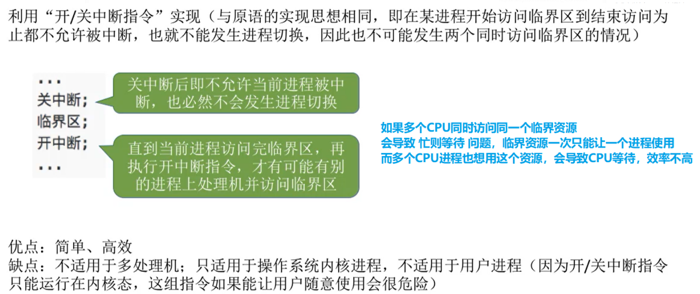
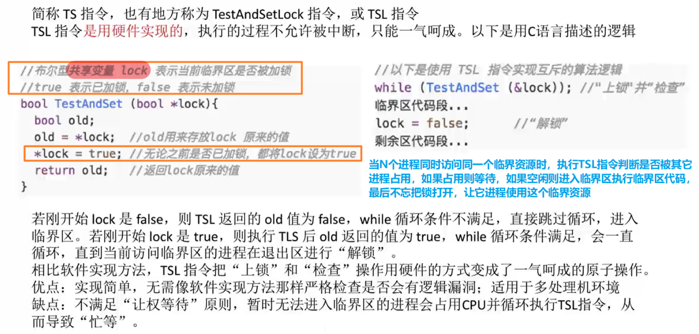
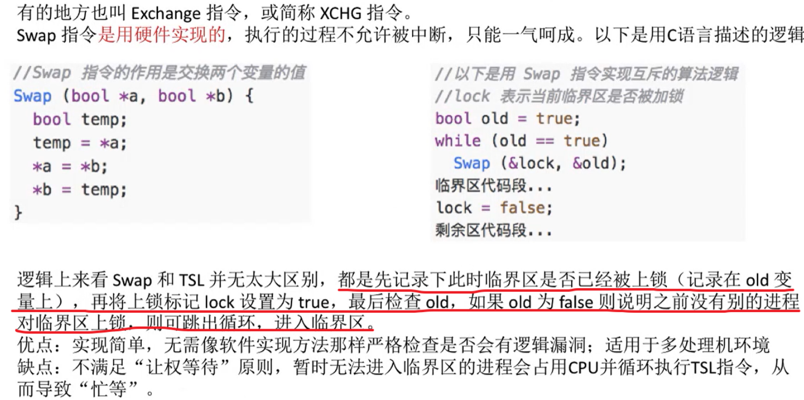
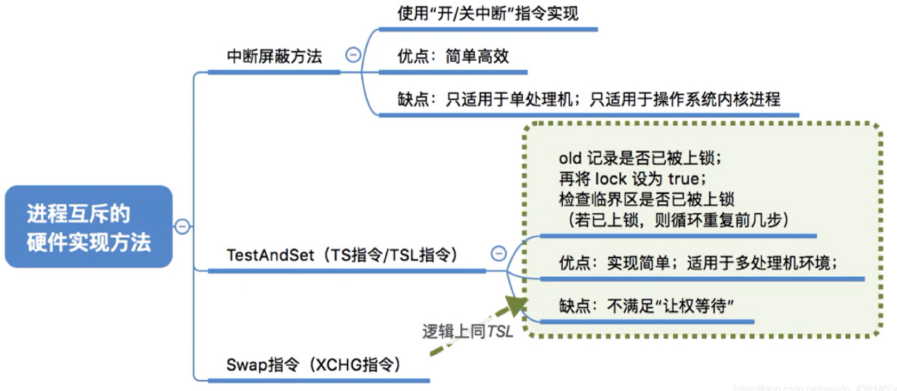

# 进程互斥的硬件实现方法

图1.本节总览

## 一. 中断屏蔽方法

图2.中断屏蔽方法

利用开/关中断指令实现，在开始访问临界区前关中断，访问临界区结束后开中断，以此保证在进程临界区中时，不会被中断，不会发生进程切换，也就不会出现多个进程同时访问临界区的情况。

优点：简单、高效。
缺点：不适用于多处理机（毕竟多核CPU，其他进程在其他CPU上运行也会出现多个进程同时访问同一临界资源的情况）；只适用于操作系统内核进程，不适用于用户进程（因为开/关中断指令种子能在内核态运行，而且开/关指令不能随便给用户用）。

## 二. TestAndSet指令（TS指令/TSl指令）

图3.TestAndSet指令

TestAndSet指令，简称

TS指令，又称TSL指令。

TS指令是用硬件实现的，其执行过程不允许被中断。

图3给出了C语言描述的逻辑，但只是用C语言来描述逻辑方便理解，TS指令本身是硬件实现的。

为每一个临界资源设置一个共享布尔变量lock，lock=true表示该临界资源正被占用，lock=false表示未被占用，初始值为false。
在进程访问临界资源前，使用TestAndSet指令检查和修改标志lock。

如图3左侧，TestAndSet指令，记录该临界资源修改前的lock到old，修改lock为true，返回old。
如果返回的old=false，则进程进入临界区；反之返回的old=true，则不进入临界区，进入循环，等到正在使用该临界资源的进程退出修改lock=false，才会判断进入。

通过硬件的方式，TS指令把上锁和检查的操作变为了原子操作。

优点：实现简单，无需像软件实现方法那样严格检查是否有逻辑漏洞；适用于多处理机环境。
缺点：不满足"让权等待"原子，暂时无法进入临界区的进程会占用CPU并循环执行TS指令，从而导致忙等待。

## 三. Swap指令（XCHG指令）

图4.Swap指令

Swap指令，又可叫做Exchangde指令、ECHG指令。

Swap指令是用硬件实现的，其执行过程不允许被中断。

同一图4是用C语言描述的逻辑。

为每一个临界资源设置一个共享布尔变量lock，lock=true表示该临界资源正被占用，lock=false表示未被占用，初始值为false。

在进程中又设置一个局部变量，图4这个变量名为old。

进程中先使old=true，然后在循环中，使用Swap指令将old与lock交换。
如果当前lock为false，则交换后old=false，进入临界区。
如果当前lock为true，则交换后old=true，进入循环，直到等到正在使用该临界资源的进程退出修改lock=false，才会判断进入临界区。

（感觉和TS指令区别不大。逻辑上差不多，就是实现方式略有区别。）

优缺点：同TS指令。

## 四. 本节回顾

图5.本节回顾

2020.10.07

