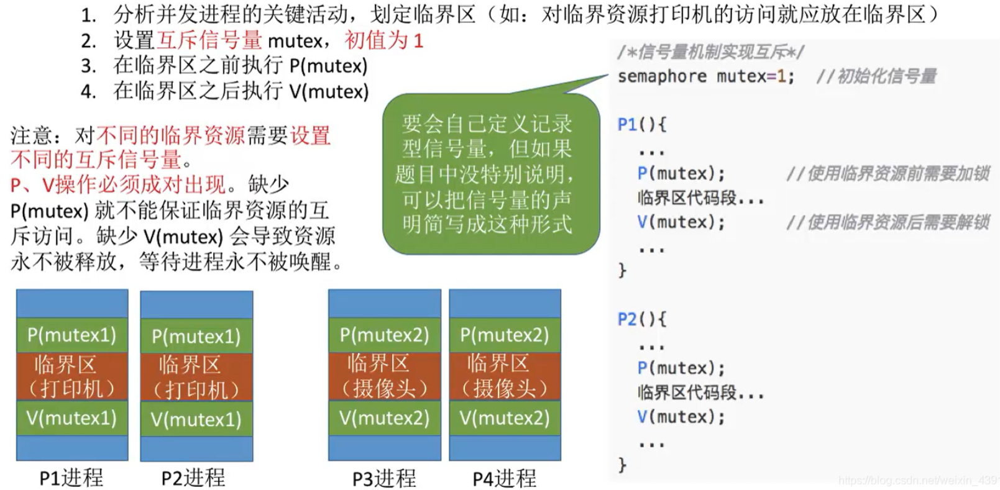
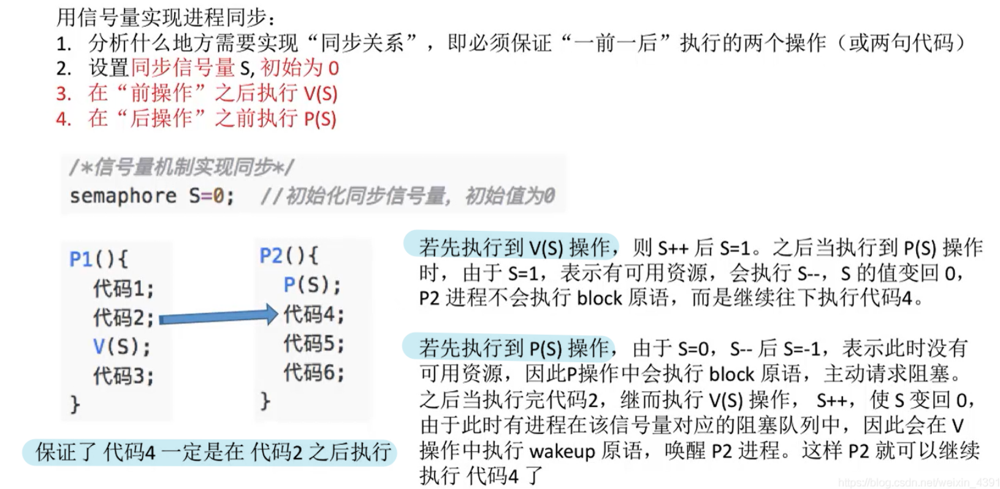
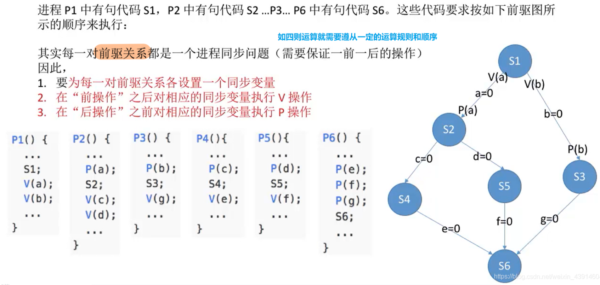
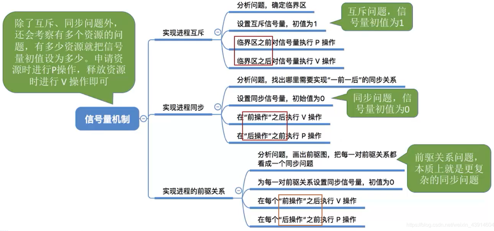

# 用信号量实现进程互斥、同步、前驱

图1.本节总览

## 一. 实现进程互斥

图2.实现进程互斥

实现进程互斥：

1. 分析并发进程的关键活动，划定临界区。

   就是找到一段代码，看作临界区。

2. 设置互斥信号，初始化。

   通常用mutex表示互斥信号， 这里假设只有一个该类型资源，于是初始化为1。

   如果题目没给特别说明，那就自己简单地定义出来，如图2右上方的semaphore mute=1。
   但是，要会定义记录型信息量，万一题目指明要定义记录型信息量呢。

   不同类型的资源是要设置不同互斥信号的，比如mutex1，mutex2......

3. 在临界区之前执行P操作。

4. 在临界区之后执行V操作。

   P、V操作必须成对出现，少了P操作无法保证临界资源互斥访问；少了V操作无法释放资源，等待进程无法被唤醒。

## 二. 实现进程同步

图3.实现进程同步

实现进程同步：

1. 分析什么地方需要实现同步关系，也就是一前一后的关系。

   图3里是代码2需要在代码4之前执行。

2. 设置同步信号量S，初始化

   **信号量初始化为0**。

3. 在前操作之后执行V操作

4. 在后操作之前执行P操作

   如果先执行的V(S)，S++，到 $P_2$ 进程时，P(S)，S=1，可以继续往下执行代码4......
   如果先执行的P(S)，S=0，无资源，阻塞进入阻塞队列，只有当V(S)执行之后，才会从阻塞队列中调入就绪队列等待执行。

这样就实现了程序的同步关系。

## 三. 实现进程前趋

图4.实现进程前趋

前驱就是多个进程的同步关系。

进程 $P_1$ 中有语句 $S_1$ ，进程 $P_2$ 中有语句 $S_2$ ，......，进程 $P_6$ 中有语句 $S_6$ 。
其运行顺序为图4的前趋图顺序，箭头方向是执行顺序，也就是箭头指向后执行的。

实现进场前趋：

1. 为每一对前驱关系分别设置不同的一个同步信号量。

2. 在前操作之后对相应的同步变量执行V操作。

   如图4，根据前趋图， $S_1$ 后应执行V(a)，V(b)， $S_2$ 后应执行V(c)，V(d)， $S_3$ 后应执行V(g)， $S_4$ 后应执行V(e)， $S_5$ 后应执行V(f)。

   V操作的顺序是无所谓的，比如 $S_1$ 后应执行V(a)，V(b)，是ab还是ba的顺序都行。

3. 在后操作之前对相应的同步变量执行P操作。

    $S_2$ 前应执行P(a)，P(b)， $S_3$ 前应执行P(b)， $S_4$ 前应执行P(c)， $S_5$ 前应执行P(d)， $S_6$ 前应执行P(e)，P(f)，P(g)。

   在这里的P操作的顺序是无所谓的，比如 $S_2$ 前应执行P(a)，P(b)，是ab还是ba的顺序都行。
   下一节的进程同步与互斥的经典问题，会遇到P操作的顺序还是有讲究的。

## 四. 本节回顾

图5.本节回顾

2020.10.07