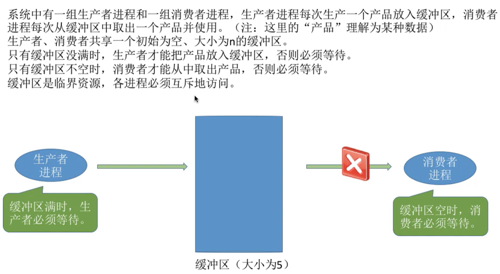
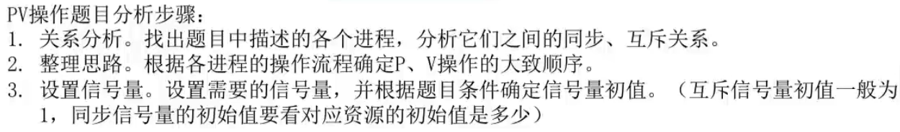
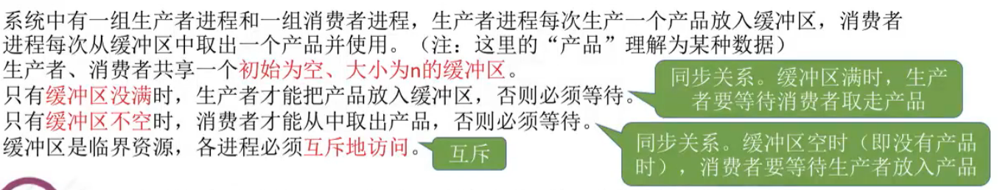
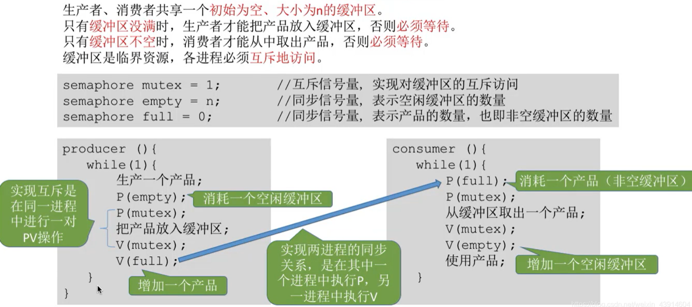
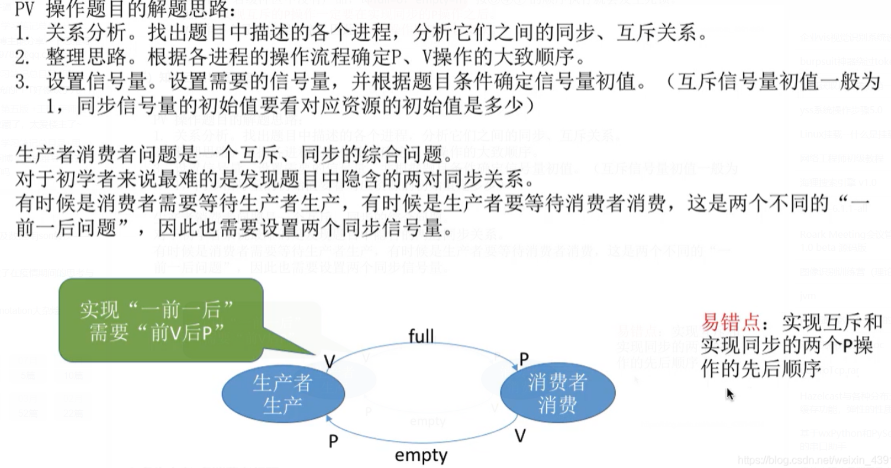

# 单生产者-单消费者问题

## 一. 问题描述

图1.问题描述

这里只考虑单个生产者，单个接收者。

缓冲区初始为空，大小为n，生产者每次可以放入1，不空的时候，消费者每次可以取走1。

## 二. 分析问题

图2.分析步骤

图2.分析关系

分析生产者和消费者之间的关系。

互斥：缓冲器为临界资源，需要互斥访问。
同步：当缓冲区不空时，消费者才能读走。
同步：当缓冲区不满时，生成者才能写入。

所以需要一个互斥信号量，两个同步信号量。

~~~C
semaphore mutex=1//互斥信号量
semaphore full=0//同步信号量，表示缓冲区中的产品数量，初始值为0
semaphore empty=n//同步信号量，表示缓冲区中空闲位置的数量，初始值为n
~~~

## 三. 实现

先写出生产者和消费者的最简单的操作。

~~~C
producer(){
	while(1){
        生产一个产品;
		放入缓冲区;
	}
}

consumer(){
	while(1){
		从缓冲区取出一个产品;
        使用一个产品;
	}
}
~~~

分析一下。
放入缓冲区前，需要检查有没有空位，也就是需要消耗一个缓冲区。所以

~~~C
		P(empty)//减少一个空位
		放入缓冲区；
~~~

自然释放这个资源，就是从缓冲区中取出一个产品：

~~~C
		从缓冲区取出一个产品;
		V(empty)//增加一个空位
~~~

同样，从缓冲区取出一个产品前，需要缓冲区有产品：

~~~C
		P(full)//减少一个产品，
		从缓冲区取出一个产品;
		V(empty)//增加一个空位
~~~

那么释放这个full：

~~~C
		P(empty)//减少一个空位
		放入缓冲区；
		V(full)//增加一个空位
~~~

还有一个互斥访问的互斥信号量，**注意**了，并不是直接分别包起来就好了，而是**互斥信号量的P操作要在同步信号量之后**：

~~~C
producer(){
	while(1){
        生产一个产品;
		P(empty)//减少一个空位
		P(mutex)
		放入缓冲区；
		V(muteX)
		V(full)//增加一个空位
	}
}

consumer(){
	while(1){
		P(full)//减少一个产品，
		P(mutex)
		从缓冲区取出一个产品;
		V(muteX)
		V(empty)//增加一个空位
        使用一个产品;
	}
}
~~~

图4.实现

如果，互斥在同步之前，会发生**死锁**，就是卡住了。如：

~~~C
producer(){
	while(1){
        生产一个产品;
		P(mutex)//第三次执行该句，mutex变为-1，进入阻塞队列，等待V(mutex)
		P(empty)//减少一个空位
		放入缓冲区；
		V(full)//增加一个空位
		V(muteX)
	}
}

consumer(){
	while(1){
		P(mutex)//当empty=n，full=0时，第一次执行该句，mutex变为0
		P(full)//减少一个产品，第二次执行该句，full变为-1，进入阻塞队列，等待V(full)
		从缓冲区取出一个产品;
		V(empty)//增加一个空位
		V(muteX)
        使用一个产品;
	}
}
~~~

所以啊！**互斥信号量的P操作要在同步信号量的P操作之后**，当然V操作的顺序无所谓，毕竟是释放资源。

还有就是，生产/使用一个产品没必要放入P、V操作之间，因为本身生产/使用一个产品是不用到临界资源的，如果放进去，那相当于是在临界区中加了不必要的操作，增加了临界区的占用资源的时间。

## 四. 本节回顾

图5.本节回顾

易错点：互斥P操作应该在同步P操作的后面。

2020.10.07