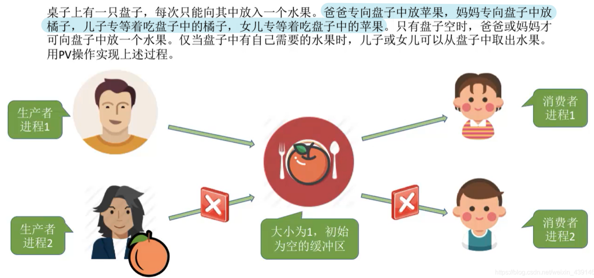
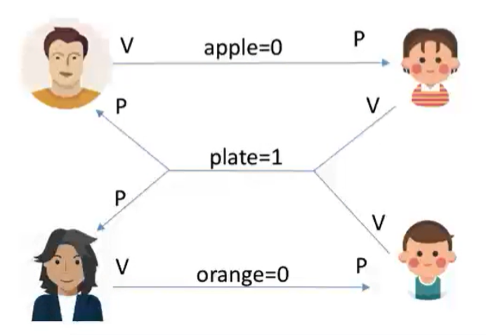
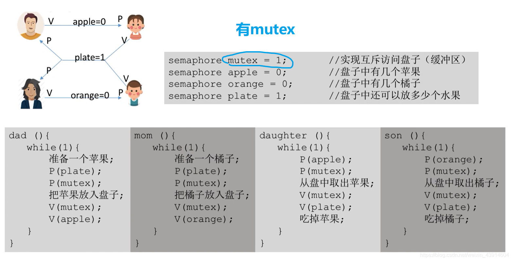
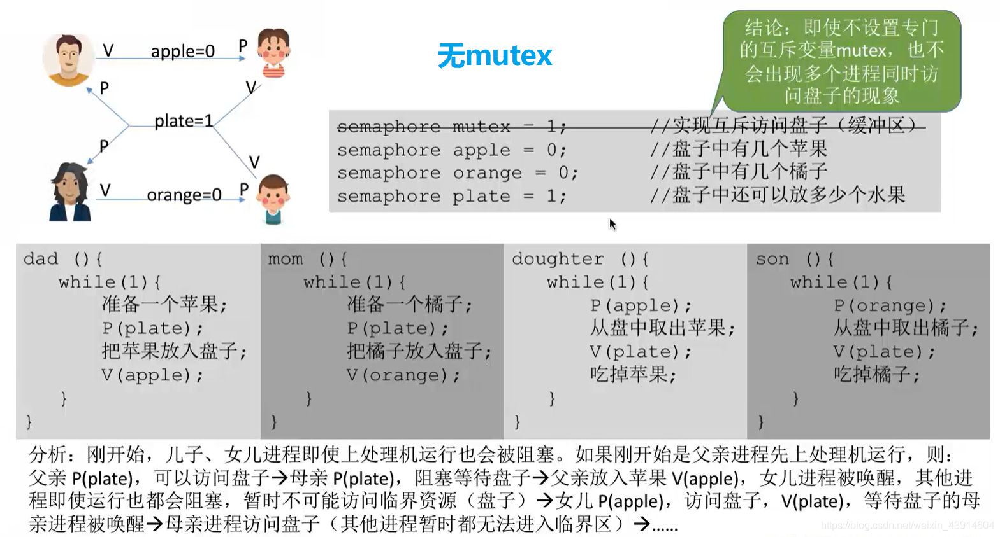
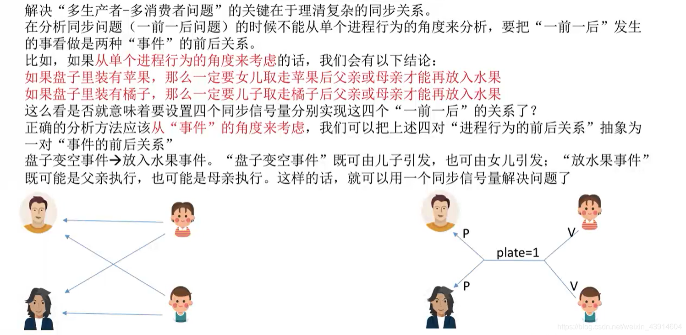

# 多生产者-多消费者问题

## 一. 问题描述

图1.问题描述

两个生产者，两个消费者，分别生产/消费橘子或苹果，缓冲区大小为1，初始为0。

## 二. 分析问题

四者存在互斥，
苹果生产者和苹果消费者存在同步，
橘子生产者和橘子消费者存在同步，
盘子为空时，才能放入水果，即盘子为空与橘子、苹果生产者存在同步。

~~~C
semaphore mutex = 1;//互斥信号量
semaphore apple = 0;//缓冲区中苹果数量
semaphore orange = 0;//缓冲区中橘子数量
semaphrore plate = 1//盘子的空位
~~~

图2.画个前趋图

## 三. 实现

写出来就是：

~~~C
apple(){
    while{
        准备一个苹果;
		P(palte);//申请占用盘子中的空位，空位-1
		P(mutex);//申请使用盘子，盘子-1
		放入一个苹果;
		V(mutex);//释放盘子，盘子+1
		V(apple);//苹果+1
    }
}
orange(){
	while(1){
		准备一个橘子;
		P(palte);//申请占用盘子中的空位，空位-1
		P(mutex);//申请使用盘子，盘子-1
		放入一个橘子;
		V(mutex);//释放盘子，盘子+1
		V(orange);//橘子+1
    }
}

take_out_apple(){
	while(1){
		P(apple);//申请占用一个苹果，苹果-1
		P(mutex);//申请使用盘子，盘子-1
		拿走一个苹果;
		V(mutex);//释放盘子，盘子+1
		V(plate);//空位+1
		吃掉苹果;
	}
}
take_out_orange(){
	while(1){
		P(orange);//申请占用一个橘子，橘子-1
		P(mutex);//申请使用盘子，盘子-1
		拿走一个橘子;
		V(mutex);//释放盘子，盘子+1
		V(plate);//空位+1
		吃掉橘子;
	}
}
~~~

图3.有互斥信号量mutex

不过，这题实际上不用mutex也不会出现死锁。

图4.无互斥信号量mutex

主要是因为盘子的空位只有1个，所以plate、apple、orange同时只会有一个为1，意味着即便去掉mutex，同时也只会有一个进程的P操作会通过，能起到互斥的作用。

如果缓冲区的大小为2，那么就必须要互斥信号量了。
因为此时如果不使用互斥信号量来实现互斥访问的话，plate可以减2次到0，也就是同时可能有两个进程通过P(plate)，即苹果和橘子生产者可能同时访问缓冲区，导致数据覆盖。

## 四. 本节回顾

图5.本节回顾

2020.10.08

