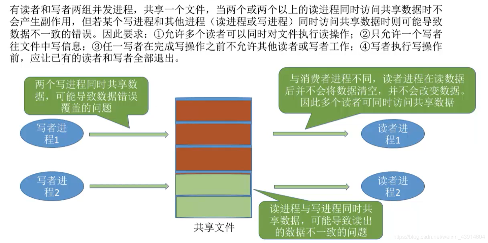
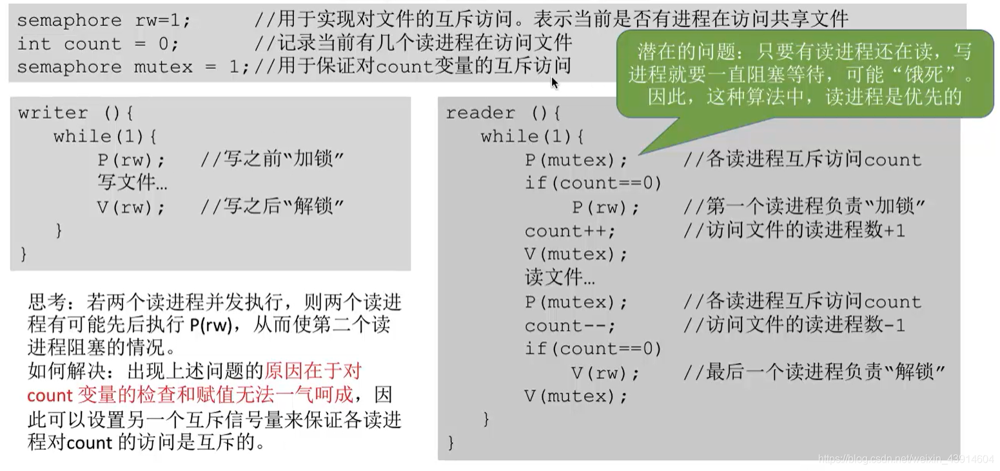
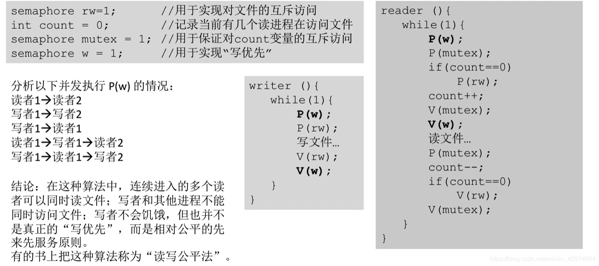

# 读者-写者问题

## 一. 问题描述

图1.问题描述

写进程和写进程互斥、写进程和读进程互斥，读进程与读进程不互斥。
同时只能一个写进程写操作。
同时可以多个读进程读操作。
写操作前，已有读进程、写进程要退出。

## 二. 分析问题

互斥：写进程-写进程，写进程-读进程。
同步：共享文件有空位-写进程，贡献文件有内容-读进程。

由于读进程之间是可以同时读的，

~~~C
semaphore rw = 1;//互斥信号量，共享文件的资源。
int count = 0;//记录有多少个读进程要访问共享文件，
semaphore mutex = 1;//对count的互斥信号量
~~~

## 三. 实现

~~~c
writer(){
	while(1){
		P(rw)//申请共享文件资源
			写文件;
		V(rw)//释放共享文件资源
	}
}
reader(){
	while(1){
		P(mutex);		//表明占用count资源
		if(count==0)	//如果count为0，说明没有其他读进程，如果count不为0，则可以直接去读
			P(rw);		//申请占用共享文件，加锁，使得与写进程互斥
		count++;		//count加1，说明有一个读程序想要占用共享文件。
        V(mutex);		//释放count，使得其他读进程可以占用count，使count+1，
        
        读文件;
        
        P(mutex);		//读完了，占用count
		count--;		//修改count，数量减1
		if(count==0)	//如果count为0说明没有读进程占用共享文件了
			V(rw);		//释放共享文件资源，使得写进程可以进行操作
		V(mutex);		//释放count，
	}
}
~~~

图2.实现

但是这样存在一个问题，当读进程太多，源源不断的时候，会导致写进程饥饿。本质上是读进程优先的。

所以解决这个问题，新加一个变量：

~~~C
semaphore w = 1;
~~~

变为：

~~~C
writer(){
	while(1){
		P(W)；
		P(rw)//申请共享文件资源
		写文件;
		V(rw)//释放共享文件资源
		V(W);
	}
}
reader(){
	while(1){
	
		P(W);
		P(mutex);		//表明占用count资源
		if(count==0)	//如果count为0，说明没有其他读进程，如果count不为0，则可以直接去读
			P(rw);		//申请占用共享文件，加锁，使得与写进程互斥
		count++;		//count加1，说明有一个读程序想要占用共享文件。
		V(mutex);		//释放count，使得其他读进程可以占用count，使count+1，
		V(W);
		
		读文件;
		
		P(mutex);		//读完了，占用count
		count--;		//修改count，数量减1
		if(count==0)	//如果count为0说明没有读进程占用共享文件了
			V(rw);		//释放共享文件资源，使得写进程可以进行操作
		V(mutex);		//释放count，
	}
}
~~~

图3.实现

这样，使得读/写是公平的。

## 四. 本节回顾

图4.本节回顾

使用计数器来实现多个进程共享文件。
遇到多进程共享文件时，考虑读者-写者问题模型。

2020.10.08

