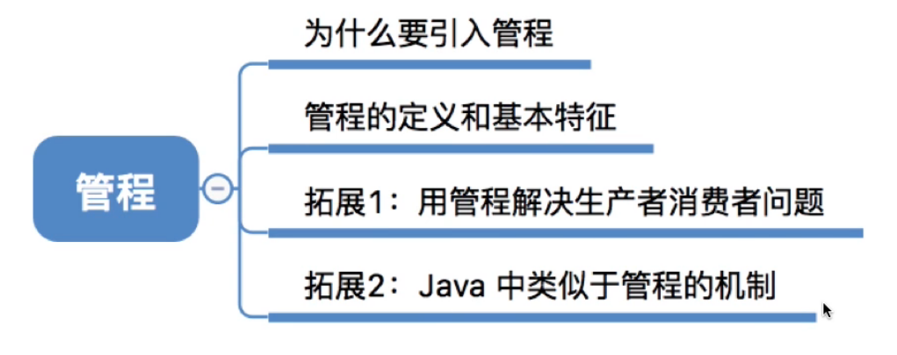
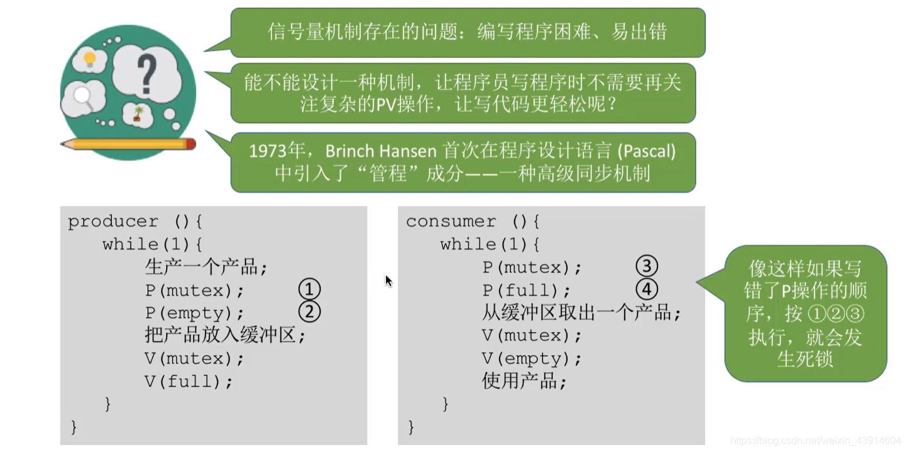
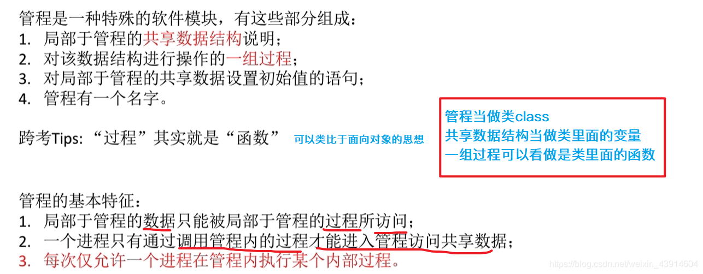
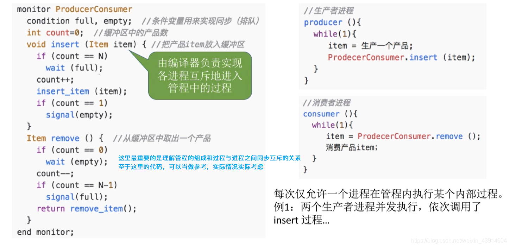
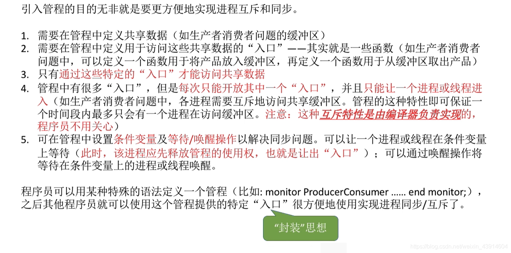
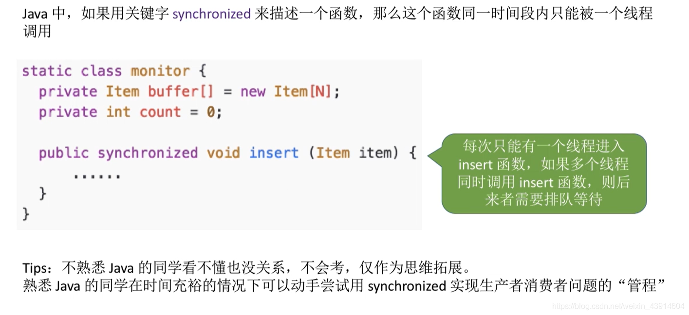
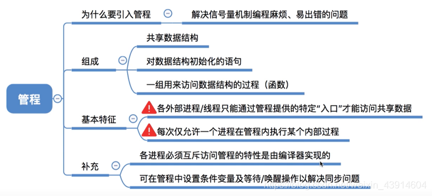

# 管程

图1.本节总览

## 一. 为什么要引入管程

图2.为什么要引入管程

就是手动写信号量机制也太烦了吧，一不小心写错了就可能死锁。

所以引入了管程。

管程嘛，管理这些同步的、互斥的进程嘛。

## 二. 管程的定义与基本特征

图3.管程的定义与基本特征

管程的定义：

管程是一种特殊的软件模块，由以下部分组成：

1. 管程的名称；
2. 局部于管程内部的共享数据结构说明；
3. 对该数据结构进行操作的一组过程；
4. 对局部于管程内部的共享数据设置初始值的语句；

（感觉有点像C++里面的类class）

管程的基本特征：

1. 局部于管程的数据只能被局部于管程的过程所访问；
2. 一个进程只有通过调用管程内的过程才能进入管程访问共享数据；
3. 每次仅允许一个进程在管程内执行某个内部过程。

（感觉是真像C++里面的类class，
一个管程=一个定义好的类class，
对该数据结构进行操作的一组过程=class里面的各种函数，
对局部于管程内部的共享数据设置初始值的语句=class里面的一些初始化语句。
就是封装嘛。）

## 三. 用管程来实现生产者-消费者问题

图4.管程实现生产者-消费者问题

图4中只是用的类C语言来描述这个逻辑。实则并非一个编程语言。

~~~C
monitor ProducerConsumer//用提供的关键字来定义一个管程，管程名字为ProducerConsumer
    condition full,empty//条件变量，用来实现同步（排队）
    int count = 0;//缓冲区种的产品数
	//还需要定义一些对缓冲区进行描述的数据结构，但为了方便这里省掉了。
	void insert(Item item){//把产品放入缓冲区
        if(count == N)
            wait(full)
        count++;
        insert_item(item)
    	if(count == 1)
            signal(empty)
    }
	Item remove(){//从缓冲区中取出一个产品
        if(count == 0)
            wait(empty);
        count--;
        if(count == N-1)
            signal(full);
        return remove_item();
    }
end monitor;
~~~

所以看图4右方，生产者和消费者进程进行放入或取出的操作，都是直接调用管程中定义好的函数就行了。

感觉就是封装好了，我们用的时候把参数改成自己的就行。

关于互斥的进入管程，在编译的时候，编译器负责实现各进程互斥的进入管程。

各个进程只能串行执行管程内的过程。

条件变量condition，用于进程的阻塞，唤醒操作，解决同步问题。
上面类C语言中条件变量为full,empty，代码中调用wait()，signal()来实现同步。

**注意**，管程中的 signal(condition) 操作是将 condition 等待队列中的一个阻塞进程唤醒，如果该 condition 对应等待队列为空，则该 signal(condition) 相当于一个空操作。

这里是想说明，管程中的 signal(condition) 和信号量机制中的 signal(S) 是不同的。
信号量机制中的 signal(S)，无论如何都会使 S++，而不会是一个空操作。

总结一下

引入管程的目的是更方便地实现进程互斥与同步。

1. 需要在管程中定义共享数据（比如缓冲区）

2. 需要在管程中定义用于访问这些共享数据的"入口"。

   本质就是一些函数，函数里面又有一些语句。

3. 只有通过这些特定的"入口"才能访问共享数据，进行操作。

4. 管程中由很多"入口"，每次只能开放其中一个"入口"，并且只能让一个进程或线程进入。

   这种互斥是由编译器实现的，程序员不用关心。

5. 可在管程中设置条件变量及等待/唤醒操作以解决同步问题。

   进程或线程等待时，放弃管程的使用权。通过唤醒操作可以将等待在条件变量上的进程或线程唤醒。

程序员可以用某种特殊的语法定义一个管程，之后就可以使用管程的"入口"来方便的实现进程同步、互斥了。

## 四. Java中类似管程机制

Java中类似管程机制

（虽然我还没学过Java）

Java中如果用synchronized来描述一个函数，那么这个同一时间段内只能被一个线程调用。

## 五. 本节回顾

图7.本节回顾

2020.10.08