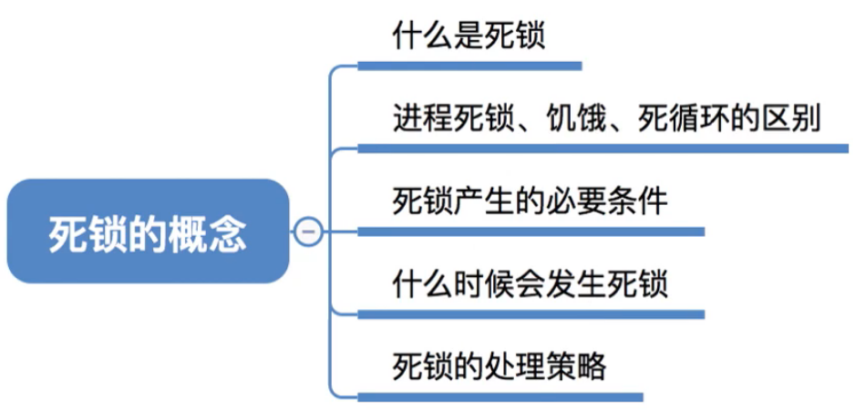
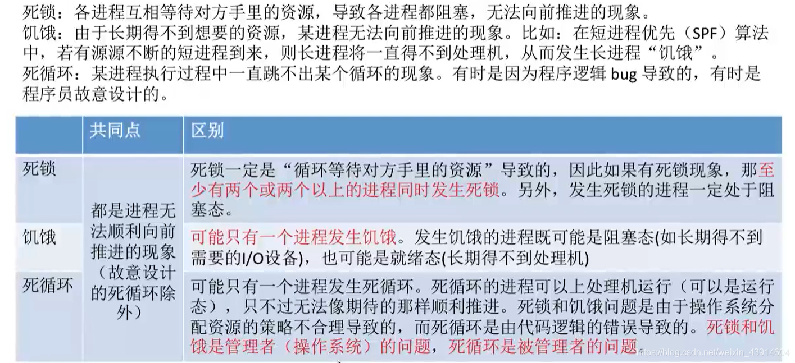
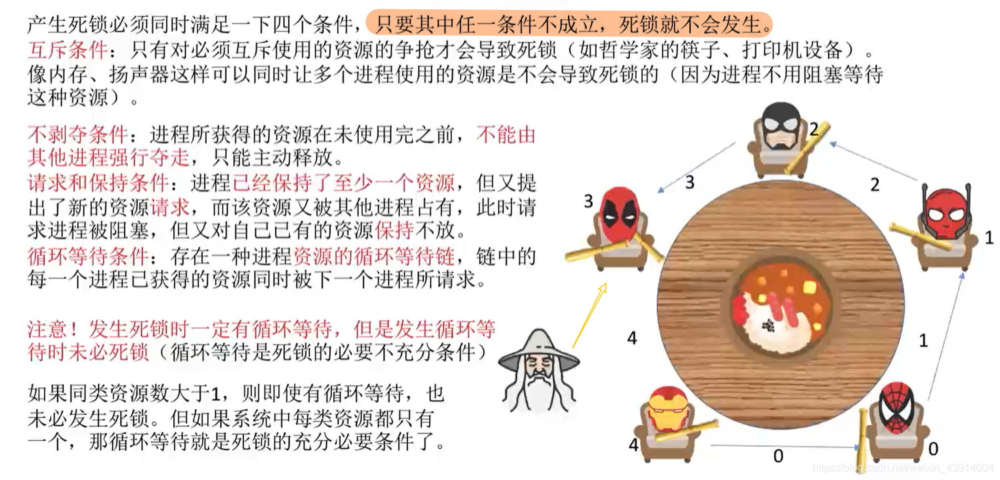
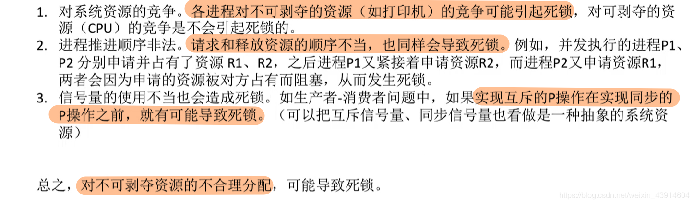
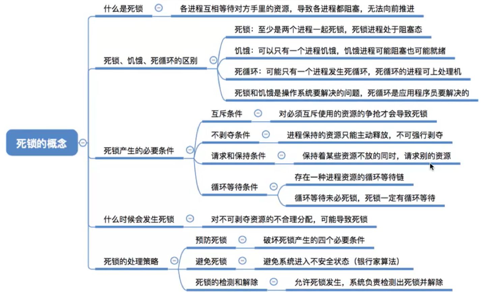

# 死锁的概念

图1.本节总览

## 一. 什么是死锁

在多道程序系统中，多个进程因为竞争资源而造成的一种僵局（互相等待），如果无外力作用，这些进程都将无法向前推进。

## 二. 进程死锁、饥饿、死循环的区别

图2.死锁、饥饿、死循环

都是进程无法顺序向前推进（当然，不包括故意设置的死循环）

死锁：
两个或两个以上进程循环等待对方的资源才会发生死锁，发生死锁的进程一定在阻塞态。

饥饿：
饥饿可能是长期处于阻塞态（如长期得不到I/O设备），也可能是就绪态（长期得不到处理机）

死循环：
死循环是由代码的逻辑错误导致的。可以是运行态。
死锁和饥饿是操作系统（管理者）的问题，死循环是......呃......是我（被管理者）的问题。

## 三. 死锁产生的必要条件

图3.死锁的必要条件

产生死锁有四个必要条件，只要有一条不满足，就不会发生死锁：

1. 互斥条件：

   只有对必须互斥访问的资源的争夺才会导致死锁。

2. 不剥夺条件：

   进程所获得的资源在未使用完前，不能由其他进程强行夺走，只能主动释放。

3. 请求和保持条件：

   进程已经保持了至少一个资源，同时又提出了新的资源请求，新的资源被其他进程占有，虽然该进程进入阻塞态，但本身已有资源仍保持使用权。

4. 循环等待条件：

   存在一种进程资源的等待循环链，链中的每一个进程已获得的资源同时被下一个进程所请求。

这是必要条件，有死锁一定有循环等待，但有循环等待无法推出死锁。

如果同类资源数大于1，即便有循环等待，也未必发生死锁。
A和B争多个同类资源中仅剩余的未被占用的一个资源，循环等待，好像是死锁了，但是只要有用完了被占用资源的C退出了，AB就往前推进了。

如果同类资源只有1个，那循环等待和死锁就是充分必要条件。
A和B争唯一个资源，循环等待，死锁了。

## 四. 什么时候会发生死锁

图4.可能发生死锁的情况

可能发生死锁的情况：

1. 对系统资源的竞争：

   对不可剥夺资源的进程，可能引起死锁。
   对可剥夺资源（如CPU），不会引起死锁。

2. 进程推进顺序非法

   请求和释放资源的顺序不当，可能导致死锁。
   比如两进程分别占有各自资源，又申请对方的资源。

3. 信号量的使用不当

   如互斥的P操作应该在同步的P操作之后，否则可能导致死锁。

总结就是，对不可剥夺资源的不合理分配，可能导致死锁。

## 五. 死锁的处理策略

图5.死锁的处理策略

死锁的处理策略：

1. 预防死锁

   破坏死锁产生的四个必要条件中的一个或几个。

2. 避免死锁

   用某种方法防止系统进入不安全状态，从而避免死锁（银行家算法）。

3. 死锁的检测和解除

   允许死锁发生，但操作系统会负责检测出死锁的发生，然后采取某种措施解除死锁。

## 六. 本节回顾

图6.本节回顾

2020.10.08