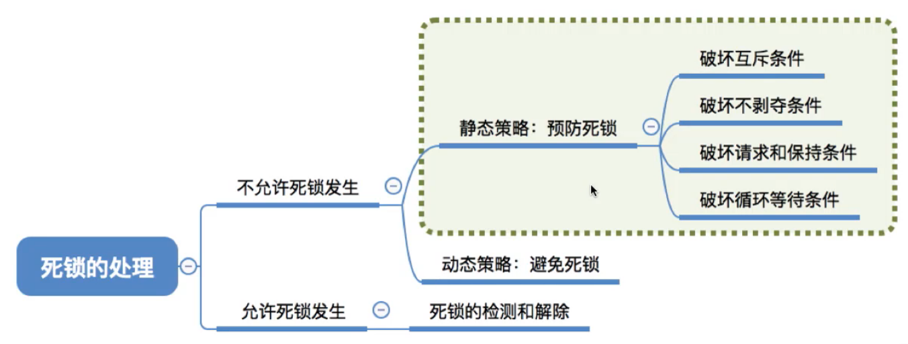
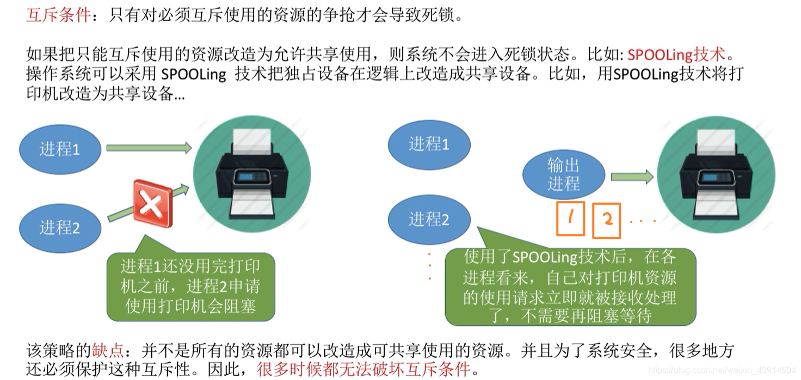
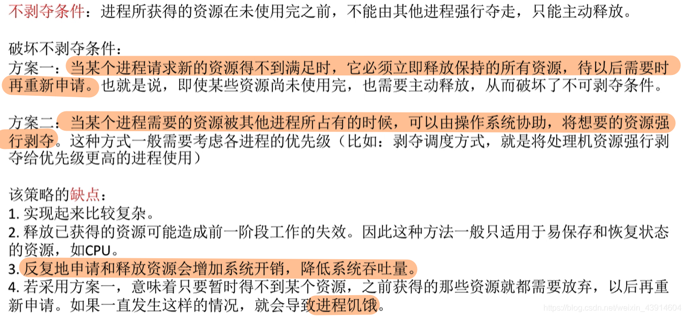
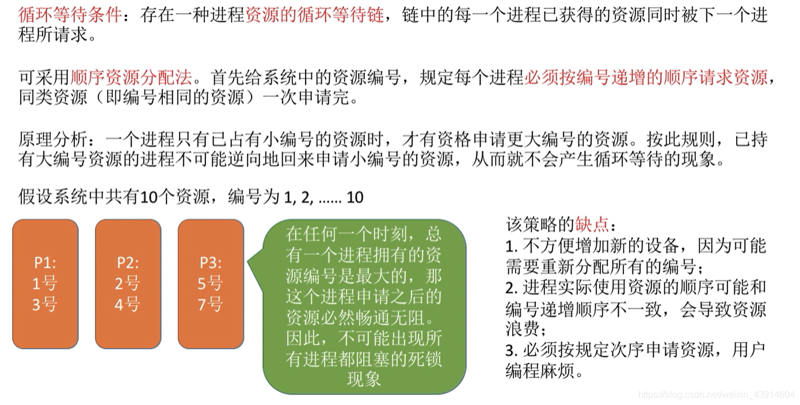
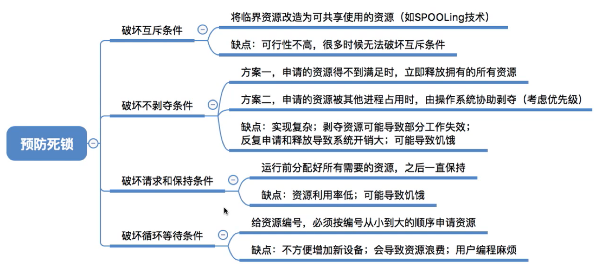

# 死锁的处!理策略-预防死锁

图1.本节总览

本节讲述图1中，预防死锁的部分，方法是通过破坏死锁的四个必要条件从而避免死锁。

## 一. 破坏互斥条件

图2.破坏互斥条件

互斥条件：只有对必须互斥访问的资源的争抢才会导致死锁。

所以，通过一些技术，将原本只能互斥访问的资源，改为可以共享使用。
比如SPOOLing技术，现在进程1，进程2都申请使用打印机，但是它们的请求的作业都是交个输出进程。然后它们就可以去接着做自己的事情了，由输出进程来依次控制打印机输出。

缺点：很明显嘛，不是所有的互斥资源都可以改造成可共享使用的资源。并且为了系统安全，很多地方还必须保护这种互斥性。
因此，很多时候都无法破坏互斥条件。

## 二. 破坏不剥夺条件

图3.破坏剥夺条件

不剥夺条件：当进程所获得的资源未使用完成前，不能被其他进程强行夺走，只能主动释放。

破坏方法：

1. 方案一：当某个进程申请新资源，但暂时得不到满足，则释放已有所有资源，即便这些资源还没使用完，也释放，等以后需要时再申请。

2. 方案二：当某个进程需要的资源被其他程序占有时，可由操作系统协助，将想要的资源强行剥夺。

   这种方式一般需要考虑各个进程的优先级。（比如剥夺调度方式，将处理机资源强行剥夺给优先级更高的进程使用）

缺点：

1. 实现起来比较复杂。
2. 释放已有资源，可能导致进程一段工作的失效。所以一般用于易保存和恢复状态的资源，如CPU。
3. 反复的申请和释放资源会增加系统开销，降低系统吞吐量。
4. 如果采用方案一，可能导致，进程申请A，放弃BCD，申请B放弃ACD，申请C，放弃ABD......导致饥饿。

## 三. 破坏请求和保持条件

图4.破坏请求和保持条件

请求和保持条件：进程已有至少一个资源，又请求新的资源，而请求的资源正被其他进程占有，此时进程被欸阻塞，但对已有资源保持不释放。

可以采用**静态分配方法**，即资源在运行前就一次申请完它所需的全部资源。在它的资源未满足前，不进入运行。但一旦运行后，在此期间这些资源就一直归它所有，该进程就不会请求别的新的资源了。

缺点：申请的资源，有些可能只会用很短时间，但仍然长期占用着。造成资源严重浪费，资源利用率低。
也可能导致某些进程饥饿，比如进程需要的资源多，可能长期无法凑齐所有资源，如图4，C进程需要资源1和资源2，但A进程只需要资源1，B进程只需要资源2，导致C进程长期无法凑齐所有资源而饥饿。

## 四. 破坏循环等待条件

图5.破坏循环等待条件

循环等待条件：存在一种进程资源的循环等待链，链中的每一个进程已获得的资源同时被下一个进程所请求。

可采用**顺序资源分配法**。首先给系统中的每类资源编号，规定每个进程必须按照编号递增的顺序请求资源，同类资源（即编号相同的资源）一次申请完。

这样，当一个进程申请资源时，从编号小的资源开始申请，当已经占有了该资源后，才申请编号更大的资源。由此，已拥有大编号资源的进程，是不会回头申请小编号的资源的，所以不会形成资源的循环等待链。

缺点：

1. 不方便再增加新的设备，因为可能需要重新分配编号。
2. 进程时机使用资源顺序可能和编号递增顺序不一致，导致资源浪费。
3. 必须按规定次序申请资源，用户编程麻烦。

## 四. 本节回顾

图6.本节回顾

2020.10.08