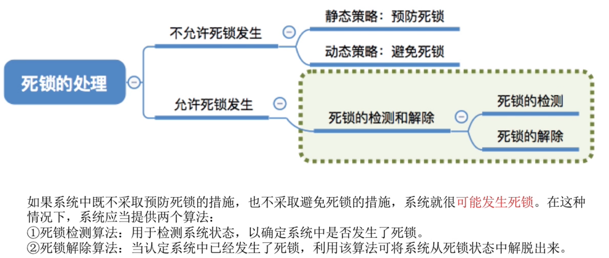
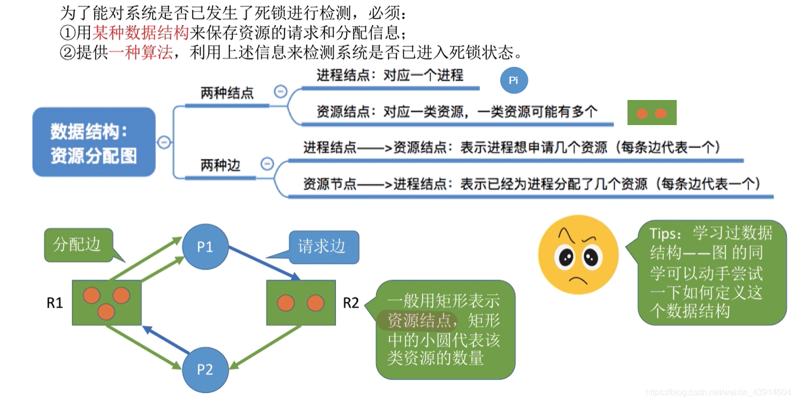
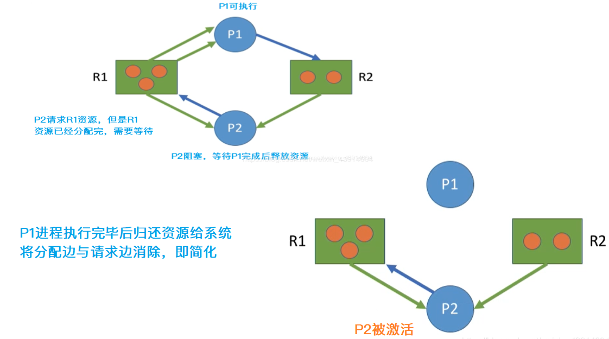
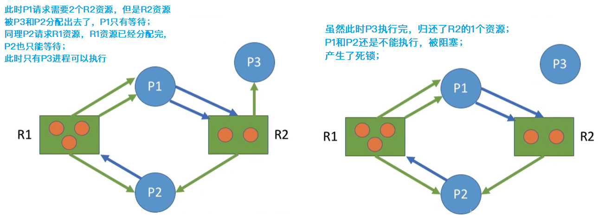
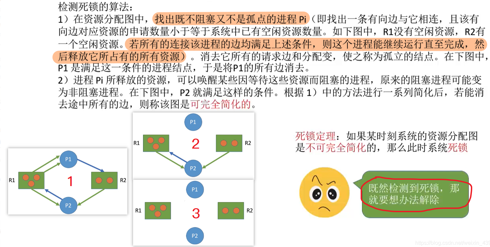
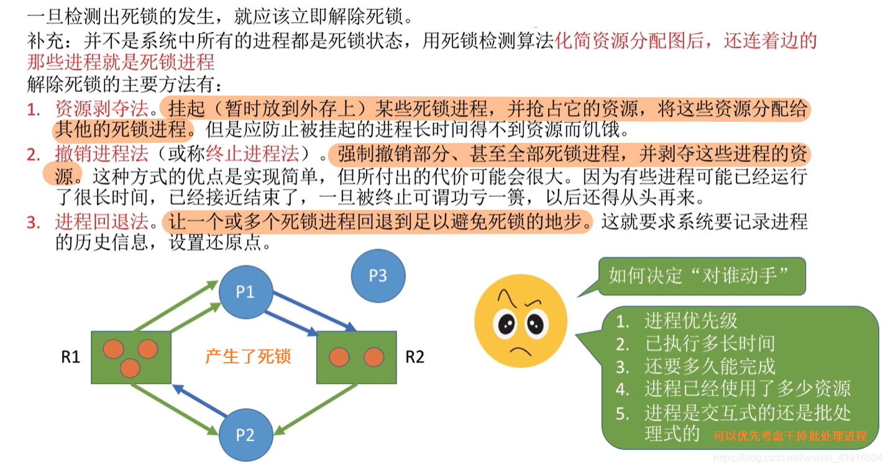
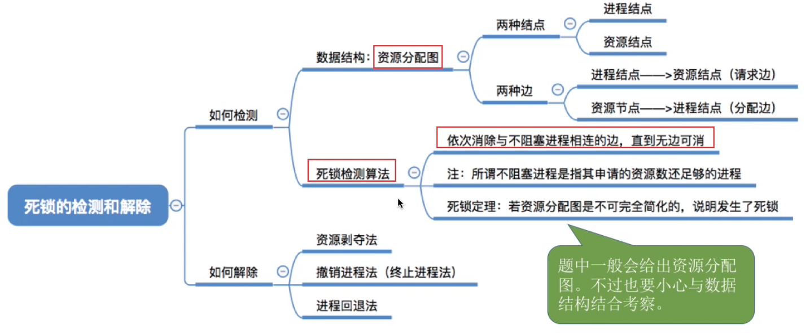

# 死锁的处理策略-检测和解除死锁

图1.本节总览

允许死锁发生，但通过检测死锁，解除死锁，使进程顺利进行。

## 一. 死锁的检测

### 1.1 死锁/非死锁的情况

图2.检测死锁的数据结构

系统死锁，可以利用资源分配图来描述。

该资源分配图中有两种节点：

1. 进程节点：对应一个进程， 用圆圈表示。
2. 资源节点：对应一类资源，用方框表示。方框中的小圆表示该类资源数量。

有两种边：

1. 请求边：进程节点指向资源节点，表示进程想要申请几个资源，一条边代表一个。
2. 分配边：资源节点指向进程节点，表示已经为进程分配了几个资源，一条边代表一个。

图3.不会发生死锁的情况

图2或图3上方图，其情况是不会发生死锁的。

 $P_1$ 已获得2个 $R_1$ ，在申请1个 $R_2$ ，是可以满足的。
 $P_2$ 已获得1个 $R_1$ ，1个 $R_2$ ，在申请1个 $R_2$ ，虽然此时 $R_2$ 已经分配完了，无法再给 $P_2$ 1个，于是 $P_2$ 阻塞。

但 $P_1$ 执行完毕后，会归还资源给系统，如图3下方图，将 $P_1$ 的分配边和请求边擦除。此时 $P_2$ 就有足够资源运行了。
这样 $P_2$ 运行完毕后，也会消除 $P_2$ 的分配边和请求边。

可以看出，最终是**能够消除所有边**的，这称为**可完全简化**，此时**一定没有发生死锁。**

图4.发生死锁的情况

如图4，**如果最终不能消除所有边，那么就发生了死锁。**

最终连着边的进程，就是处于死锁状态的进程。

### 1.2 检测死锁的算法

图5.检测死锁的算法

检测死锁的算法：

1. 在资源分配图中，找出既不阻塞又不孤立的进程，也就是找出能运行完成的进程，消除其所有请求边和分配边，即释放其所有资源。
2. 重复1的步骤，若最后能够消除所有边，则称该图可完全简化。否则，如果某时刻改图不可完全简化，则此时系统死锁。

图5左方1、2、3的顺序最终可完全简化，没有死锁。

## 二. 死锁的解除

图6.死锁的解除方法

解除死锁的方法主要有：

1. 资源剥夺法：

   挂起某些死锁进程，将其资源分配给其他死锁进程。

   但是应该防止被挂起的进程饥饿。

2. 撤销进程法：

   或称终止进程法。强制撤销部分、甚至全部死锁进程，当然剥夺这些进程的资源。

   实现简单，但是付出代价可能很大。

3. 进程回退法：

   让一个或多个死锁进程回退到足以避免死锁的地步。

   这要求系统要记录进程的历史信息，设置还原点。

关于选择挂起/撤销/回退哪些进程，一般按照：

1. 进程优先级：

   进程优先级低的先挂起/撤销/回退。

2. 已执行时间：

   对执行时间长的进程撤销/回退，代价大，先对执行时间短的。

3. 还要多久能完成进程：

   让快完成的进程优先获得资源。

4. 已经使用了多少资源：

   让使用很多很多资源的进程先挂掉。

5. 进程是交互式还是批处理式：

   先干掉批处理式。交互式给干掉了用户很不爽，没有反馈。

## 三. 本节回顾

图7.本节回顾

2020.10.09

