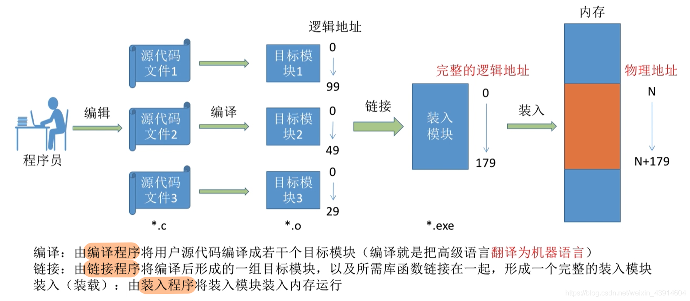
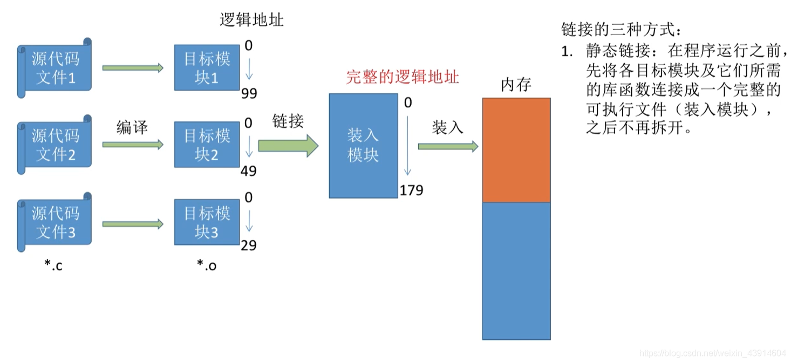
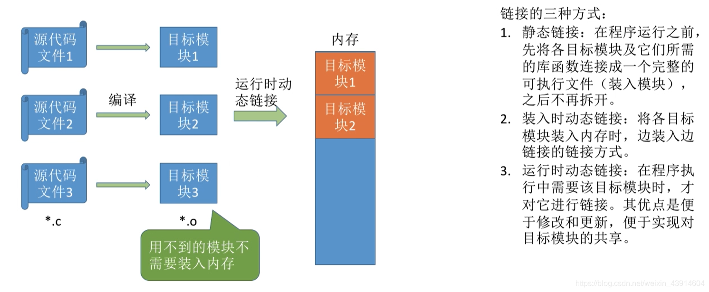

# 内存的基本知识

图1.本节总览

我在<计组>里已经知道的，就不写了。

## 一. 三种装入方式

图2.

程序员写了几个源代码（.c文件），由编译程序将其编译成目标模块（.o文件），也就是翻译成机器语言。

在每个.o文件中，使用的都是**逻辑地址**，都是从0开始的。

通过链接程序来将一组目标模块以及所需库函数链接到一起，形成一个完整的装入模块（.exe文件）。
.exe文件也形成了自己的逻辑地址。

由装入程序，将装入模块装入内存运行。

显然.exe装入内存后，其内部用的是逻辑地址，而如果执行指令时按照根据其逻辑地址作为物理地址寻址，除非.exe是从物理地址0开始连续放入的，不然肯定出错呀。

为了解决这个问题，有三种装入方式：

### 1.1 绝对装入

图3.绝对装入

绝对装入。

如果提前就知道程序将会放到内存中的哪个位置，那么在编译的时候，编译程序就将产生物理地址的目标代码。
这样装入程序直接装入就好了。

如图3，早就知道该程序会从内存中物理地址100开始装入，于是编译时将程序中的逻辑地址加上100。

只适用单道程序环境。
书上说的是，因为当计算机系统很小，只能运行单道程序时，那完全有可能知道程序在内存中的位置。
（感觉就是内存每次就放入一个程序，可能前面留了一些地址空间给系统，所以绝对装入可行。）
毕竟这个方法编译后其地址就无法改变了， 意味着该程序每次都只能放在内存的固定位置运行。
或者比如一些在内存中常驻的程序，干脆就特地留一块空间，写死位置好了。

这个程序中的物理地址，刚才说是编译程序编译时转变，当然反正都知道该程序在内存的起始地址了，由程序员在写源代码的时候就直接适用物理地址也行。不过很麻烦，一般还是编译程序来实现。

### 1.2 静态重定位

图4.静态重定向

静态重定位，又称可重定向装入。

在装入时，对地址进行"重定位"：根据装入内存的起始地址，将装入模块的逻辑地址，都加上起始地址，由此将逻辑地址变为物理地址。

如图4，装入模块将要装入内存的起始地址是100，则装入时，其逻辑地址都加上100。

显然，静态重定位要求其内存空间是**连续**的。
如果没有足够大的连续的内存空间，则无法装入。
一旦该程序装入内存后，在运行期间不能移动（放入开始运行后就不能移动了）。

### 1.3 动态重定位

图5.动态重定向

动态重定位，又称动态运行时装入。

在装入时，不进行重定向，真正执行这个指令时，才进行重定位。

这种方式需要一个**重定位寄存器**的支持。

图6.动态重定向

我个人觉得，这就是CPU取指后，取数时，把地址部分和这个程序的重定位寄存器里存的起始地址加起来嘛。

这基地址是存在PCB中的。
CPU执行不同程序时，会先把该程序的PCB中的基地址，传给重定位寄存器，然后取址/取数讲逻辑地址与基地址相加。

采用动态重定位：

1. 允许程序在内存中发生移动。

   比如程序A阻塞，程序A挂起，从主存调入程序B占用了程序A的位置，又要运行程序A了，调入内存，此时不用放回原位置，找个空位放着就行。毕竟程序A中逻辑地址和重定向寄存器里的地址（首地址）相加指向并不会出错。

2. 并且可以将程序分配到不连续的存储区中；

   程序本身放入内存是分段的，比如一个程序分为程序段和数据段，更细分的话可以分为主程序、变量集、函数库、动态数组、栈等等。
   于是我们可以通过段号+段内偏移的方式来寻址，其实也是基地址+偏移的形式，不过现在是以段来划分，为每段的基地址+在该段的偏移。
   也就是PCB中原本只需要存放整个程序的基地址，现在是存放每段的基地址。
   这样，整个程序可以不必连续存储，而是每段连续存储，段与段之间不必连续存储。

3. 在程序运行期前，只需要装入它的部分代码即可投入运行，然后在程序运行期间，根据需要动态申请分配内存；

4. 便于程序段的共享，可以向用户提供一个比存储空间大得多的地址空间。

(这里3、4点我暂时也没理解，视频里说学了分页式存储后就好理解了，但是我明明在<计组>虚拟存储器中学过了。)

## 二. 三种链接方式

### 2.1 静态链接

图7.静态链接

静态链接。

把目标模块和所需库函数链接成一个完整的可执行文件（装入模块），当然各个目标模块的逻辑地址也形成一个完整的逻辑地址。

之后便不再拆开，装入内存也是整个装入。

### 2.2 装入时动态链接

图8.装入时动态链接

动态链接——装入时动态链接。

装入目标模块1，检查发现它的代码中有调用scanf()（即便此时进程还并没有运行到调用scanf()函数），于是把scanf()装入，进行链接。
继续装入目标模块2，检查发现它的代码中有调用printf()（即便此时进程还并没有运行到调用printf()函数），于是把printf()装入，将进行链接。
同样的目标模块3也是。

装入时动态链接。

将各个目标模块装入内存时，边装入边链接的链接方式。

### 2.3 运行时动态链接

图9.运行时动态链接

动态链接——运行时动态链接。

在程序执行中需要该目标模块时，才对它进行连接。

在许多情况下，应用程序运行时，每次要运行的模块可能是不同的。所以每次都把全部的模块装入内存，太浪费了，又不是每个都一定用到，所以将某些模块的链接推迟到程序执行时才进行。

也就是在执行过程中，当发现一个被调用的模块尚未装入内存时，立即由操作系统去找到该模块，并将之装入内存，将其链接到调用者模块上。

比如运行目标模块1，那我就只装入目标模块1并链接，当进程确实运行到了scanf()函数，调用scanf()函数时，才装入scanf()的目标模块并链接。
当进程确实运行到了需要用到目标模块2中的部分时，才装入目标模块2并链接。
若该进程本次运行用不到目标模块3，那就不装入目标模块3也不需要链接。

---

动态链接的优点是便于修改和更新，便于实现对目标模块的共享。

## 三. 本节回顾

图10.本节回顾

2020.10.10