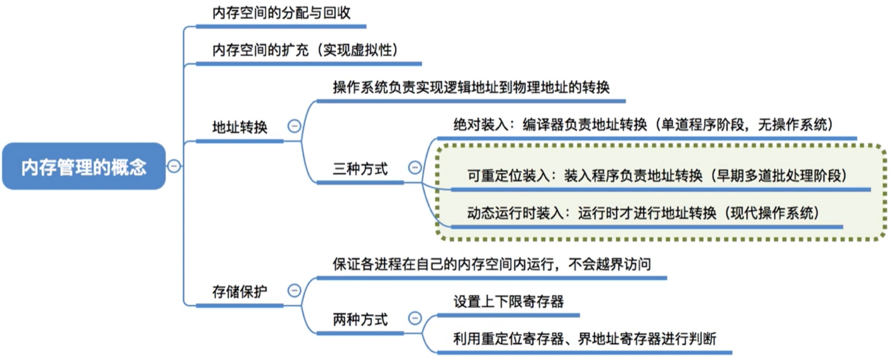

# 内存管理的概念

图1.本节总览

操作系统对于内存管理，需要做哪些事情，工作。

## 一. 内存空间的分配与回收

操作系统负责内存的分配与回收。

进程调入内存，应该分配到内存的哪里。
如何记录已经分配了的内存，和空闲的内存。
进程结束后，如何回收该进程的内存。

## 二. 内存空间的扩充

操作系统需要提供某种技术从逻辑上对内存空间进行扩充。

某程序几十个G，比如一些游戏。内存只有几G，根本无法全部调入内存，如何实现游戏正常运行的呢。

——虚拟技术（操作系统的虚拟性）

## 三. 地址转换

操作系统需要提供地址转换功能，负责程序的逻辑地址与物理地址的转换（重定位）。

为了使程序员编程方便，程序员编写程序时应该只需要关注指令、数据的逻辑地址，而不需要关心逻辑地址到物理地址的转换，这由操作系统负责。

也就是上一节讲的三种装入方式。

图2.三种装入方式

绝对装入，用于单道程序阶段，当时操作系统其实还没出现，是编译器来完成的。

重定位装入，用于早期的多道批处理操作系统。

动态运行时装入，用于现代操作系统。

## 四. 内存保护

操作系统需要提供内存保护功能，保证各进程在各自存储空间内运行，互不干扰。

内存保护有两种方法：

1. 方法一：

   在CPU中设置一堆上、下限寄存器，存放用户作业在主存中的上限和下限地址，每当CPU要访问一个地址时，判断有无越界。

2. 方法二：

   采用重定位寄存器（基址寄存器）和界地址寄存器（又称限长寄存器），重定位寄存器存的是起始地址，界地址寄存器存的是进程的最大逻辑地址，用这俩来进行越界检查。

   CPU取指中的地址与界地址寄存器的值比较有无越界，没有的话就和重定位寄存器的值相加去寻址。
   （感觉视频里这句讲解，没判断越下界啊，不过和重定位寄存器对比也能判断越下界。）

## 五. 本节回顾

图3.本节回顾

2020.10.10