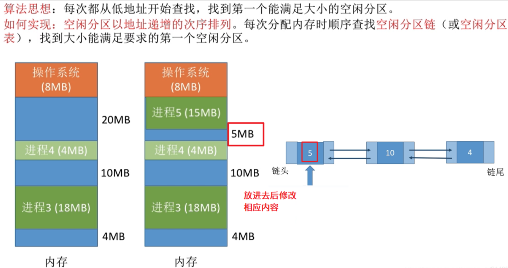
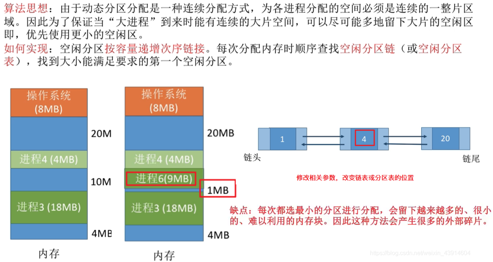
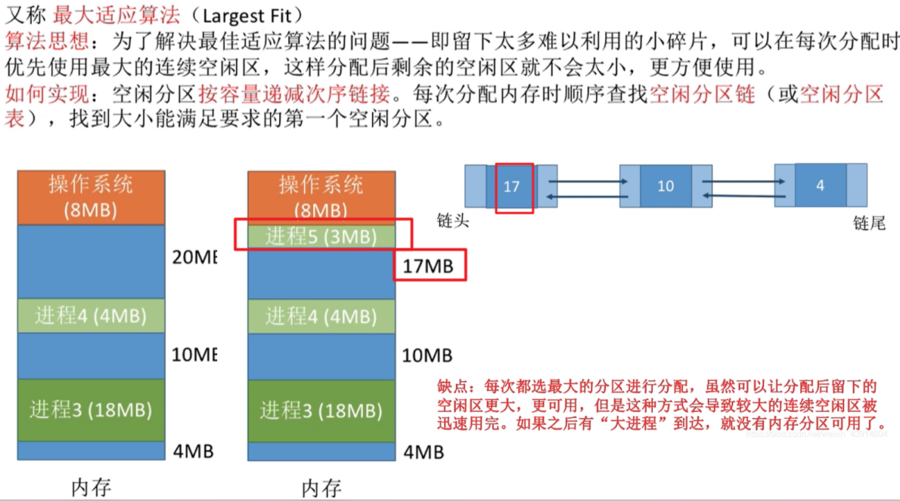
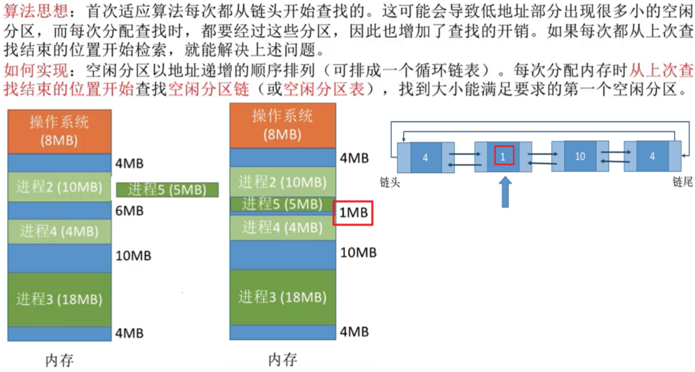
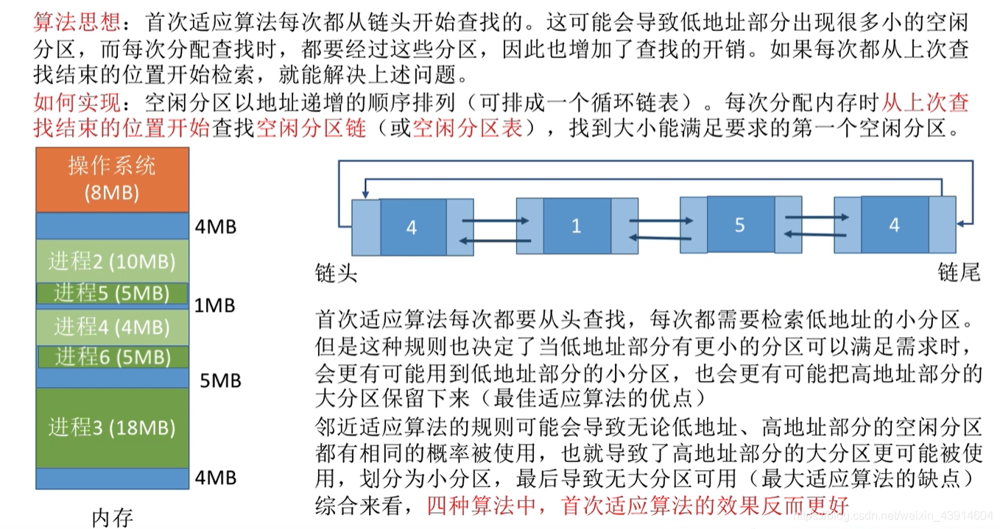
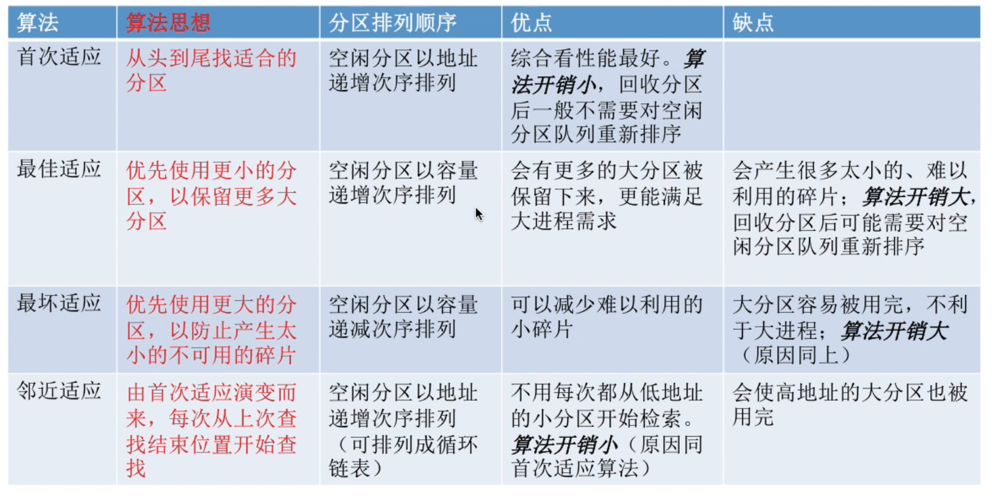

# 动态分配分区算法

图1.本节总览

## 一. 首次适应算法(First Fit)

图2.首次适应算法

首次适应算法：每次都从低地址开始查找，找到一个能满足大小的空闲分区。

实现：就是空闲分区表（链）以低地址递增顺序记录，每次分配内存按顺序查找，找到能满足要求的第一个空闲分区。

图2，放入进程5，修改空闲分区链的信息。不需要重新排列。

## 二. 最佳适应算法(Best Fit)

图3.最佳适应算法

最佳适应算法：尽可能地留下大片空闲区域，优先使用小的空闲分区，这样当大进程装入时内存有大空闲空间。

实现：空闲分区表（链）按容量递增次序记录，每次分配时按顺序查找，找到能满足要求的第一个空闲分区。

图3，原本空闲分区链为：4—10—20。进程6需要9MB，放入10MB的空闲分区，变为：4—1—20。按容量递增次序调整顺序，为：1—4—20。

缺点：每次都选最小分区分配，容易留下越来越多的小的外部碎片，难以利用。

## 三. 最坏适应算法(Worst Fit)

图4.最坏适应算法

又称最大适应算法：每次分配优先使用最大的空闲分区，这样剩余空闲分区不会太小而难以利用。

实现：空闲分区表（链）按容量递减次序记录，每次分配时按顺序查找，找到能满足要求的第一个空闲分区。

图4，空闲分区链：20—10—4，放入进程5后：17—10—4。还是容量递减的，不用调整顺序。

## 四. 邻近适应算法(Next Fit)

图5.邻近适应算法

邻近适应算法：首次适应算法每次都从开头查找，导致低地址部分出现很多小的空闲分区，而每次查找都是从开头查找，而开头的低地址很可能都是无法利用，所以没必要每次都查前面，浪费时间。而是每次从上一次查找结束的位置开始检索。

实现：空闲分区表（链）以低地址递增顺序记录，每次分配内存按顺从上一次查找结束的位置开始检索，找到能满足要求的第一个空闲分区。（可用循环链表）

图5，空闲分区链为：4—6—10—4，进程5在第二个空闲分区放入后：4—1—10—4。不需要重新排列。

图6.接着放入进程6

接着放入进程6，从上一次停止位置（第二个空闲分区）开始，为1MB，不够，往下，10MB足够，进程6装入第三个空闲分区，修改空闲分区链为4—1—5—4。

综合看，首次适应算法的效果更好。

## 五. 本节回顾

图7.本节回顾

2020.10.10