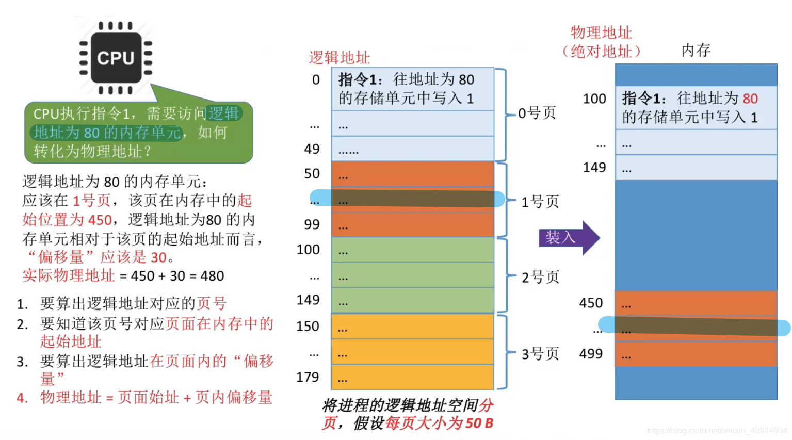

# 基本分页存储管理的基本概念

## 一. 基本概念

图1.基本概念

将内存空间分为一个个**大小相等的分区**，称为页框（页帧、内存块、物理块）。
每个页框有一个编号，称为页框号（页帧号、内存块号、物理块号），页框号从0开始。

将用户进程的地址空间也分为**与页框大小相等**的一个个区域，称为**页**或页面。
每个页面也有一个编号，称为页号，页号也是从0开始。
（显然，进程的最后一页的大小是可能小于页框大小的。）

操作系统以页框为单位为各个进程分配内存空间。进程的每个页面分别放入一个页框中，即进程的页面与内存的页框有一一对应的关系。

各页面不必连续存放，也不必按先后顺序来，可以放到不相邻的各个页框中。

## 二. 如何寻址

图2.寻址方式

将中间的进程分为与页框大小相等的若干页面，装入内存，可以不连续状态，也可不按照顺序装入。

显然的，还是以该页面的起始地址+偏移量的方式来计算出位置。

图2左方简单讲了过程：
根据逻辑地址，和页框大小，算出所处页号；
由页号找到对应的内存中该页的起始地址；（操作系统会用某种数据结构记录进程各页面的起始位置）
根据逻辑地址，算出在该页的偏移量；
由该页起始地址+偏移量找到位置。

## 三. 页号和偏移量的计算

图3.页号与偏移量的计算

很简单。不解释。

一般页面大小为2的整数幂。因为计算机二进制方便嘛。

假设页面大小为 $2^K$ B，那么二进制地址的最低位K位就是偏移量。其他高位就是页号。

## 四. 逻辑地址结构

图8.逻辑地址结构

逻辑地址结构，

感觉就在说废话，前面已经说过了。

总二进制位为M+K位，最高M位为页号，最低K位为页内偏移量，或称页内地址。

 $2^M$ 就是一个进程最多允许有 $2^M$ 个页面，
 $2^K$ 就是一个页面的大小是 $2^K$ 个存储单元。

## 五. 页表

图5.页表

操作系统会为每个进程建立一张页表。

已知页号，查询页表，可得该页号对应的内存块。

1. 一个进程对应一张页表。
2. 进程每一页对应一个页表项。（就是对应一行嘛，页表项给我看懵了几秒。）
3. 每个页表项由页号和块号组成。
4. 页表记录进程页面和实际存放的内存块之间的对应关系。
5. 每个页表项的长度是相同的，页号是隐含的。

图6.例子

假设物理内存4GB，页面大小4KB。

 $4G=4\times2^{30}=2^{32},4KB=4\times 2^{10}=2^{12}$ ，
页框数量：$\frac{2^{32}}{2^{12}}=2^{20}$ 个，块号至少有20位。题目说的字节，那就至少3字节。

为什么说页号是隐含的，不用存储。
因为页表项是**按顺序连续存储**在内存中的。
设页表在内存中的起始地址为X，我现在用虚页号M来查询对应的块号，那么因为页表是连续存储的，则存有页号M对应的块号的存储单元的起始地址就是X+3*M。

## 六. 本节回顾

图7.本节回顾

2020.10.10