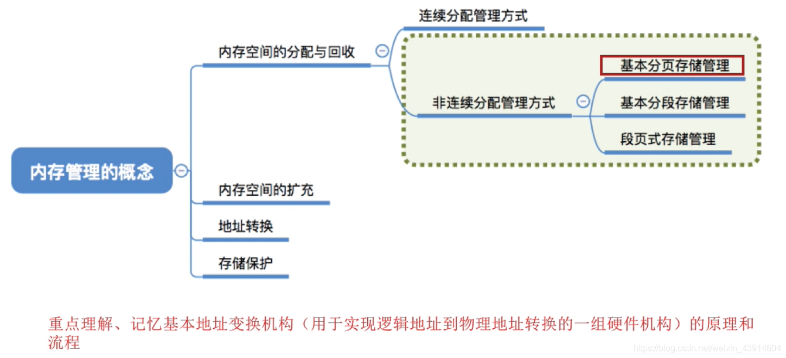
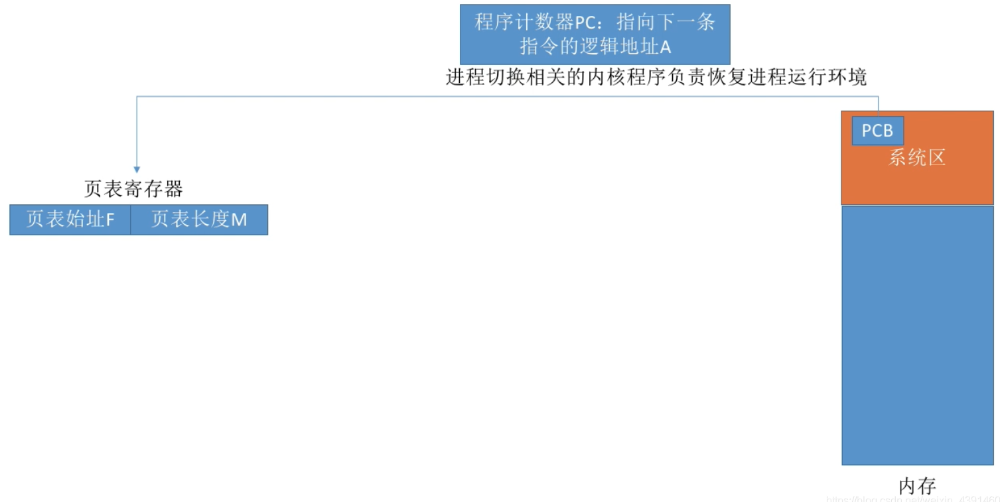
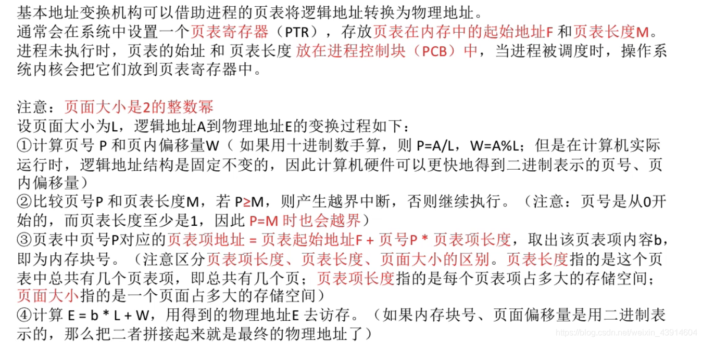
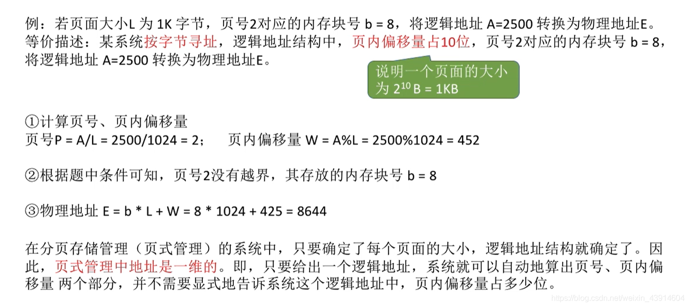
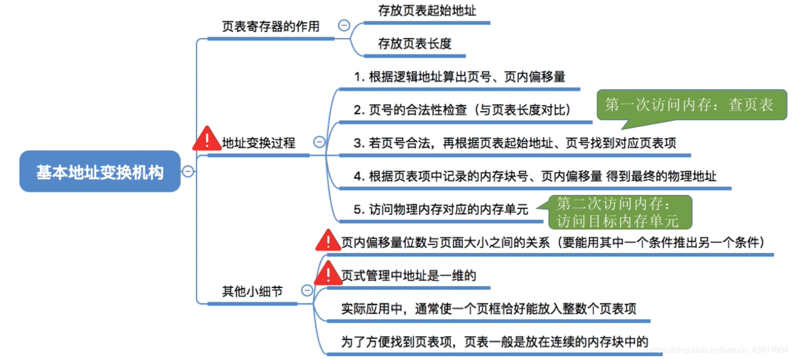

# 基本地址变换机构

图1.本节总览

这一节内容也属于基本分页存储管理。

讲解基本分页存储管理中，实现逻辑地址到物理地址转换的一组硬件机构。

## 一. 概念

图2.页表寄存器

首先，当CPU执行一个程序，切换一个程序时，会先把PCB中连续存放的页表的起始地址和页表长度，传到页表寄存器中。

页表的起始地址和页表长度也是存在PCB中。

（到这里应该能理解为什么尽量少切换进程了吧，因为每次切换都得换表。）

图3.寻址流程

流程：

1. 根据逻辑地址计算出页号、页内偏移量。

2. 判断页号是否越界。

   页表寄存器中，页表长度就是页表的数量，如果页号大于等于了页表长度，则越界，抛出一个越界中断（内中断）。（因为长度至少为1，页号从0开始，所以大于等于是越界，包含了等于。）
   如果没有，则正常，进入下一步。

3. 查询页表，找到页号对应的页表项，确定页面存放的内存块号。

   逻辑地址的页号与页表寄存器中的页表起始地址相加（页表项长度为1是直接相加），得到该页表对应的物理地址。
   （实际上是页表项地址=页表起始地址+页表项长度x逻辑地址页号)

   由该物理地址，找到对应的页表项在内存中的存储单元，其中就是该页号对应的内存块号。

4. 用内存块号和页内偏移量得到物理地址。

   用查到的内存块号+页内偏移量，得到欲访问的物理地址。

5. 访问目标内存单元。

图4.

看图4吧，感觉没啥好说的。

注意第2点。大于等于都越界，因为页号是从0开始，而页表长度最小为1。

## 二. 例题

图5.例题

很简单的，我就不写一遍了。

页式管理中地址是一维的。
一维的意思是只需要给出一个信息就可以确定物理地址了。二维就是二维数组，确定一个位置需要两个信息。

## 三. 页表项长度的探讨

图6.

上一节有个例题。说是一个页表项至少3字节。

但如果真的用3字节一个页表项，会发现一个页面大小4KB，除以3B， $4096/3=1365......1$ ， 

我感觉视频里的没说，但是意思是页表的存储虽然是连续的，但是一个页面最后剩下的字节，不足以存储一个页表项长度，则只能留着的空。

原本我们是通过页表项地址=页表起始地址+页表项长度x逻辑地址页号，得到该页表对应的物理地址。
以这题的条件，就是页表项地址=X+3M，

但此时每页最后有1B是空着的无法使用，从第0页开始，每过一页，这个式子就需要加1。
如第0页的式子是页表项地址=X+3M，第1页就是页表项地址=X+3M+1，......。

所以为了能一个式子描述完，也就是为了不会有空隙。如果页表项最后一页有空隙，通常会使页表项长度多占几个字节，比如3B变为4B，使得刚好占满一个页面。
于是页表项地址=X+4M。

## 四. 本节回顾

图7.本节回顾

2020.10.10

