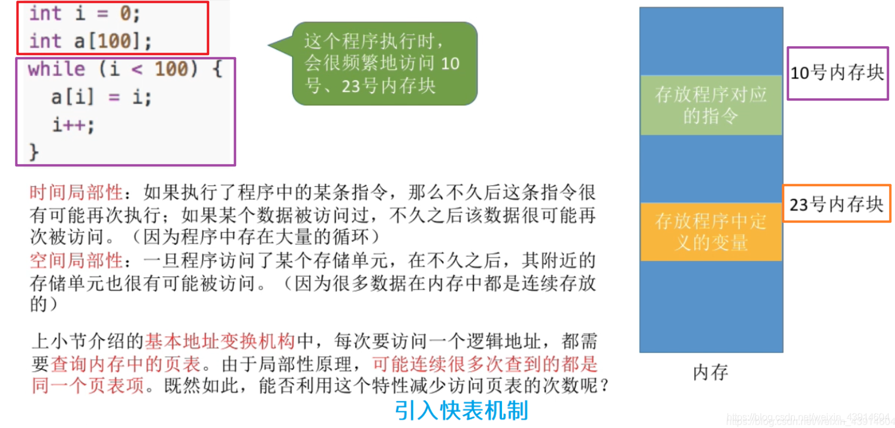
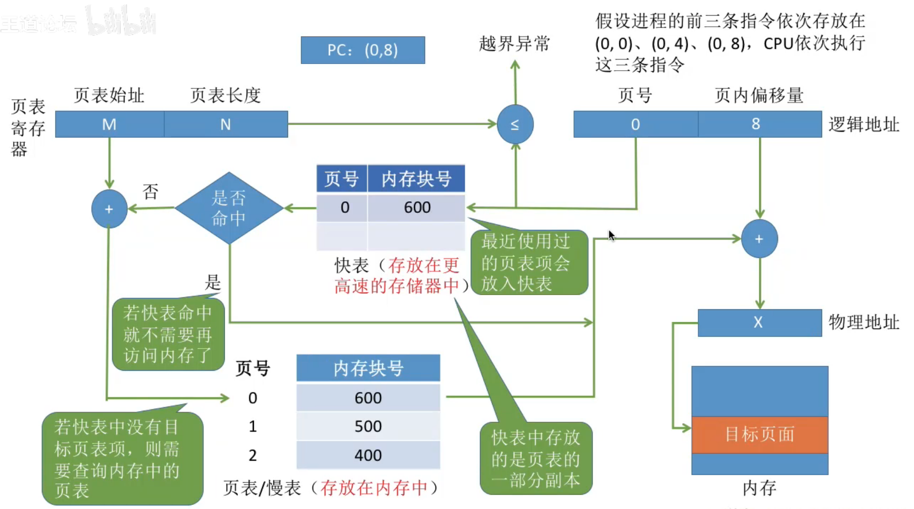
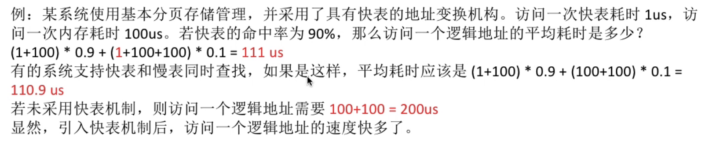
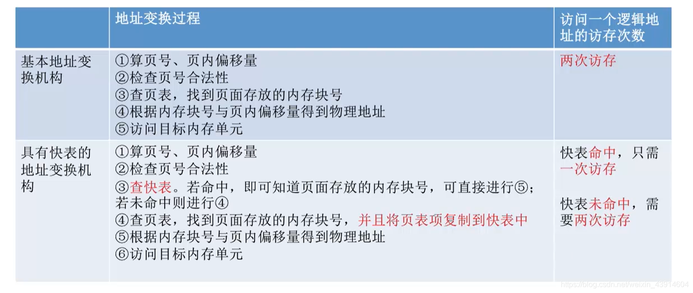

# 具有快表的地址变换机构

图1.本节总览

## 一. 局部性原理

图2.局部性原理

关于局部性原理，在<计算机组成原理>—7高速缓冲存储器—701局部性原理中有相关内容。

**局部性原理**包括**时间局部性**和**空间局部性**：

1. 空间局部性：

   在最近的未来要用到的信息（指令和数据），很可能与现在正在使用的信息在存储空间上是邻近的。

   比如指令通常是顺序存放，顺序执行的；数据一般也是以向量，数组等形式存储在一起。

2. 时间局部性：

   在最近的未来要用到的信息，很可能是现在正在使用的信息。

   比如程序中存在循环，对一组数据循环进行操作。

## 二. 快表TLB

快表TLB，在<计算机组成原理>—8虚拟存储器—801虚拟存储器也有相关内容。

为了提高地址变换，用Cache存放常用的页表项，称为**快表**（TLB），又称联系寄存器。
考虑了局部性原理，只是把常用的页表项存入Cache。
相对地，通常也把存在主存中的页表，称为**慢表**（Page）。

图3.快表

图3，假设CPU依次执行三条指令，这里(0,0)，(0,4)，(0,8)，表示逻辑地址（页号，页内偏移值）。

1. CPU给出逻辑地址，由某硬件算得页号、页内偏移量。

2. 将页号与页表长度（慢表长度）对比，检查越界。

3. 检索快表中有无相同页号，如果是第一次使用快表，快表内无内容，则未命中。

   图3条件，第一次未命中，后两次都命中。

4. 如果命中，则内存块号和页内偏移量拼接，得到物理地址。不需要再查询慢表了。

   由物理地址访问目标存储空间。结束

5. 如果未命中，则页号与页表寄存器中的页表起始地址（慢表）相加，找到页表项地址。
   页表项地址=页表起始地址+页表项长度x页号。

   而且将慢表查询到的页表项复制到快表当中。
   快表是慢表的一部分副本。

6. 由页表项地址，找到内存块号。内存块号和页内偏移量拼接，得到物理地址。

7. 由物理地址访问目标存储空间。

## 三. 引入快表后的地址变换过程

图4.引入快表TLB后的地址变换过程

过程上面说了的，就不再写了。

快表命中，仅需一次访存。
快表在Cache嘛。

快表未命中，需要两次访存。
访存第一次查表，第二次取址/取数。
记得未命中，慢表查到后会更新到快表。快表满了就会按照一定算法进行替换。

图5.例题

不支持快表、慢表同时访问： $(1+100)\times 0.9+(1+100+100)\times0.1=111us$ 。

支持快表、慢表同时访问： $(1+100)\times 0.9+(100+100)\times0.1=110.9us$ 。

如果题目没有说明，默认不支持快表、慢表同时访问。

## 四. 本节回顾

图6.本节回顾

想着2020.10.10写玩的，现在是2020.10.11 00:08，差了几分钟啊。

2020.10.11