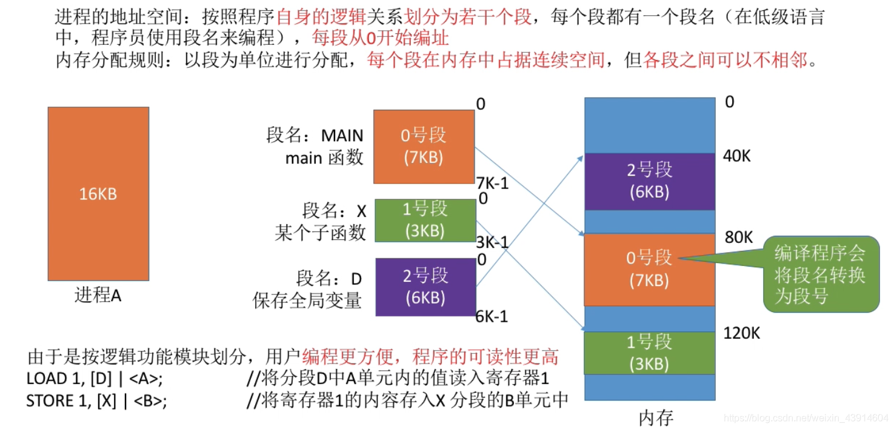
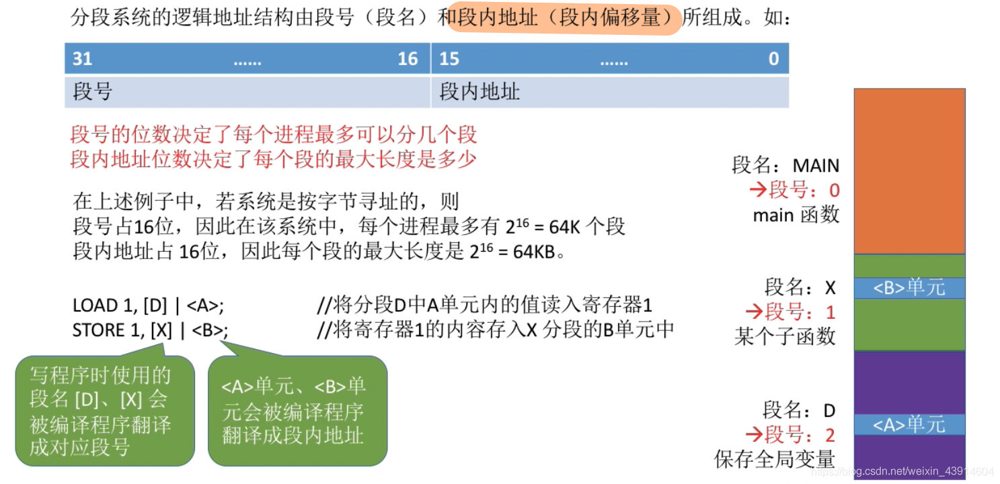
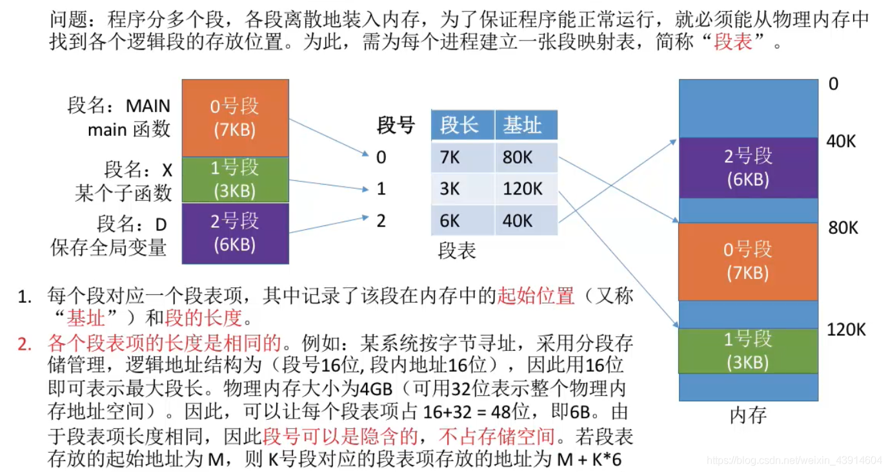
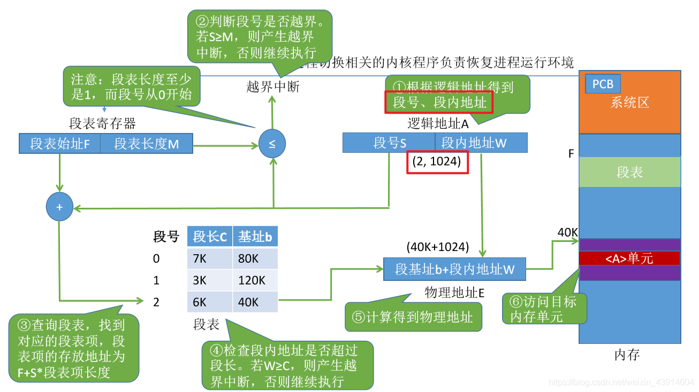
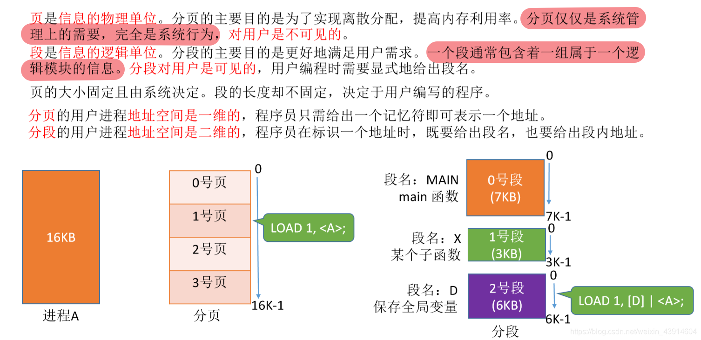
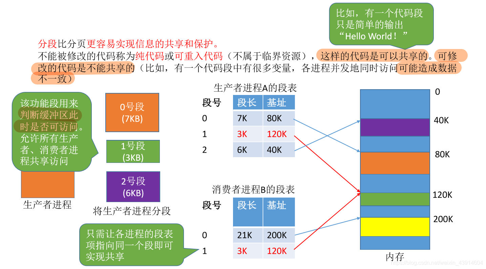
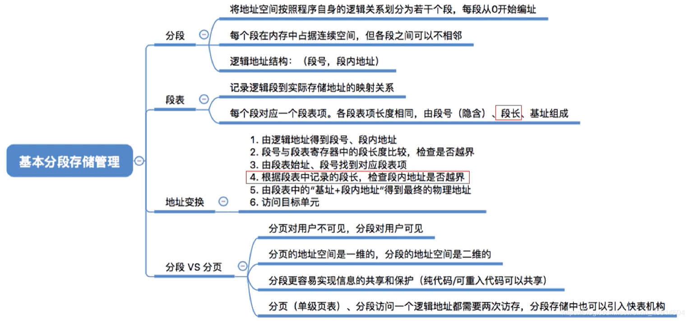

# 基本分段式存储管理方式

图1.本节总览

在<计算机组成原理>—8虚拟存储器—801虚拟存储器中有相关知识。

## 一. 分段

图2.分段

一个进程，其实可以按照其逻辑关系进行分段。

如图2，main函数为一段，某个子函数为一段，全局变量为一段。
当然这样并不像分页那样等长，每段是可不等长的。

每段有一个段名，在低级语言中，程序员使用段名来编程，程序可读性更高。
每段从0开始编址。

内存分配：以段为单位，每段是连续空间，各段可以不连续。

## 二. 逻辑地址结构

图3.逻辑地址结构

分段存储管理方式的逻辑地址结构：段号+段内偏移量（段名+段内地址）。

段号的位数决定了每个进程最大可以分为几段。
段内偏移量的位数决定了每段的最大长度。

写程序时用的段名、用助记符表示的单元，会在编译的时候翻译成对应的段号、段内地址。

## 三. 段表

图4.段表

与基本页式存储管理方式类似，基本段式存储管理方式也需要操作系统为每个进程建立**段表**。

段表在内存中连续存储。

段表记录了段长、基址，也就是每段的长度和起始地址。
因为每段的长度可能是不一样的，所以需要记录，分页就不用。

因为段表项的长度是相同的，段表是连续存储的，所以也不需要记录段号，通过计算来找到对应的段表项。

## 四. 地址变换

图5.地址变换流程

地址变换流程：

1. CPU运行进程，或切换进程后，首先PCB中的段表起始地址和段表长度会传到段表寄存器中。

2. 给出逻辑地址，分为段号和段内地址。

3. 段号与段表长度对比，判断是否越界，若越界，则越界中断（内中断）；没有越界，则下一步。

   注意段号从0开始，段表长度最小为1，所以是段号大于等于M，越界。

4. 根据段表起始地址、段号、段表项长度，找到段表项。

   段表项地址=段表起始地址+段表项长度x段号。

5. **检查段内地址是否超过段长**，如果超过，则越界中断（内中断）；没有越界，则下一步。

6. 段基址+段内地址，得到物理地址。

7. 根据物理地址访问存储单元。

## 五. 分页、分段的对比

图6.分页、分段对比

页是信息的物理单位。
分页的主要目的是实现离散分配，提高内存利用率。
分页是系统管理上的需要，是系统行为，**对用户不可见**。
页的大小固定且由系统决定。
分页的**用户进程地址空间**是**一维的**。

段是信息的逻辑单位。
分段的主要目的是更好的满足用户需求。一个段通常包含一组属于一个逻辑模块的信息。
用户编程时需要显式地给出段名，**分段对用户是可见的**。
段的大小不固定，取决于用户编写的程序。
分段的**用户进程地址空间**是**二维的**，程序员既要给出段名，也要给出段内地址。

图7.分页、分段对比

**分段比分页更容易实现信息的共享和保护。**
**不能修改的代码**称为**纯代码**或**可重入代码**（不属于临界资源），是**可以共享的**。可修改 的代码是不能共享的。
共享的纯代码不属于临界资源，不同进程并发访问没问题。

访存次数：

分页：第一次查页表，第二次访问目标存储单元（单级页表）。
分段：第一次查段表，第二次访问目标存储单元。

当然，分页、分段都能用快表。

图8.分段的共享的实现

如图8，1号段是可以进程A和进程B共享的。那么进程A、B的段表里就会有1号段的段表项。

图9.分页较难共享

如果分页的话就比较难共享。

因为不是按逻辑来分的，所以一页里可能会有不能共享部分，如果共享了这页，那一旦修改了不该共享的部分，就出错了。

## 六. 本节回顾

图10.本节回顾

2020.10.11