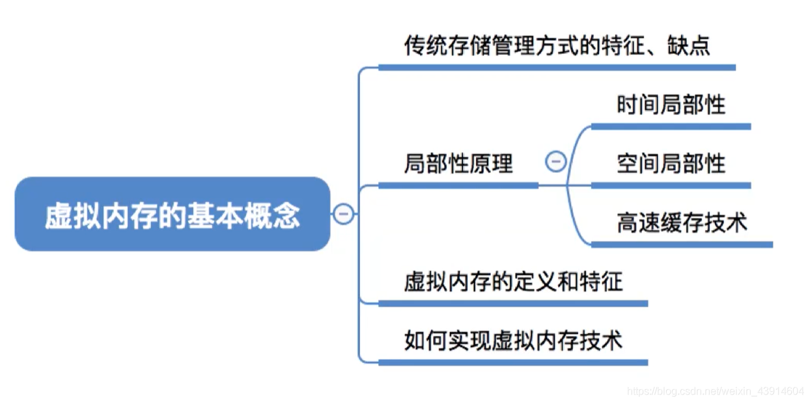

# 虚拟内存的基本概念

也就是前面说到，操作系统的内存管理中，内存空间的扩充，讲了覆盖和交换，剩了个虚拟存储技术，现在来讲。

图1.本节总览

## 一. 传统存储方式的特征、缺点

图2.传统存储方式的特权、缺点

特征：

1. 一次性：

   作业必须一次性全部装入内存后才能开始执行。

   导致，作业很大时，无法全部放入内存，大作业无法运行。
   运行大作业期间，剩余内存很小，只能运行少量作业。

2. 驻留性：

   一旦作业被装入内存，就会一直驻留在内存中，知道作业运行结束。

   但实际上一个时间段内，只需要访问作业的一部分即可正常运行。
   导致内存中驻留大量的、暂时用不到的数据。

## 二. 局部性原理与Cache

不多说了。

**局部性原理**包括**时间局部性**和**空间局部性**：

1. 空间局部性：

   在最近的未来要用到的信息（指令和数据），很可能与现在正在使用的信息在存储空间上是邻近的。

2. 时间局部性：

   在最近的未来要用到的信息，很可能是现在正在使用的信息。

引入了高速缓冲寄存器Cache。
常用的就放在Cache中，快表就在Cache中。

## 三. 虚拟内存的定义与特征

图3.虚拟内存的定义

基于局部性原理，在运行程序时，并不需要将完整程序装入内存，而是将程序中很快会用到的部分装入内存，暂时用不到的还是留在外存。

当程序执行过程中，访问的信息不在内存时，再由操作系统将所需信息从外存调入内存，然后继续执行程序。

如果内存空间不足时，由操作系统将内存中暂时用不到的信息换出到外存。

So，在用户看来，自己有比实际内存大的多的内存，这就是**虚拟内存**。

举个简单的例子，两块区域，放程序块A和程序块B，执行B的时候，A的位置换成C，执行C的时候B的位置换成D，......，这样就两块区域就能执行完整个程序。

虚拟内存的**最大容量**：由计算机的地址结构（CPU的寻址范围）确定。
虚拟内存的**实际容量**：min{内存+外存，CPU寻址范围}。

图3.虚拟内存的特征

虚拟内存的三个主要特征：

1. 多次性：

   无需在作业运行时一次全部装入内存，而是运行分为多次调入内存。

2. 对换性：

   在作业运行时无需一直常驻内存，而是运行过程中，将作业换出、换入。

3. 虚拟性：

   从逻辑上扩充了内存的容量，使用户看到的内存容量，远大于实际的容量。

## 四. 实现方式

图5.实现方式

虚拟内存技术，既然运行作业多次调入内存，那么如果采用连续分配方式就非常不方便实现了。
所以虚拟内存技术的实现建立在**离散分配**的内存管理方式基础上。

在这些离散分配的基本分页存储管理、基本分段存储管理、基本段页式存储管理方式之上，再应用虚拟内存技术，就有了：

1. 请求分页存储管理。
2. 请求分段存储管理。
3. 请求段页式存储管理。

虚拟内存的管理方式与传统内存管理方式主要区别：

1. 当程序执行过程中，访问的信息不在内存时，再由操作系统将所需信息从外存调入内存，然后继续执行程序。

   操作系统需要提供请求调页（或请求调段）功能。

2. 如果内存空间不足时，由操作系统将内存中暂时用不到的信息换出到外存。

   操作系统需要提供页面置换（或段置换）功能。

## 五.本节回顾

图6.本节回顾

2020.10.11