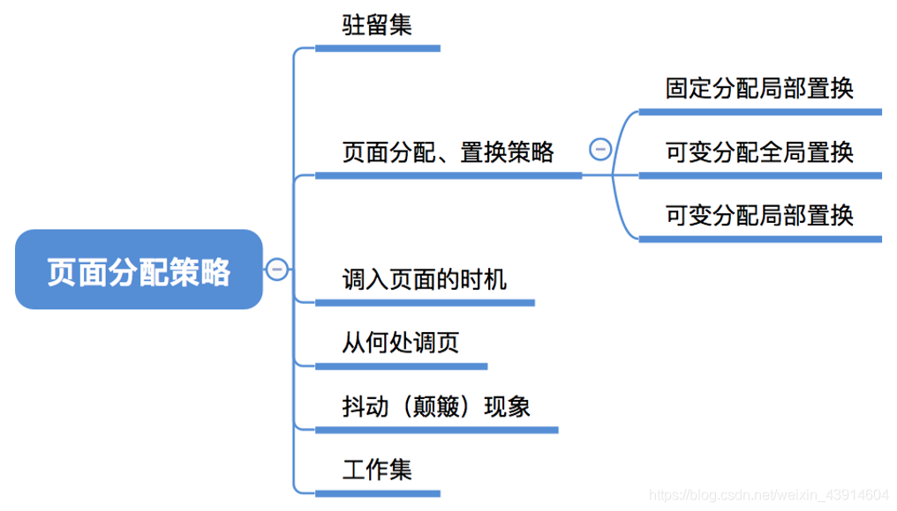
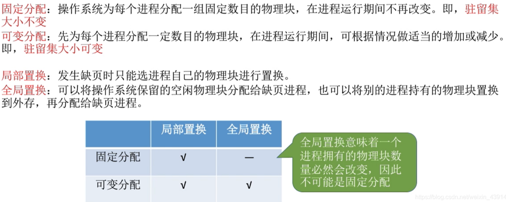
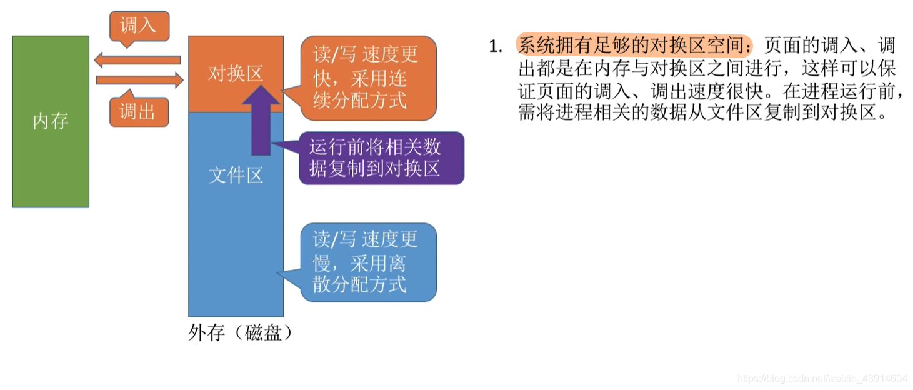
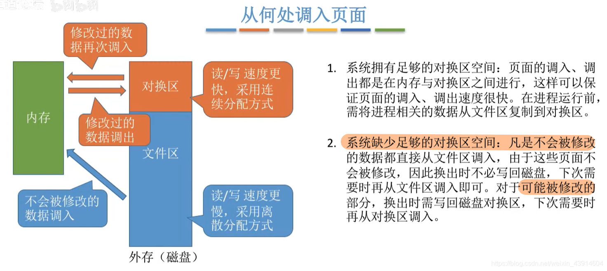
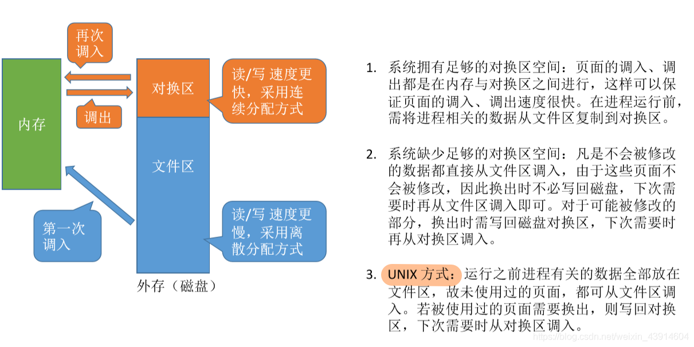
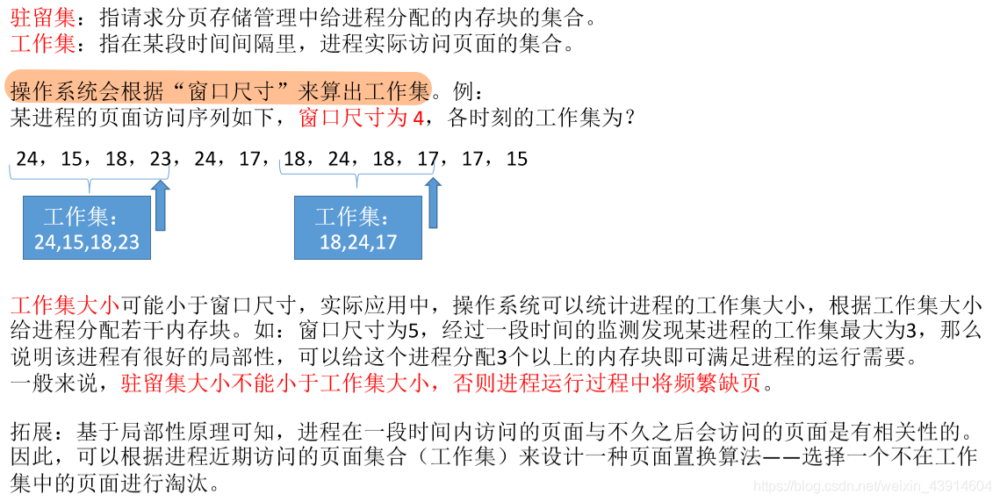
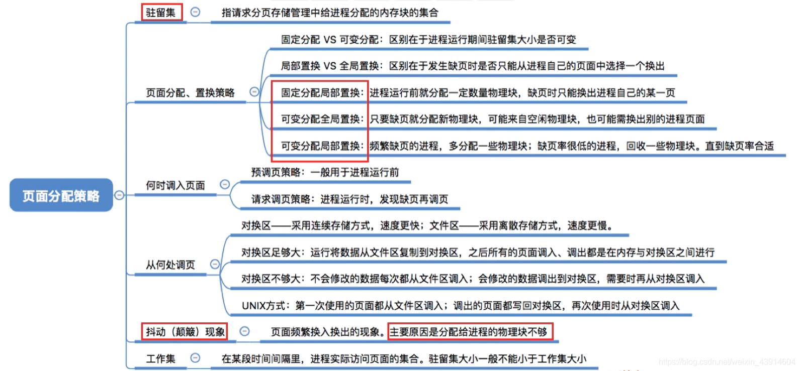

# 页面分配策略

图1.本节总览

## 一. 驻留集

图2.驻留集

**驻留集**：指请求分页存储管理中，给进程分配的物理块的集合。

在采用了虚拟存储技术的系统中，驻留集大小一般小于进程的总大小。

如果驻留集太小，则会导致缺页频繁。
如果驻留集太大，则会导致多道程序并发度下降。（内存里能放的程序数量减少了）

## 二. 页面分配、置换策略

图3.分配、置换策略

分配内存块：

1. 固定分配：

   操作系统为每个进程分配一组固定数目的内存块，在进程运行期间不再改变。
   即**驻留集大小不变**。

2. 可变分配：

   操作系统先为每个进程分配一定数目的内存块，在进程运行期间，可根据情况做适当的增加或减少 。
   即**驻留集大小可变**。

置换：

1. 局部置换：

   发生缺页时，只能选进程自己的内存块进行置换。

2. 全局置换：

   发生缺页时，由操作系统将空闲内存块分配个缺页进程，也可讲别的进程的内存块置换到外存，然后将该内存块分配给缺页进程。
   也就是缺页进程，会获得新的内存块，来自空闲的或别的进程的。

   全局置换是从别的地方拿啊，意味着缺页就会获得新的内存块。

图4.分配、置换策略

组合起来就有：

1. **固定分配局部置换**：

   驻留集固定，只能在驻留集中选择进行替换。

   缺点：
   很难一开始就确定需要多大驻留集。

2. **可变分配局部置换**：

   驻留集可变，只能在驻留集中选择进行替换。

   如果频繁缺页，则会增加驻留集；如果缺页率低，则减少驻留集。

3. **可变分配全局置换**：

   驻留集可变，可在未锁定的页面中进行替换。

   当缺页时，若有空闲内存块，则分配给该进程；
   仅当已无空闲内存块，才选择一个未锁定的页面换出外存，并将该内存块分配给该缺页进程。
   与此同时，被选中的进程会减少内存块，缺页率增加。

   （未锁定是指，操作系统会锁定一些页面不能置换出外存。）

   **只要缺页就会分配新的内存块**。

为什么没有固定分配全局置换呢？因为全局置换把空闲的、别的进程的内存块分配给缺页进程，必然驻留集大小变化了。所以不会是固定分配。

## 三. 调入页面的的策略

图5.调入页面的策略

调入页面的策略：

1. **预调页策略**：

   根据局部性原理（空间局部性），一次调入若干相邻页面。

   主要用于进程的首次调入。

2. **请求调页策略**：

   当进程运行期间发生缺页时才调入。

   每次调入一页，I/O开销比较大。

## 四. 从何处调页

对换区：采用连续分配方式，I/O速度快。

文件区：采用离散分配方式，I/O速度慢。

图6.有足够对换区空间时

如果系统有足够对换区空间时：

页面的调入/调出都是在内存与对换区之间进行。

程序运行前，首先，将程序复制到对换区，再调入内存运行，之后调入/调出都是内存与对换区之间。

图7.缺少对换区空间时

如果系统对换区空间不足时（不够大）：

不会被修改的数据直接从文件区调入，调出就不用了， 直接覆盖就完事。
可能被修改的数据从对换区调入，也调出到对换区。

图8.UNIX方式

UNIX方式：

程序运行前，都在文件区，所以没有使用过的页面都是直接从文件区调入。
若使用过的页面调出，则调出到对换区，下次调入就从对换区调入了。

## 五. 抖动（颠簸）现象

图9.抖动（颠簸）现象/center>

刚调出/调入的页面，马上又要调入/调出，这种频繁的页面调度行为称为**抖动**或**颠簸**。

产生抖动的主要原因是**进程频繁访问的页面数量高于可用的内存块数**。

显然应该避免抖动。
但是分配太多影响并发度，太少又容易发生抖动现象。
So，提出了工作集这个概念。

## 六. 工作集

图10.工作集

**工作集**：某段时间段里，进程实际访问的页面集合。

工作集可由时间t与工作集**窗口尺寸**得出。

比如图10，窗口尺寸为4：
则在t访问23页面时，工作集：24，15，18，23；工作集大小为4。
则在t访问17页面时，工作集：18，24，17；工作集大小为3。

工作集大小可能小于窗口尺寸（因为一个时间段内是可能访问同一页面的）。
操作系统可以统计进程的工作集大小，从而给进程分配内存块。
比如，经过一段时间的检测，某进程工作集大小最大为3，则说明该进程具有很好的局部性，可以给该进程分配3个内存块即可满足运行需要（减少驻留集）。

一般来说，驻留集不能小于工作集大小，否则进程运行过程中将频繁缺页，比如发生抖动。

## 七. 本节回顾

图11.本节回顾

2020.10.13

