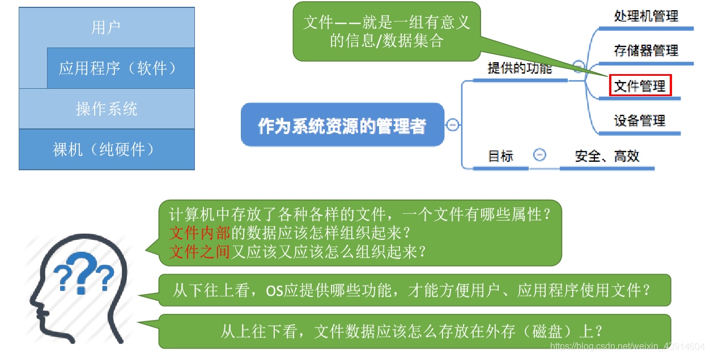
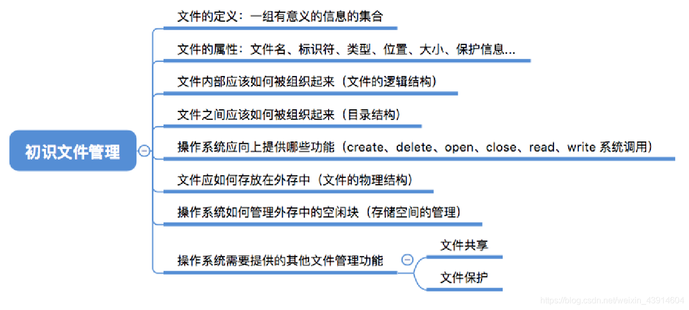
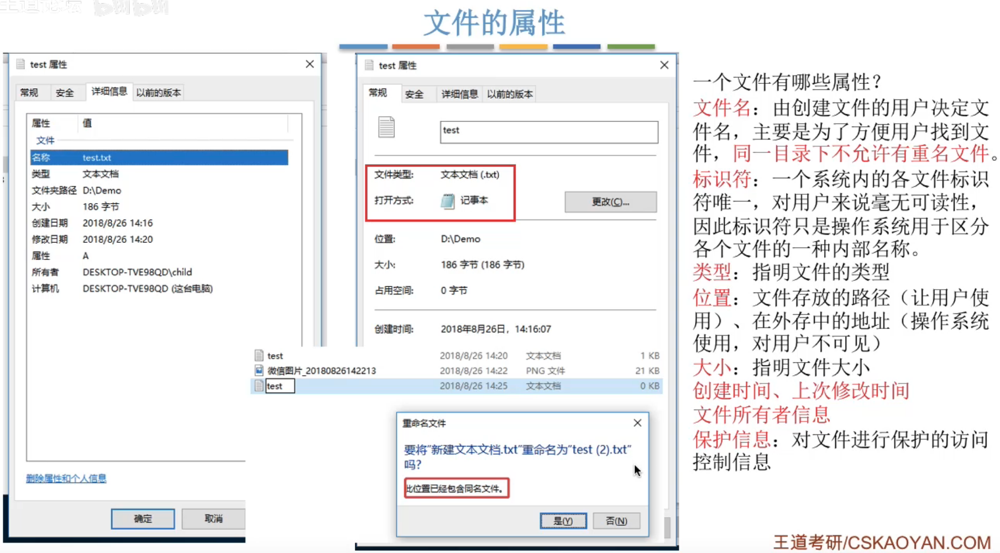
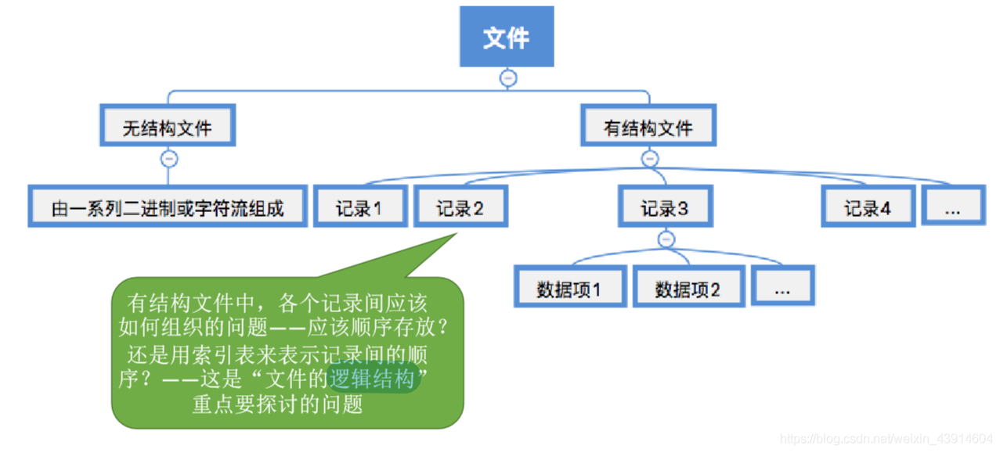
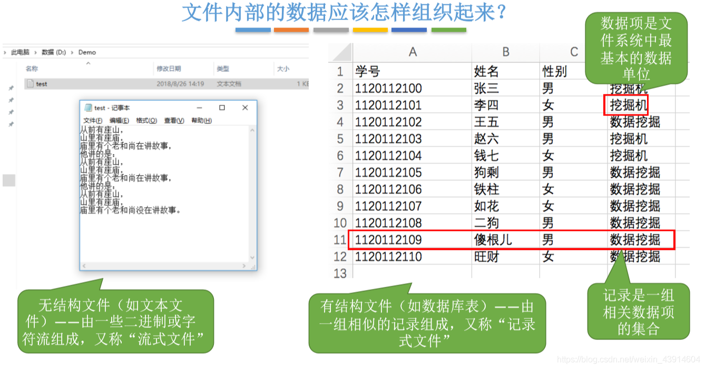
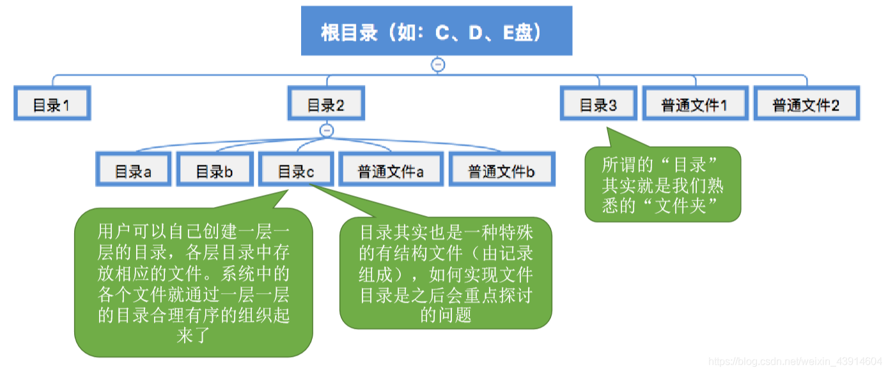
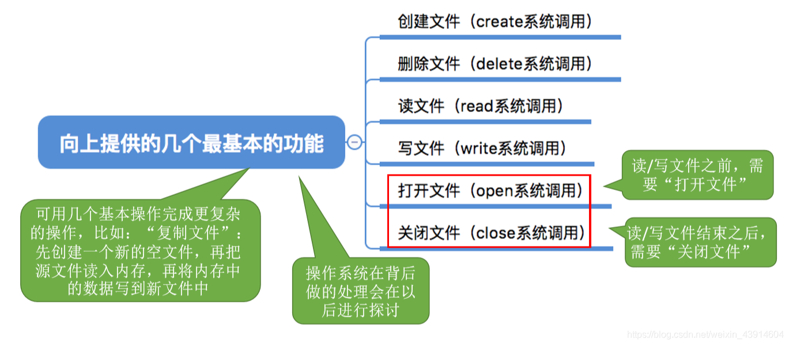
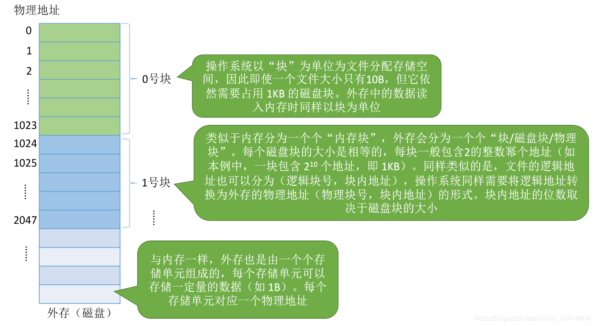

# 初识文件管理

图1.前情回顾

计算机中存放了文件，文件内部是怎么样的结构，文件之间又如何组织。

从OS往上，操作系统应该如何方便用户和应用程序。

从OS往下，文件应该如何存储在外存上。

图2.本节总览

**文件**：一组有意义的信息的集合。

## 一. 文件的属性

图3.文件的属性

随便找个文件，右键——属性，就能看到文件的属性。

1. 文件名：由创建文件的用户决定的文件名，主要为了方便用户找到这些文件。同一目录不允许有重名文件。
2. 标识符：一个系统内的各个文件的标识符唯一，标识符只是操作系统用于区分各个文件的一种内部名称。对用户来说毫无可读性，所以右键——属性里也没有对用户显示这个属性。
3. 类型：指明文件类型，比如文本文件.txt。
4. 位置：文件存放的路径（让用户使用）、在外存中的地址（操作系统使用，对用户不可见）。
5. 大小：指明文件的大小。
6. 创建时间、上次修改时间
7. 文件所有者信息
8. 保护信息：对文件进行保护的访问信息。也就是不同用户对文件的权限不同。

## 二. 文件的结构

图4.文件的结构

文件分为：

1. **无结构文件**

   由一系列二进制或字符流组成，又称**流式文件**。

2. **有结构文件**

   文件由一组相似的记录组成，又称**记录式文件**。

图5.文件的结构

如图5。

文本文件为无结构文件。

excel为有结构文件，记录就是一组相关数据项的集合，这里为一行；数据项是最基本的数据单位，这里为一个单元格。

## 三. 文件间如何组织

图6.文件间的组织

通过多层目录来组织，目录本质也是一种特殊的有结构文件。

## 四. 操作系统向上提供的功能

图7.OS向上提供的功能

OS向上提供的功能：

1. 创建文件
2. 删除文件
3. 读文件
4. 写文件
5. 打开文件
6. 关闭文件

## 五. 操作系统向下，如何存放文件

图8.OS向下，如何存放文件

将外存分为若干大小相等的块，如1KB，以块为单位为文件分配存储空间。

即便一个文件只有1B，但仍然占用一个块，1KB。（感觉和分页很像啊）

同样的，文件的逻辑地址也可以分为逻辑块号+块内地址，操作系统同样需要将逻辑地址转换为外存的物理地址。
（这真不就是分页吗？）

## 六. 操作系统需要提供的其他功能

图7.操作系统需要提供的其他功能

文件共享、文件保护。

2020.10.13