# 文件的逻辑结构

## 一. 文件的分类

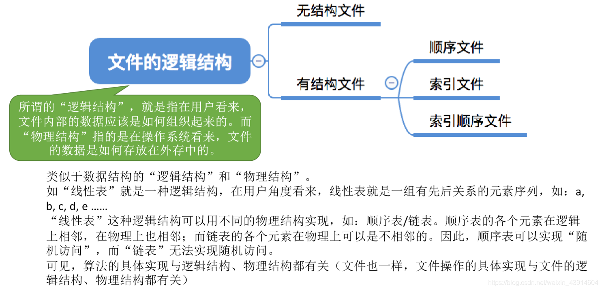

图1.本节总览

这里讲的是文件的逻辑结构，而非物理结构。

如线性表是一种逻辑结构，而线性表的实际实现可以用顺序表或链表来实现，就是物理结构。

同样的，这一节讲的是文件的逻辑结构，是抽象的模型。

首先是文件的分类，按照有无结构可分为：无结构文件、有结构文件。

显然我们主要讲有结构文件的逻辑结构，毕竟无结构文件名字都无结构了。

### 1.1 无结构文件

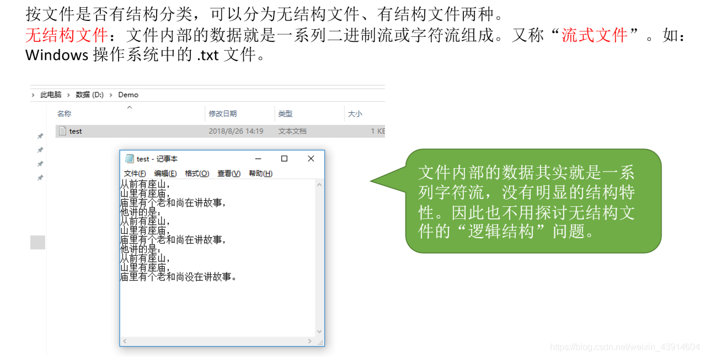

图2.无结构文件

无结构文件：

文件内部的数据就是一系列二进制流或字符流组成，又称流式文件。如.txt文件。

### 1.2 有结构文件

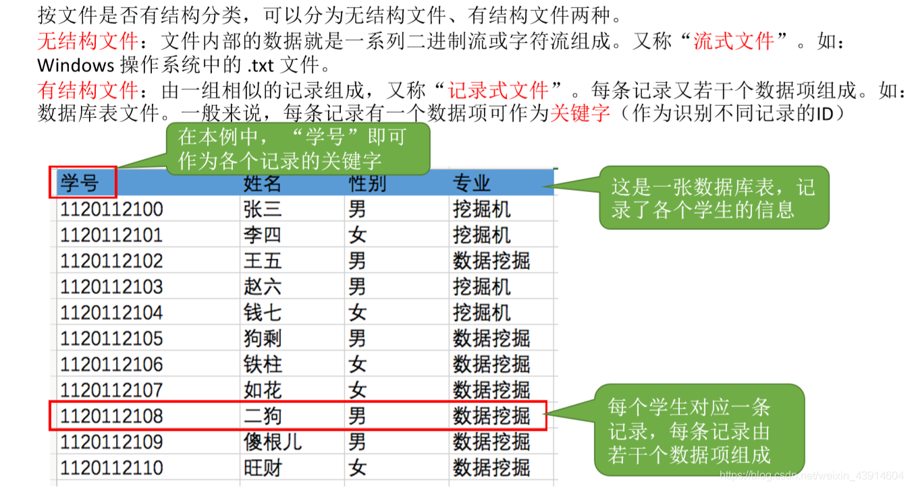

图3.有结构文件

有结构文件：

由一组相似的记录组成，又称**记录式文件**。

每条**记录**由若干**数据项**组成。一般来说，每条记录有一个数据项可作为**关键字**（作为识别不同记录的ID）。

根据各条记录的长度是否相等，又可分为**定长记录**和**可变长记录**两种。

#### 1.2.1 定长记录

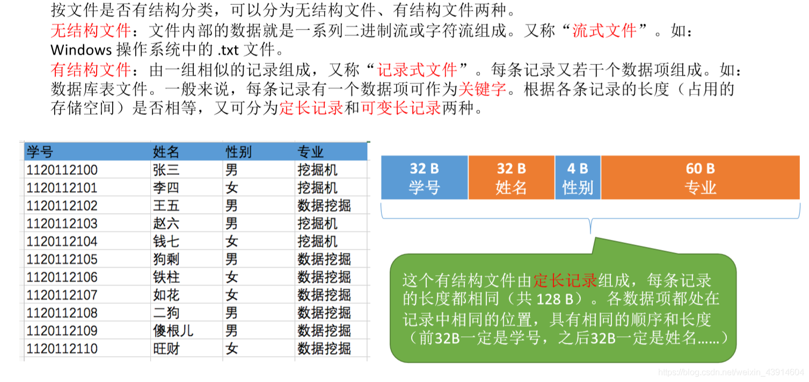

图4.定长记录

定长记录，每条记录长度相同。

#### 1.2.2 可变长记录

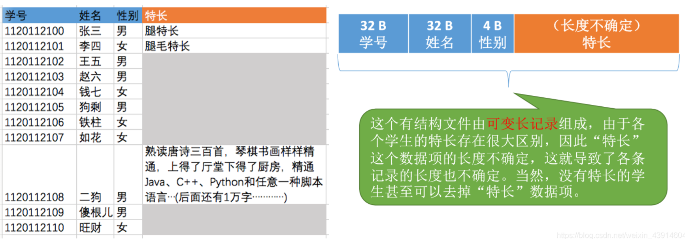

图5.可变长记录

可变长记录，每条记录长度有不等。

## 二. 有结构文件的逻辑结构

图6.有结构文件的逻辑结构

按照有结构文件中，各记录间在逻辑上如何组织，可分为：

1. 顺序文件。
2. 索引文件。
3. 索引顺序文件。

### 2.1 顺序文件

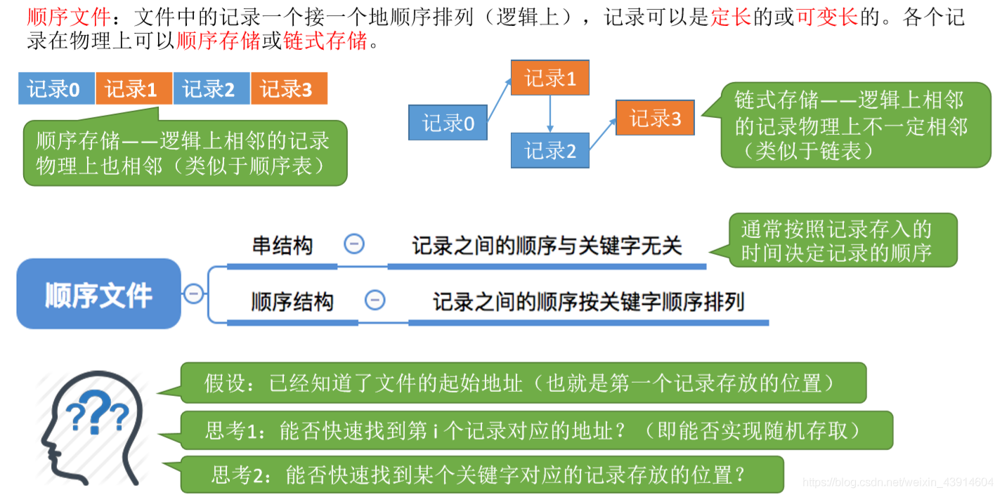

图7.顺序文件

顺序文件：
文件中的记录一个接一个地顺序排列（逻辑上），记录可以是定长地或可变长地。

各记录在物理上可以顺序存储或链式存储。

**顺序存储：逻辑上相邻的记录在物理上也相邻。**
链式存储：逻辑上相邻的记录在物理上不一定相邻。

按照记录是否依照关键字顺序来排列，可分为：

1. 顺序结构

   记录之间的顺序按关键字顺序排列。

2. 串结构

   记录之间的顺序与关键字无关。

分析，各种结构的查询时间。

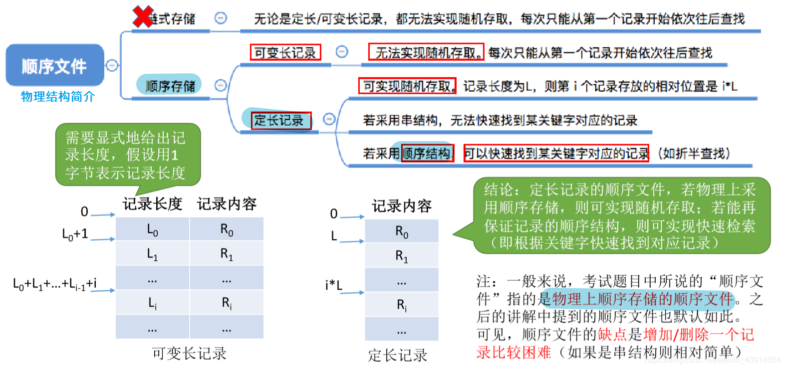

图8.顺序文件结构分析

1. 链式存储，无论是定长、可变长记录，都无法随机存取，每次只能从第一个记录开始依次往后查找。

2. 顺序存储：

   ​	2.1采用可变长记录，无法实现随机存取，每次只能从第一个记录开始依次往后查找。

   ​	2.2采用定长记录，可实现随机存取，若记录长度为L，则第i个记录存放的相对位置是iL。

   ​		2.2.1 若采用顺序结构，可以快速找到某关键字对应的记录。

   ​		2.2.2 若采用串结构，无法快速找到某关键字对应的记录。

如图7，可变长因为要记录每条记录的长度，所以要找到第i条记录，需要从第1条开始把前i-1条记录的长度加起来。

一般来说，考试题目中说顺序文件，是指**顺序存储**的顺序文件（物理上也是顺序相邻的）。

顺序文件缺点，增加/删除一个记录比较困难（串结构会相对简单一点）。

### 2.2 索引文件

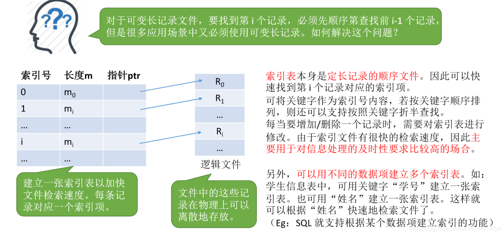

图9.索引文件结构

对于可变长记录文件，可建立一张索引表，索引表项中记录了索引号、长度、指针（起始地址），从而加快文件检索速度。

索引表本身也是**定长记录的顺序文件**。

可以将关键字作为索引号的内容，若按关键字顺序排列，则还可以支持按照关键字折半查找。

同样，不仅可以用关键字作为索引号的内容，也可以用其他信息，而且可以建立多个不同索引号的索引表。
比如以关键字、学号、姓名建立三张索引表，这样根据关键字、学号、姓名都可以快速的检索文件。

每当要增加/删除一个记录时，需要对索引表进行修改。由于索引文件有很快的检索速度，因此**主要用于对信息处理的及时性要求比较高的场合**。

### 2.3 索引顺序文件

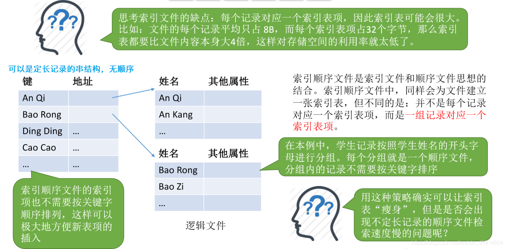

图10.索引顺序文件结构

索引顺序文件。

索引文件中，索引表是按照关键字顺序排列的，要插入新的就很麻烦。

索引顺序文件，将顺序文件分组，索引表中指对每个分组中的第一个记录建立索引项。
每次先在索引表中查询找到所在组，然后再在组中顺序查询。

同一组内可以无序存放，在以组为整体来看，组与组时间是有序的。

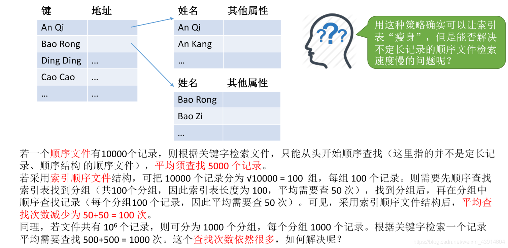

图10.索引顺序文件效率分析

若有N的记录。

顺序文件，平均需要查找 $\frac{N}{2}$ 次。
索引顺序为文件，把N个记录分为  $\sqrt{N}$ 组，每组 $\sqrt{N}$ 个记录，则平均需要查找 $\frac{\sqrt{N}}{2}(查索引表)+\frac{\sqrt{N}}{2}(查组内)=\sqrt{N}$ 次。

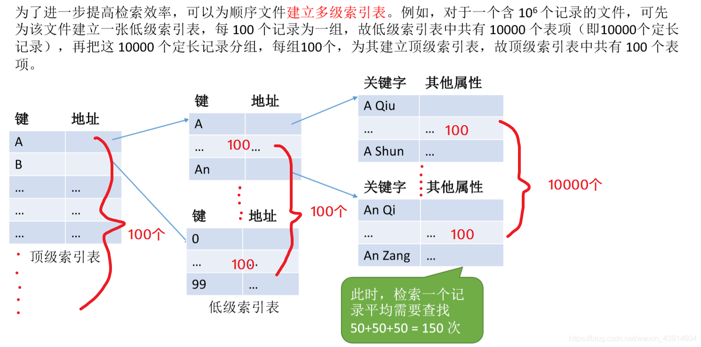

图10.多级索引表

当然，如果记录非常多，查询次数还是有点多，那就来个**多级索引表**。

这下又减少了查询次数了。

今天（2021.07.23）突然又在这里发现了一点问题，对于 N 个记录顺序查找，那么应该是 $\frac{(1+...+N)}{N}=\frac{(N+1)}{2}$ 才对。
但，王道都说的是 $N/2$ 。
为什么突然想到，因为王道在这里说是 $N/2$ ，
也确实在王道书上的一道王道自己编的选择题，算平均访问磁盘数量，直接 $N/2$ 得出结果，但偏偏就在后面的一道王道自己编的解答题，同样也是算平均访问磁盘数量，王道的答案是却是按照我这样来 $(1+N)/2$ 算的。
虽然感觉如果 $N$​ 比较大，这个加 1，基本可以忽略。

## 三. 本节回顾

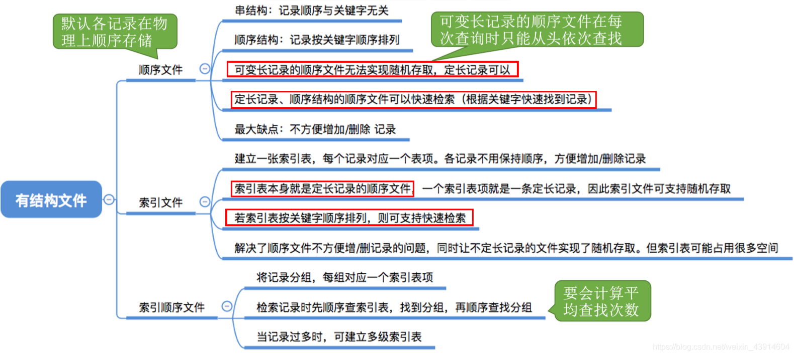

图11.本节回顾

2020.10.13

