# 文件目录

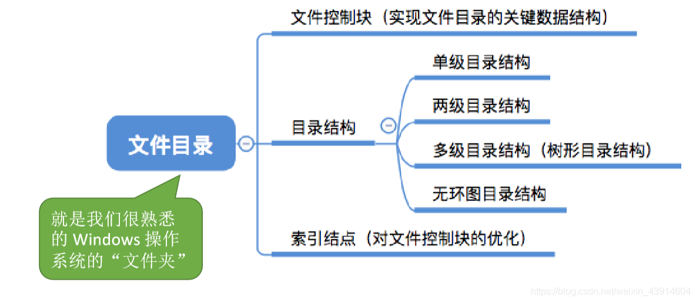

图1.本节总览

## 一. 文件控制块

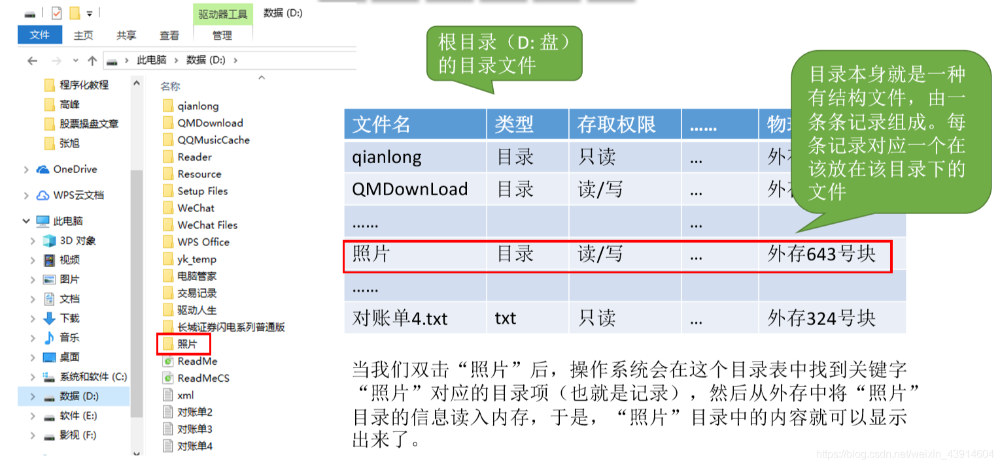

图2.目录（计算机含义）

如图2，D盘根目录。

我们日常看到的左边的目录（日常含义），实际就是目录（计算机含义）中记录的文件名。

所以实际上目录（计算机含义）本身就是一种有结构的文件，每个记录对应一个放在该目录下的文件。

可以注意到，图2目录（计算机含义）中也记录了目录（计算机含义）。

当我们双击"照片"后，操作系统会在目录表中找到关键字"照片"，然后根据记录的外存地址，从外存调入内存，然后运行软件显示。

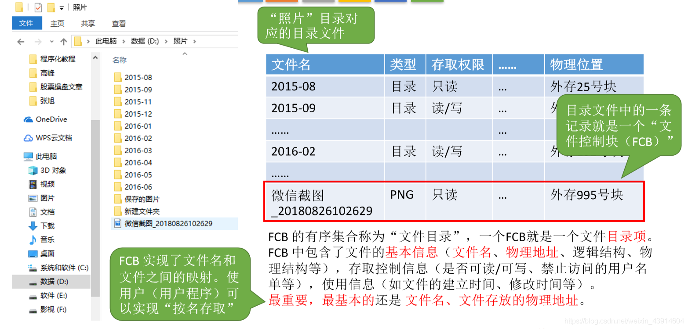

图3.文件控制块

目录文件中的一条记录就是**文件控制块FCB**。

文件控制块FCB的有序集合称为**文件目录**，一个FCB就是一个文件目录项。

文件控制块中包含了文件的基本信息（文件名、物理地址、逻辑结构、物理结构等），存储控制信息（是否可读/可写、禁止访问的用户名等），使用信息（如文件的建立时间、修改时间等）。

当然，其中最重要、最基本的是文件名，和文件存放的物理位置。
毕竟这样有了文件名，与文件存放的物理位置，才使用户可以"按照文件名来存取"。

## 二. 对目录文件的操作

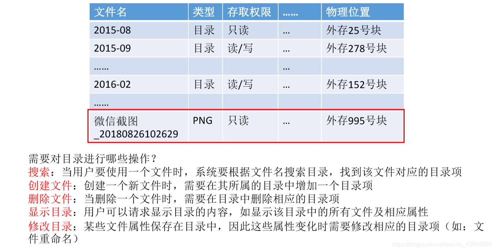

图4.文件控制块

需要对目录文件进行哪些操作：

1. 搜索：
2. 创建文件：
3. 删除文件：
4. 显示目录：
5. 修改目录：

## 三. 目录结构

### 3.1 单级目录结构

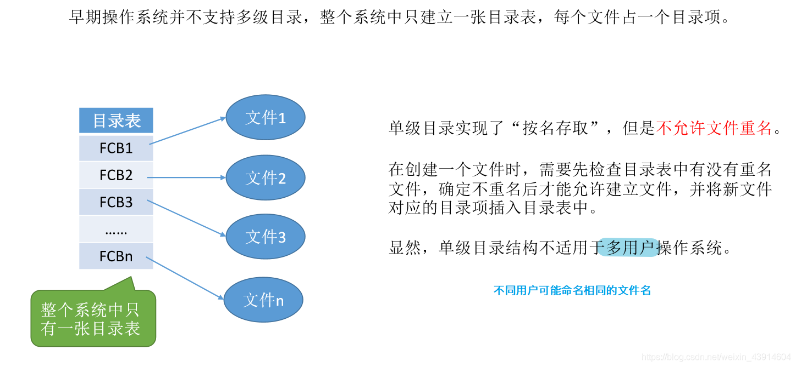

图5.单级目录结构

早期操作系统，整个操作系统中只建立一张目录表，每个文件占一个目录项。

单级目录实现了"按名存取"，但**不允许重名**。

创建文件时，需要先检查目录表中是否有重名，确定无重名后，才允许创建文件，并将新文件目录项插入目录表。

显然，单级目录结构**不适用于多用户操作系统**。

### 3.2 两级目录结构

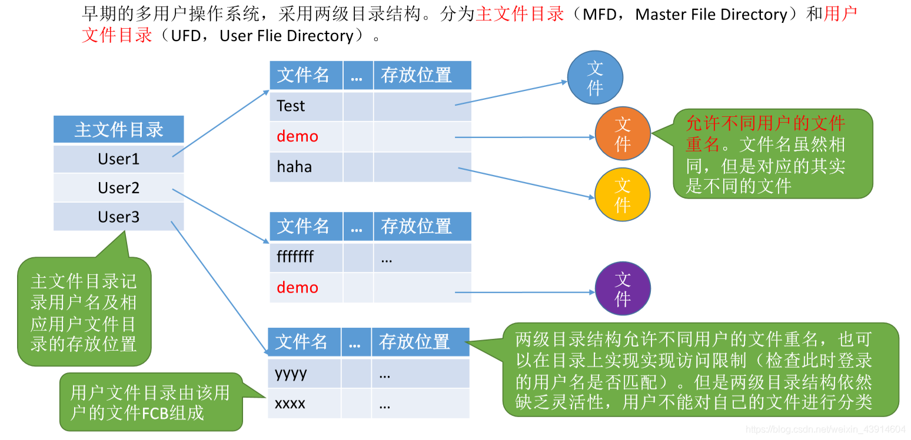

图6.两级目录结构

早期的多用户操作系统中，采用两级目录结构。
分为主文件目录（MFD）和用户文件目录（UFD）。

主文件目录记录用户名及用户文件目录的存放位置。
用户文件目录就由改用户的FCB组成了。

两级文件目录**允许不同用户的文件重名**。可以在目录上实现访问限制（根据登录的用户名是否匹配）。

但两级目录结构仍然缺乏灵活性，用户不能对自己的文件进行分类。

### 3.3 多级目录结构（树形目录结构）

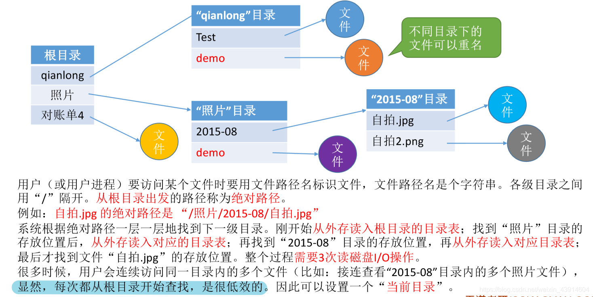

图7.多级目录结构

就是目录里放目录，多来几层就是多级目录结构了。

不同目录里的文件可以重名。

用户（或用户进程）使用文件路径名来标识文件，文件路径名是个字符串。各级目录之间用"/"隔开。
从根目录出发的路径称为**绝对路径**。

系统根据绝对路径，一层一层的，从外存调入根目录文件，索引获得下一个目录文件的存放位置，将其调入内存，再索引找到文件的存放位置，将文件调入内存，打开。

当然，经常会遇到连续访问同一个目录内的文件，每次从根目录就很低效。
所以可以设置一个**当前目录**，即每次将新的目录文件调入内存，就将其设置为当前目录。
如刚才访问了"/照片/2015-08/自拍.jpg"，则当前目录为"/照片/2015-08/"。
于是就可以使用**相对路径**："./自拍.jpg"。

引入相对路径后，I/O次数就减少了，提升了访问文件的效率。

树形目录结构可以很方便的对文件进行分类，层次清晰，也能够更有效地进行文件的管理和保护。
但是，树形目录结构**不便于实现文件的共享**。于是提出了无环图目录结构。

### 3.4 无环图目录结构

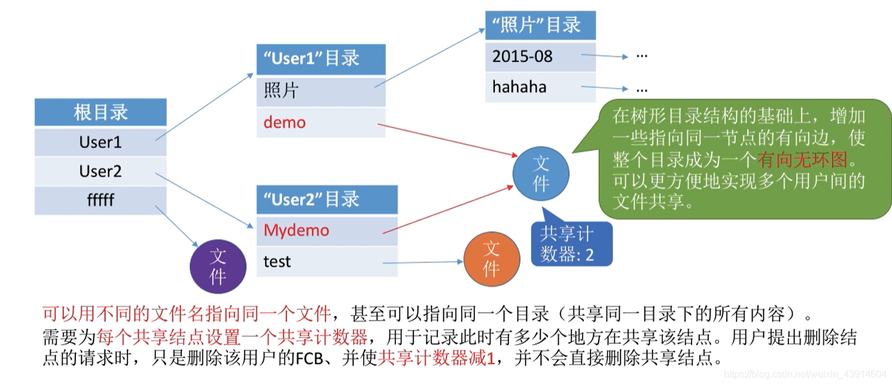

图8.无环图目录结构

在树形目录结构的基础上，增加一些指向同一节点的有向边，使整个目录成为一个有向无环图。可以更方便地实现多个用户的文件共享。

其实就是不同目录中有同一文件的物理地址。
可以用不同的文件名，但物理地址是一样的。
甚至共享的文件还能是目录文件，相当于共享了这个目录下的所有内容。

需要**为每个共享结点设置一个共享计数器**，用于记录此时有多少个地方在共享该结点。
当用户提出删除结点请求时，只删除该用户的FCB，并使共享计数器减1，并不会直接删除该共享结点。
（毕竟不能你不用了把文件删了就没了，我还要用呢。）
当共享计数器为0时，才删除该共享结点。

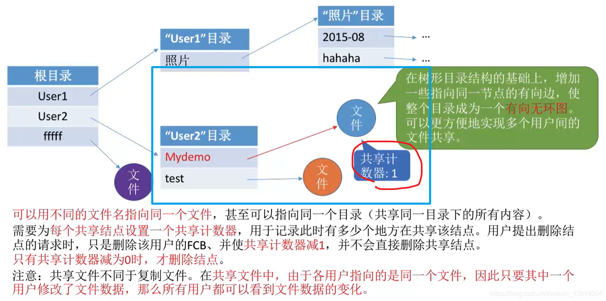

图8.无环图目录结构

稍微注意一下，共享文件与复制文件的区别。

## 四. 索引节点（FCB的改进）

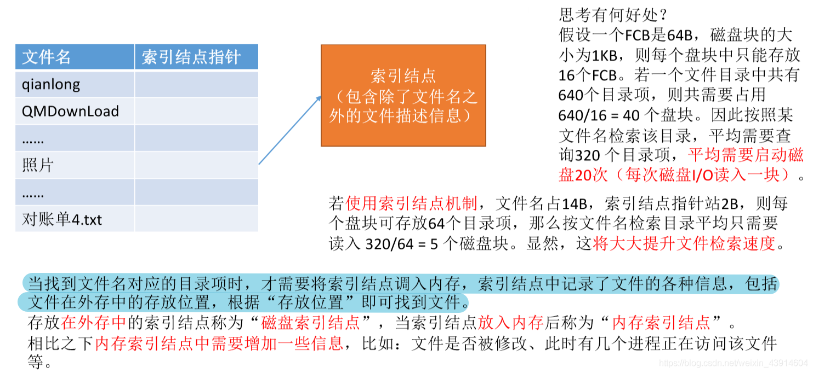

图8.索引节点

在前面的目录中，每个文件控制块FCB记录了很多信息，但实际上我们在检索目录时，很多时候只需要文件名、存放位置就行了，尤其是多级目录结构时，前几次检索目录只需要文件名、存放位置，并不需要其他太多信息。

所以可以将一个文件除了文件名之外的信息都放在一个检索节点中。

索引表变为只有文件名、和索引节点的地址。

其实是通过减少了索引项大小，使得一次I/O操作能够读入更多索引项，从而减少I/O操作。

比如原本索引表占40个磁盘块，I/O操作实际上一次是读一块的。那么平均需要进行20次I/O操作。
而**采用索引结点机制**后，索引表减少了大小，只占10个磁盘块，那么平均需要进行5次I/O操作。

当索引时找到文件名对应的的目录项时，才将需要的索引结点调入内存，索引结点中有该文件的各种信息，包括了存放位置，于是可以找到文件调入内存。

在**外存**中的索引节点称为**磁盘索引结点**。当索引节点放入**内存**后称为**内存索引结点**。
**内存索引结点中需要增加一些信息**，如文件是否被修改，此时有几个进程正在访问该文件等。

## 五. 本节回顾

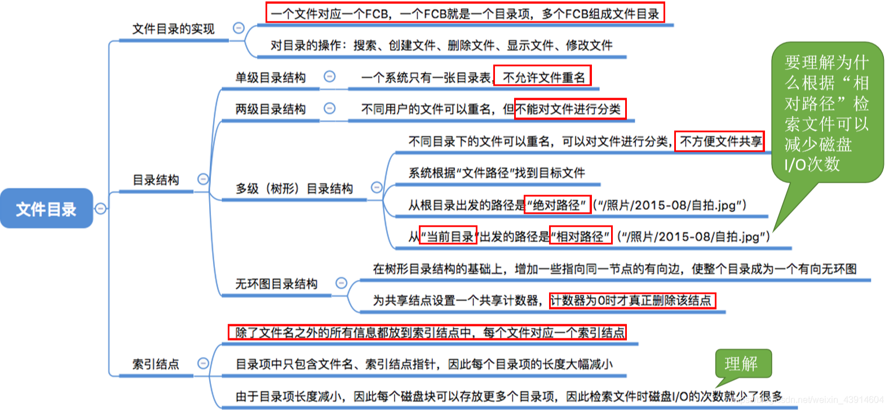

图11.本节回顾

2020.10.13