# 文件的物理结构（文件分配方式）

图1.操作系统向下对磁盘的管理

操作系统作为最接近硬件的软件，负责对硬件的管理，包括对磁盘的管理。

操作系统对磁盘的管理主要工作为，对非空闲磁盘块的管理，对空闲磁盘块的管理。

本节讲对非空闲磁盘块的管理。

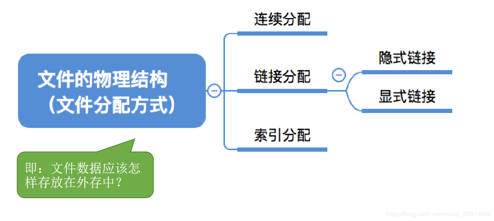

图2.本节总览

即，文件数据应该怎样存放在外存中。

## 一. 文件块、磁盘块

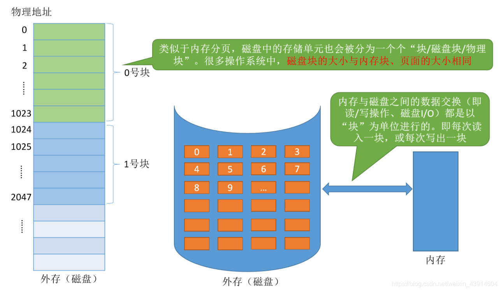

图3.磁盘块

类似与分页，磁盘也是分为若干磁盘块，一个磁盘块由多个存储单元构成。

很多操作系统中，磁盘块大小与内存块大小、页面大小相同。

内存与磁盘之间的数据交换，都是以块为单位进行，即每次读/写一块。

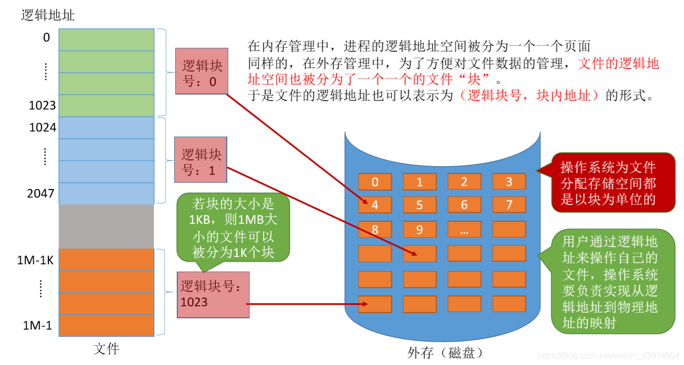

图4.文件块

同样的，文件也是分为若干文件块。

于是逻辑地址也可表示为逻辑块号+块内地址的形式。;

用户还是使用逻辑地址来操作文件，至于文件的存储，逻辑地址到物理地址的转换，由操作系统来完成，用户无需关心。

## 二. 连续分配

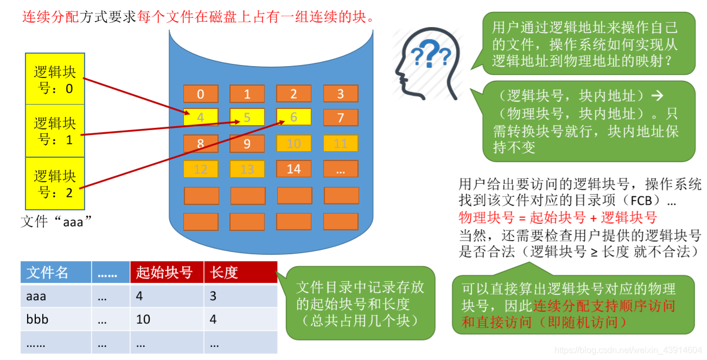

图5.连续分配方式

连续分配方式要求每个文件在磁盘上**占有一组连续的磁盘块**。

文件目录中记录存放的**起始块号**和**长度**（几块）。

显然该方式访问时可以直接算出逻辑块号对应的物理块号，因此连续分配方式**支持顺序访问和随机访问（直接访问）**。

显然当连续访问的两个磁盘块越近时，移动磁头时间越短，所以连续分配方式的文件**在顺序读/写时速度最快。**

当文件已连续存放好，而后续新增数据需要新增磁盘块时，可能出现该文件后面接着是别的文件的磁盘块，而因为连续存储，所以只能把该文件全部复制到足够大的连续的空闲磁盘块中。

所以物理上采用连续分配的文件不方便拓展。

类似于内存的外部碎片，采用连续分配，磁盘中也可能出现文件之间的小的磁盘块——磁盘碎片，而难以利用。
虽然也可以用紧凑技术来处理碎片，但时间开销大。

总结：
优点：支持顺序访问和随机访问（直接访问）；连续分配的文件在顺序访问时速度最快。
缺点：不方便文件拓展；存储空间利用率低，会产生磁盘碎片。

**随机访问的意思是，读/写耗时，与这段信息所处位置无关。**
顺序访问，就是有关。

## 二. 链接分配

**链接分配**采用离散分配的方式，可以为文件分配离散的磁盘块。分为**隐式链接**和**显式链接**两种。

### 2.1 隐式链接

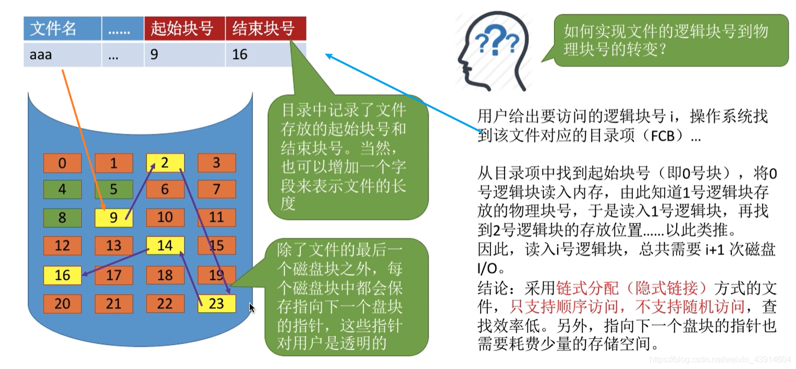

图6.隐式链接

目录中的FCB记录了文件存放的起始块号和结束块号。

在文件离散存储的磁盘块中，除了最后一块，每块的内容中都会保留有指向下一个磁盘块的指针，这些指针是**对用户透明的**。（隐式）

显然对于逻辑地址，操作系统只能从FCB中获得起始块号，然后一块一块的找过去......

不过这种方式新增磁盘块方便，就直接在找个空闲磁盘块，然后让原本是最后一块的，使其指针指向新增的，修改FCB结束块号为新增磁盘块号。

结论：
优点：方便文件扩展，不会有碎片问题，外存利用率高。
缺点：采用链式分配（隐式链接）方式的文件，**只支持顺序访问，不支持随机访问**，查找效率低。而且指向下一个磁盘块的指针也需要占用少量的存储空间。

### 2.2 显式链接

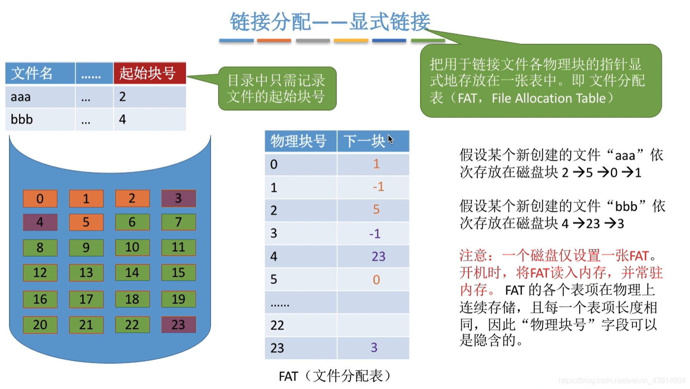

图6.显式链接

将用于连接各物理块的指针**显式**地放在一张表中，即**文件分配表FAT**。

文件分配表中记录的是每块的下一块。看图6的意思是直接记的块号，不是地址。

这样目录中的FCB只需要记录起始块号了。

一个磁盘仅设置一张文件分配表FAT，开机时，将FAT读入，常驻内存。
因为FAT在内存中是连续存储的，每一项长度相等，所以磁盘块号可以省略，隐含。

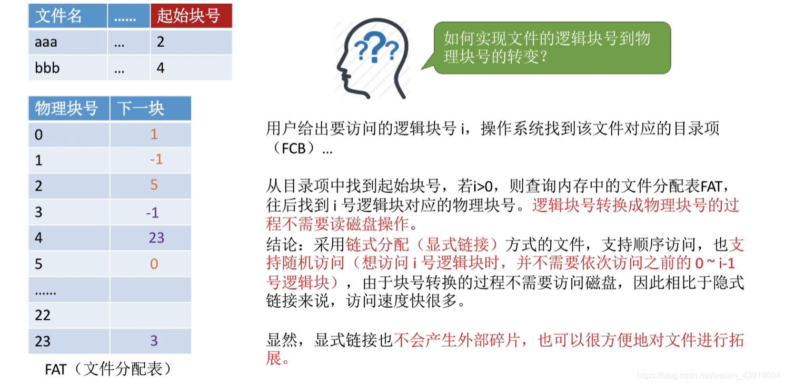

图7.显式链接

查找时，从目录的FCB中找到起始块号，然后就在内存中查文件分配表FAT，所以在逻辑地址转换物理地址过程，省去了I/O操作。

支持顺序访问。
支持随机访问（直接访问）。
这里的随机访问是说，当访问磁盘时，直接访问欲访问的物理块，虽然在 FAT 里面查我认为是顺序的，但那是在内存呀。对比前面的隐式链接，需要访问物理块一个一个访问过去。

文件拓展，类似于隐式链接，显式链接是改表，或者说，显示链接就是把指针写成一张表嘛。

结论：
优点：方便文件扩展，不会有碎片问题，外存利用率高，**支持顺序访问，支持随机访问**。相比隐式链接来说，**地址转换时不需要访问磁盘**，因此为文件的访问效率更高。
缺点：文件分配表需要占用一定的存储空间。

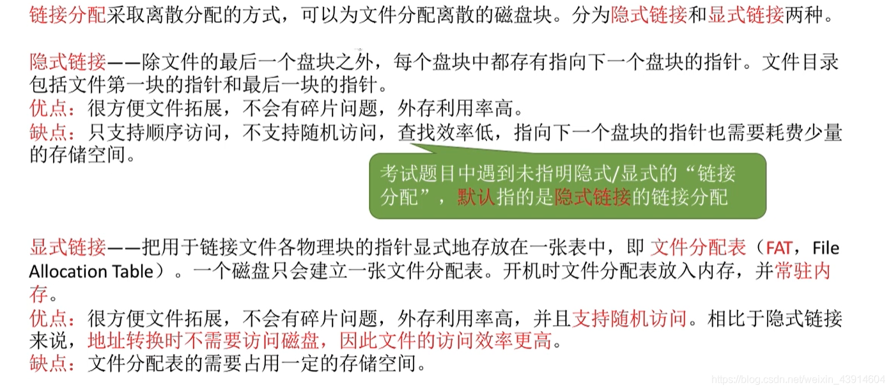

图9.链接分配总结

一般，题目只说链接分配，默认为隐式链接分配方式。

## 三. 索引分配

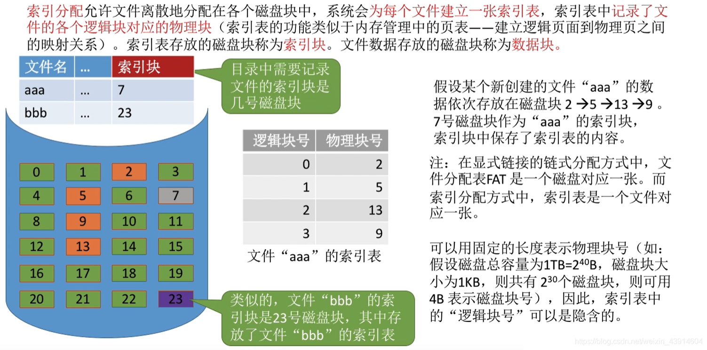

图10.索引分配

索引分配，还是允许文件离散存储。

**为每个文件建立一张索引表**，索引表中记录了文件各逻辑块对应的物理块。

索引表存放的磁盘块称为**索引块**，文件数据存放的磁盘块称为**数据块**。

显然，索引表是连续存储的，所以索引表的逻辑块号也可隐含。（感觉就是页表）

查找时，从目录中找到FCB，FCB中记录有该文件的索引块，然后从外存调入内存索引块，在索引块中查找逻辑块号对应的物理块号，然后访存。（真就页表啊）

可见，索引分配方式**支持随机访问**，文件拓展也很容易实现。
但索引表本身需要占用一定存储空间。

显然有问题，如果一个磁盘块放不完索引表怎么办？

有三种方案来解决：链接方案、多层索引、混合索引。

### 3.1 链接方案

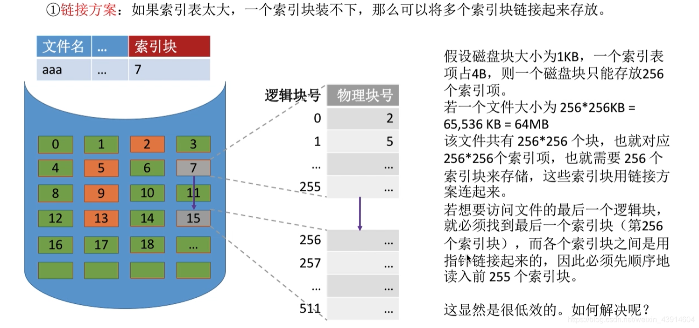

图11.索引分配—链接方案

链接方案：

类似与前面的隐式链接。这里是将索引表离散存储，通过索引块中存储的指针来指出下一索引块的位置。

### 3.2 多层索引

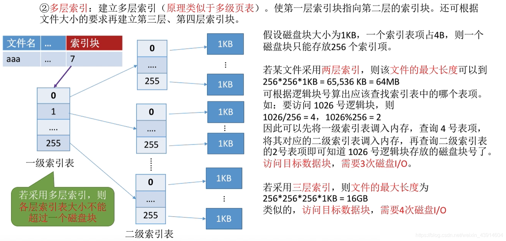

图12.索引分配—多层索引

多层索引：

类似于多级目录结构。这里是将索引表分组，然后为每组建立一个索引表。

第一次查顶层索引表，查到所需要的下一级索引表的物理地址（索引块），调入内存，查询。

当然可能有更多层索引表。

如果采用n层索引，则访问目标数据块，需要n+1次磁盘I/O（索引表事先都没有调入）。

### 3.3 混合索引

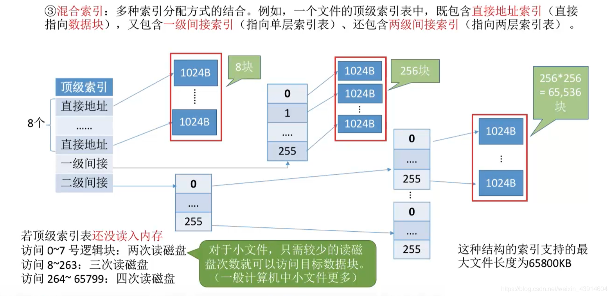

图13.索引分配—混合索引

混合索引。

多种索引方式的结合。

一个索引表中，既有指向索引表的物理地址（不一定按层次来），也有直接指向数据块的物理地址。

如图13，顶层索引表中，有直接指向数据块的直接地址，也有指向下一级索引表的一级间接地址，也有指向下两级索引表的二级间接地址。

### 3.4 索引分配总结

图14.索引分配—混合索引

自己看图13吧，懒得打字了。

**重要考点**：

1. 要会根据多层索引、混合索引的结构计算出文件的最大长度（**各级索引表不能超过一个块**）。
2. 要能分析访问某个数据块所需读磁盘次数。（注意题目条件，顶层索引块是否已调入内存）。

## 四. 本节回顾

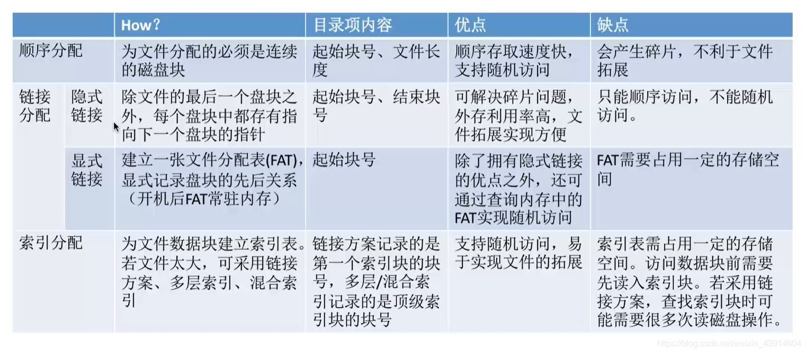

图15.本节回顾

2020.10.14