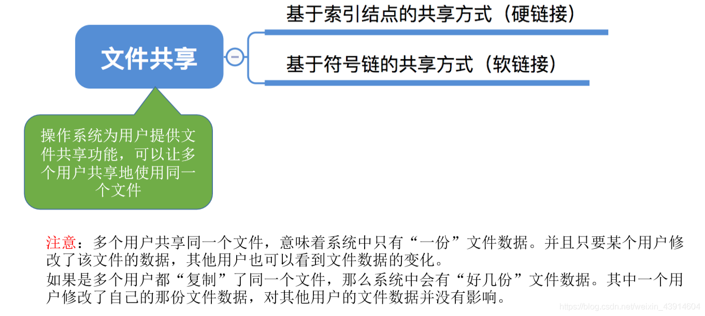
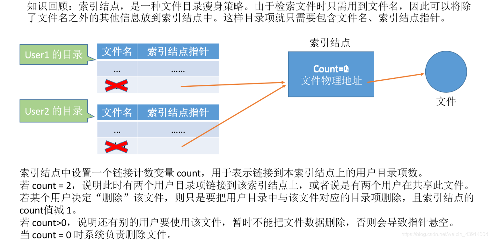
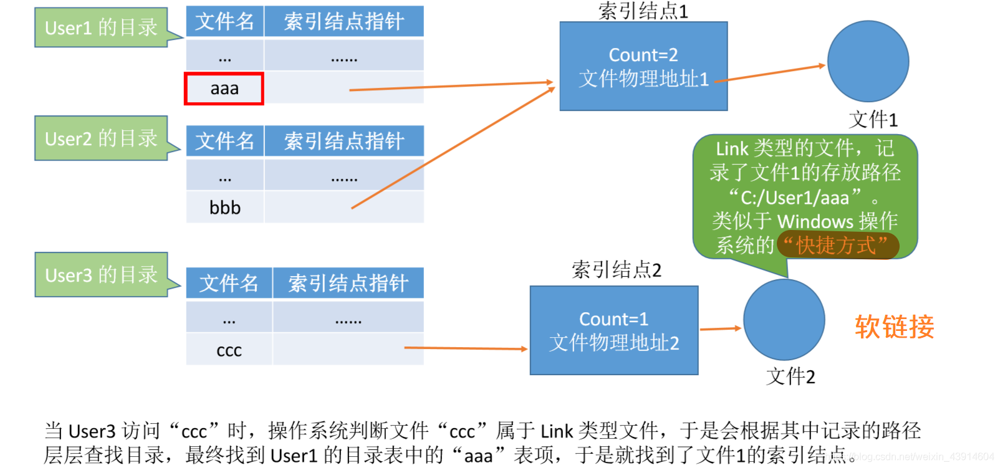
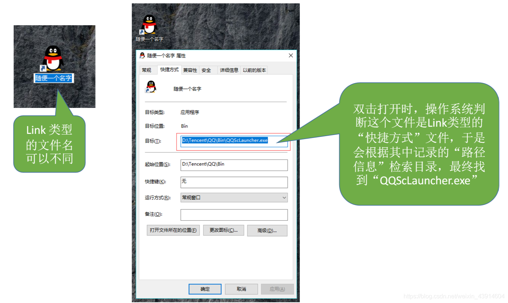
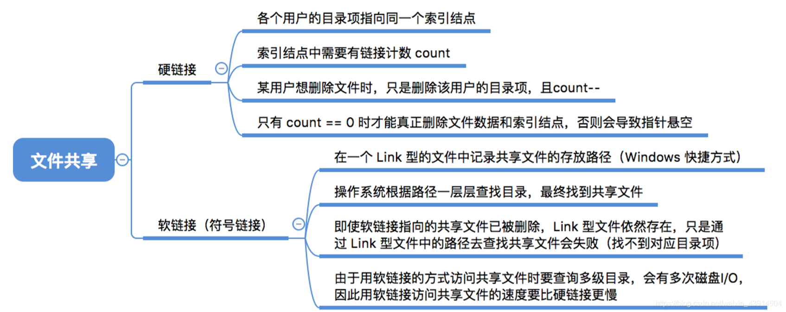

# 文件共享

图1.本节总览

共享，只多个用户共享一个文件， 某个用户修改该共享文件后，其他用户都能看到该文件的变化。

而多个用户各自复制一份自己用，这不是共享。

## 一. 基于索引结点的共享方式（硬链接）

图2.基于索引结点的共享方式（硬链接）

索引结点，也就是前面在减少目录文件大小的方式种提到的。

用户使用文件，则在用户目录中有指向该文件索引结点的索引结点指针。

在索引结点中设置一个链接计数变量count，用于表示链接到该索引结点上的用户目录项数。

当用户删除该文件，当然因为可能由别的用户在用，所以是从用户目录中删除该目录项，索引结点中的count减1。
如果索引结点中count>0，则还有用户使用该文件，不能删除文件。否则会导致指针悬空（其他共享的用户无法访问该文件了）。
如果索引结点中count=0，则无用户使用该文件，由操作系统删除文件，删除索引节点。

## 二. 基于符号链的共享方式（软链接）

图3.基于符号链的共享方式（软链接）

软链接是指，用户目录中的索引结点指针，指向索引结点，但不同于硬链接，软链接的索引结点并非直接指向文件，而是指向LINK类型的文件，这种方式称为**符号链接**。
该LIINK文件中只包含共享文件的路径，路径名只被视为**符号链**。
系统根据路径，一层一层的查找目录，来找到文件。

比如Windows的快捷方式，创建快捷方式，其实就是记录了目标文件的路径。

图4.快捷方式，就是一种LINK文件

软链接的方式，当文件的拥有者（指向的索引节点直接指向文件）删除文件。

则文件被删除。

之后若其他用户软链接访问，会访问失败，于是将符号链删除。

也就避免了硬链接会出现指针悬空的问题。

比如Windows中删除了目标文件，再点击快捷方式就会提示删除快捷方式。

## 三. 本节回顾

图5.本节回顾

2020.10.18