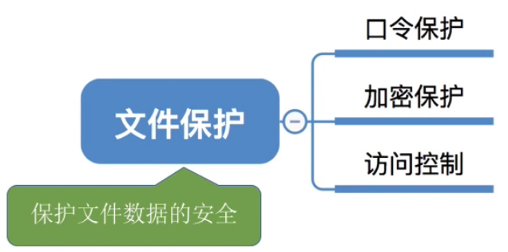
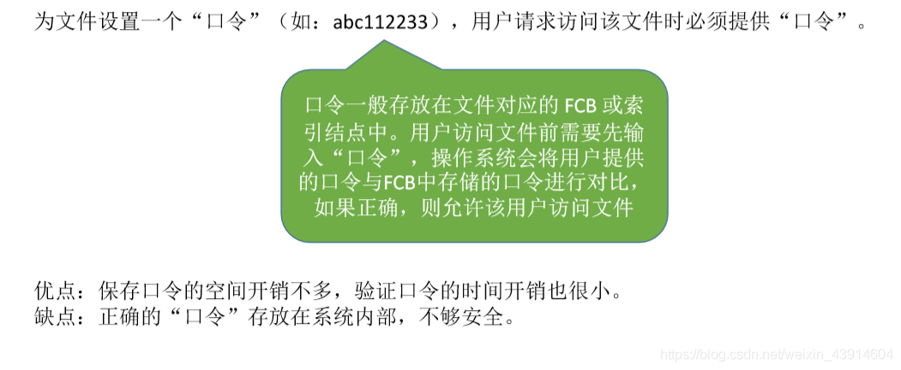
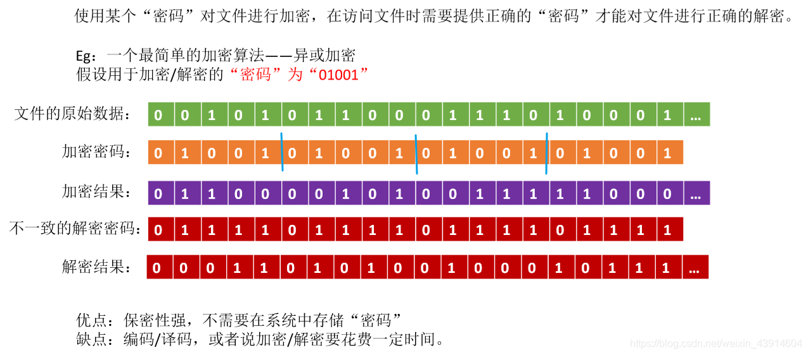
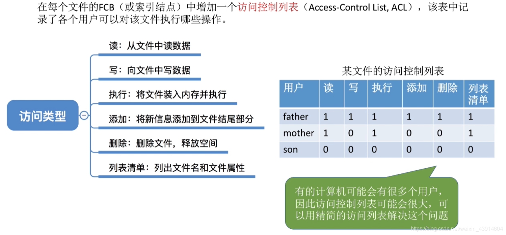
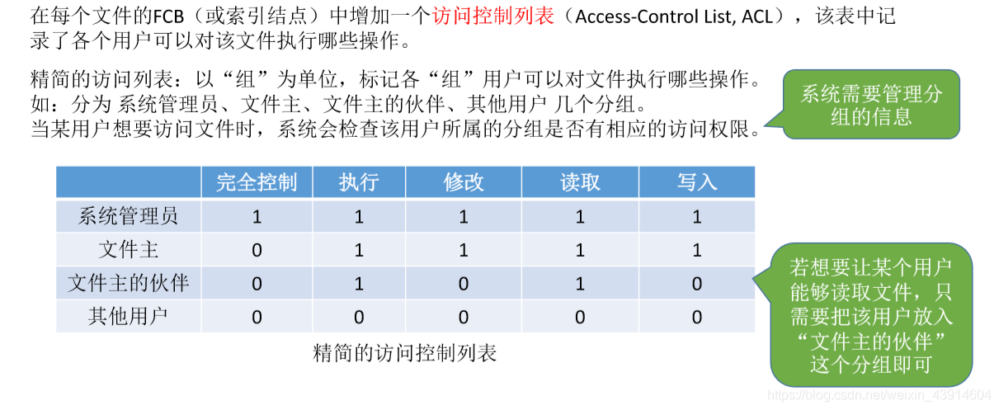
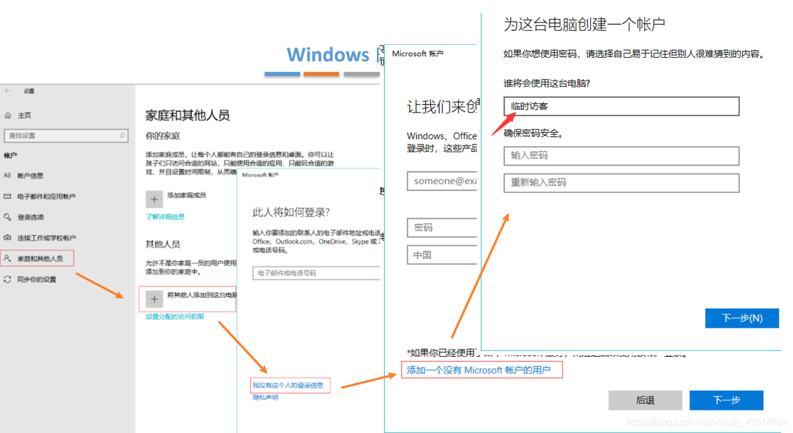
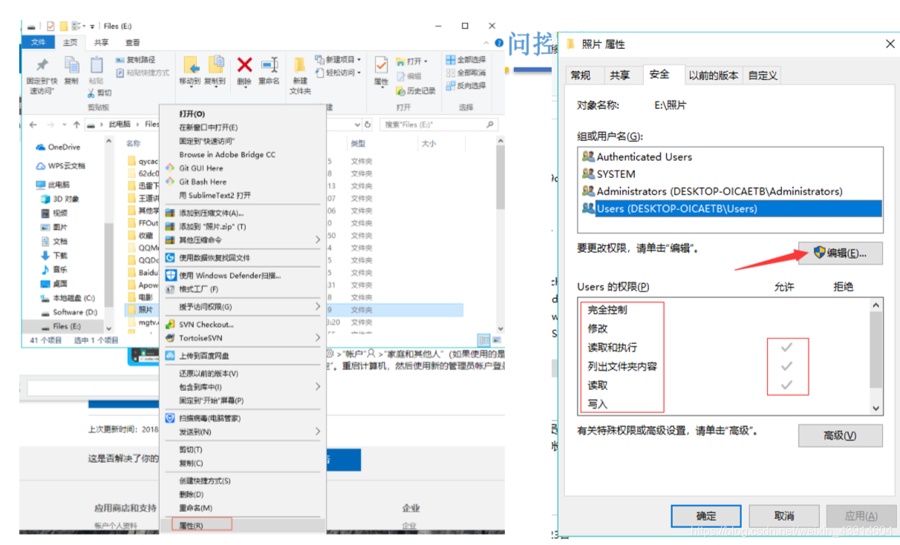
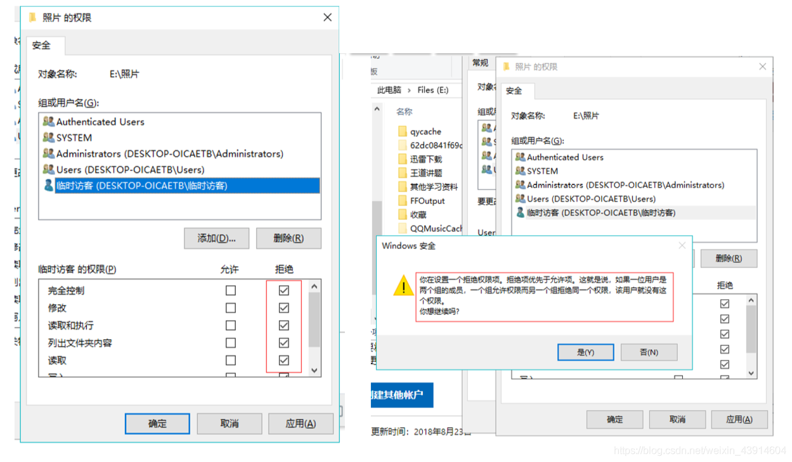
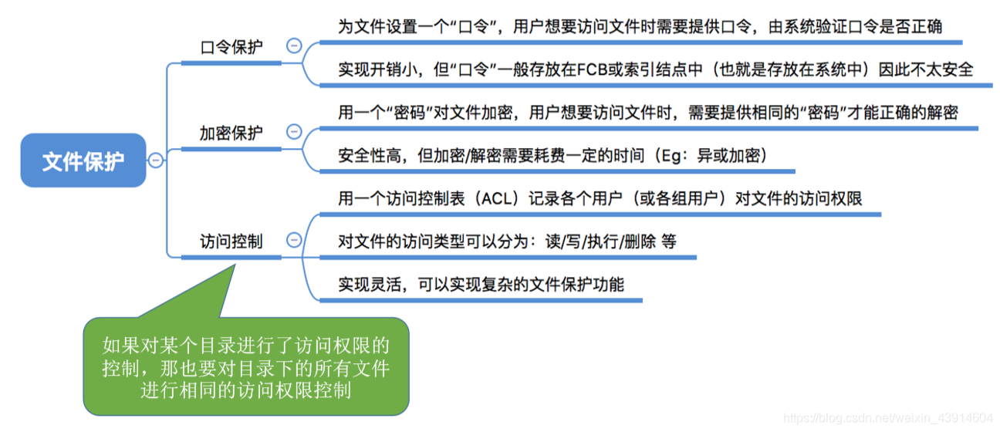

# 文件保护

图1.本节总览

## 一. 口令保护

图2.口令保护

口令保护。

为文件设置一个口令，用户请求访问该文件时必须提供口令。
一般口令存放在FCB中。
操作系统会将用户提供的口令与FCB中存储的口令进行对比，正确才允许用户访问。

优点：保存口令的空间开销不大，验证口令的实际按开销也小。
缺点：口令明文存放在系统内部，不够安全。

## 二. 加密保护

图3.加密保护

加密保护。

使用某个密码对文件进行加密，在访问文件时，提供正确的密码才能正确的解密。

如图3，以亦或加密为例，存储时以01001依次对文件原始数据进行亦或，将亦或的结果存储。访问文件时，需要提供01001才能对加密的文件解密出正确的数据。

优点：保密性强，不需要在系统中存储密码。
缺点：编码/译码（加密/解密）需要花费一定时间。

## 三. 访问控制

图4.访问控制

访问控制。

每个文件的FCB（或索引结点）中增加一个**访问控制列表**（ACL，Access-Control List），该表中记录了各个用户可以对该文件执行哪些操作。

如图4，用户对文件的操作分为了读、写、执行、添加......等多个访问类型，于是一个文件的访问控制列表中，就会对每个用户可进行的操作进行记录。

图5.精简的访问控制列表

因为当一个系统中用户很多时，记录每个用户的权限占用大，于是分组来记录。

当用户访问文件时，系统检查用户属于哪一组，该组是否拥有该操作的权限。

如图5，分为系统管理员、文件主、文件主的伙伴、其他用户，共四组。

### Windows的访问控制

图6.新建账户

新建账户。

图7.查看、编辑账户权限

可以查看和编辑各个账户对该文件的权限。

图8.添加新账户

添加新账户。

图9.对账户编辑权限

编辑账户对该文件的权限。

## 四. 本节回顾

图10.本节回顾

对一个目录进行了访问权限的控制，则该目录下的所有文件也有相同的访问控制。

就是对一个文件夹禁止访问，那么文件夹里面的都同样禁止访问。

2020.10.19