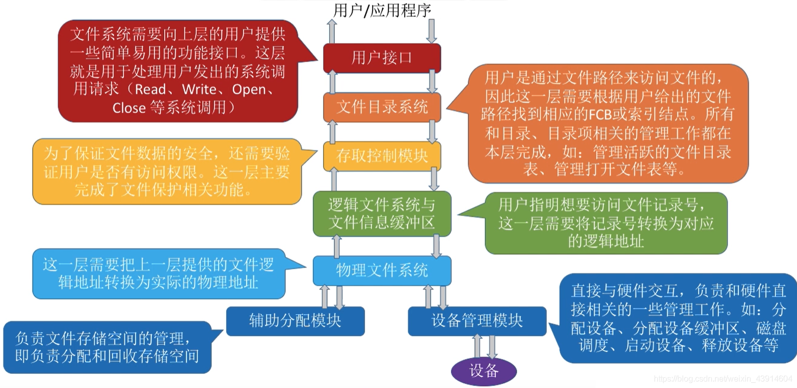
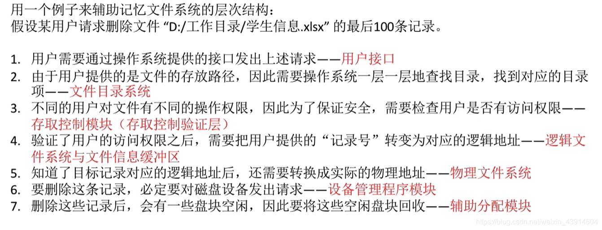

# 文件系统的层次结构

图1.文件系统的层次结构

文件系统的层次结构：

1. 用户接口

   文件系统向上层用户提供功能接口。这一层处理用户发出的系统调用请求。

2. 文件目录系统

   根据用户给出的路径，来找到相应的FCB或索引结点。所有和目录、目录项相关的管理工作都在本层完成。

3. 存取控制模块

   主要完成文件保护相关功能，为了保护文件数据安全，需要验证用户是否有访问权限。

4. 逻辑文件系统与文件信息缓冲区

   将文件的记录号转换为对应的逻辑地址。

5. 物理文件系统

   把上一层提供的问及爱你逻辑地址转换为实际的物理地址。

6. 辅助分配模块

   负责文件存储空间的管理，即负责分配和回收存储空间。

7. 设备管理模块

   直接与硬件交互，负责和硬件直接相关的一些管理工作，如分配设备，分配设备缓冲区，磁盘调度，启动设备，释放设备等。

8. 设备

图2.例子

图2例子，自己看吧，就不打一遍了。

2020.10.22

