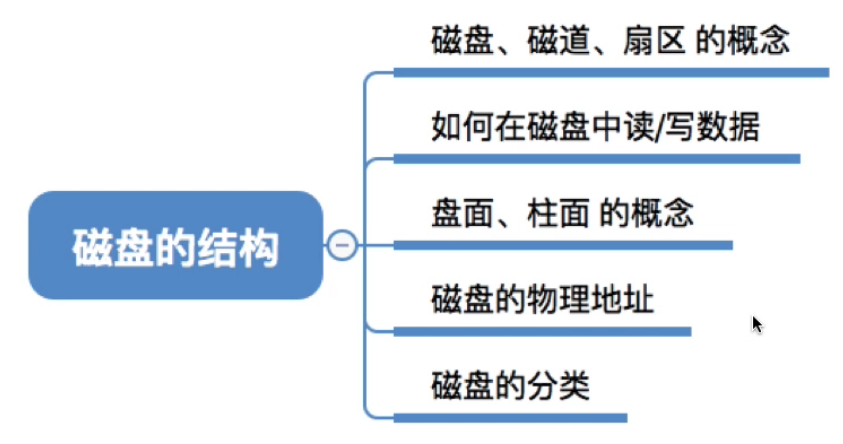
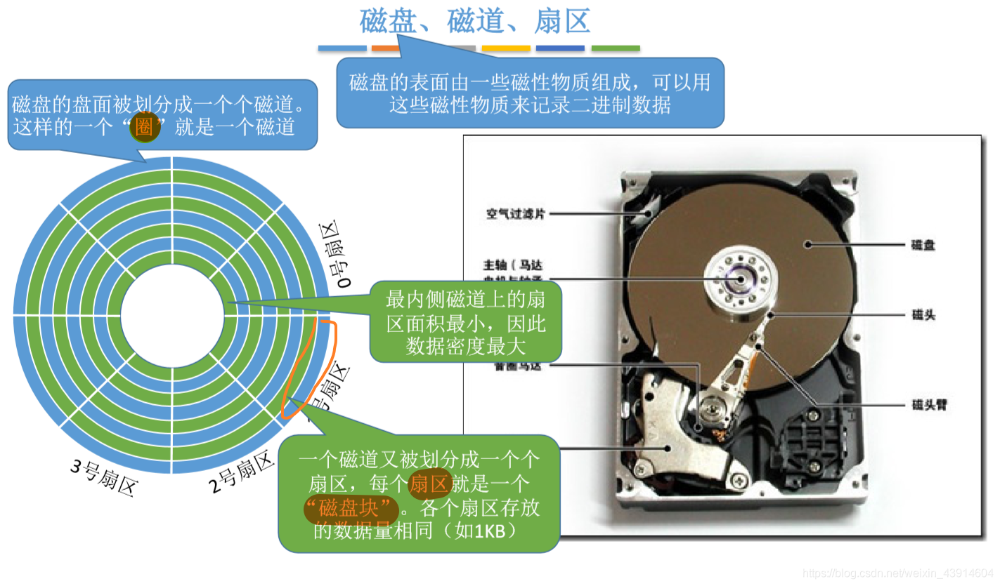
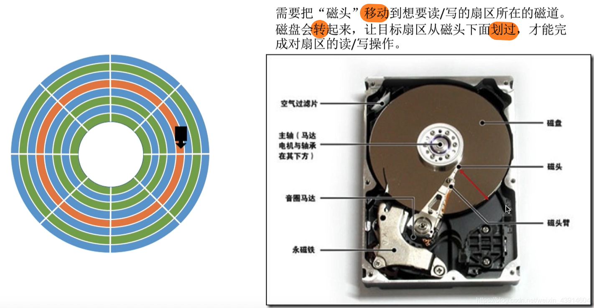
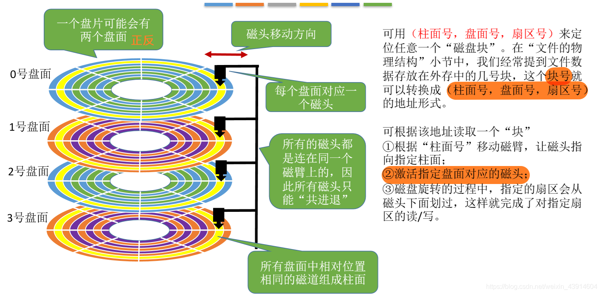
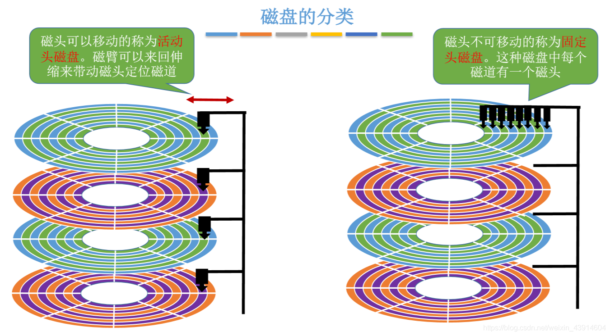
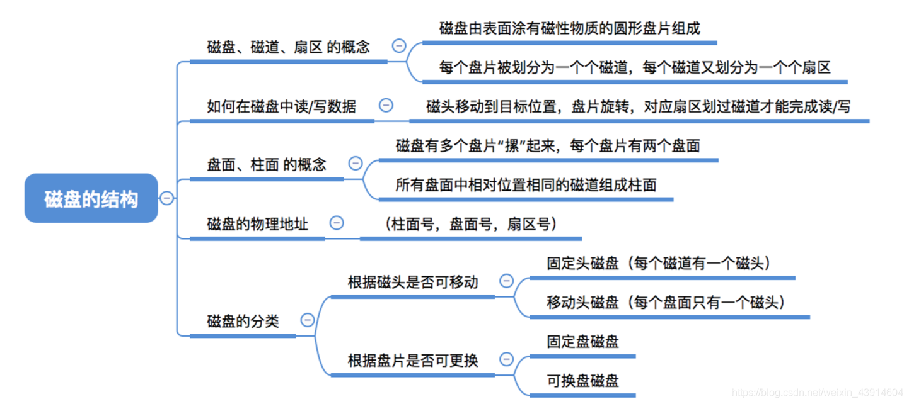

# 磁盘的结构

图1.本节总览

在<计算机组成原理>—12IO系统—1203外存储器，中有相关内容，甚至更详细。

## 一. 磁盘、磁道、扇区

图2.磁盘、磁道、扇区

磁盘就是一个盘，
磁道就是一圈，
扇区就是划分的一个区域。

不管内圈外圈的长度差异，一圈的存储容量是相等的，意味着每个扇区也是相等的，每个扇区的内圈外圈，存储容量都是相等的。
既然总量是相等的，自然内圈密度比外圈密度大。

一个磁道的一个扇区是一个 " 磁盘块 "。

---

这里有一点点小问题。
王道视频里说，一个磁道的一个扇区就是前面所说的 "磁盘块"。
而我在网上查到的信息则是，
磁盘块是对操作系统的概念，是逻辑上的，操作系统的文件系统对磁盘进行读/写是以磁盘块为单位的。
扇区是对磁盘的概念，是真实存在的，是物理上的，磁盘的读/写是以扇区为单位的。

扇区是磁盘最小的物理存储单元，由于扇区容量较小，数量较多，于是操作系统将相邻的扇区作为一个磁盘块块，以磁盘块为单位进行管理。
每个磁盘块可以包括 2、4、8、16、32 或 64 个扇区。

所以我感觉王道这里说的，应该不太准确，磁盘块应该是可以包括多个扇区的。

## 二. 读/写

图3.读/写

磁头与磁盘相对运动，进行读/写信息。

## 三. 盘面、柱面、物理地址

图4.盘面、柱面

一个磁盘，可能有正反共两面，也就是两面都可以存储信息。也可能之有一面。

多个磁盘叠放，也就形成了柱体。半径相等的磁道也就都在同一柱面上。

对于常用的几号扇区，实际上也就也就可以对应为（柱面号，盘面号，扇区号）的地址形式。

进程读/写操作：

1. 根据柱面号移动磁臂，是磁头指向指定柱面。
2. 激活指定盘面对应的磁头。
3. 磁盘旋转的过程中，指定扇区会从磁头下面划过，完成读/写。

## 四. 磁盘的分类

图5.按磁头可否移动分类

按磁头可否移动分类：活动头磁盘、固定头磁盘。

按磁盘可否更换分类：可换盘磁盘、固定盘磁盘。

## 五. 本节回顾

图6.本节回顾

2020.10.22