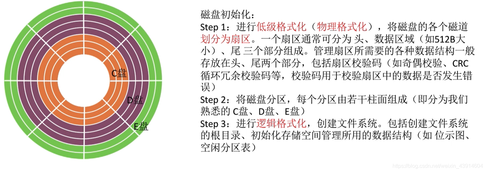
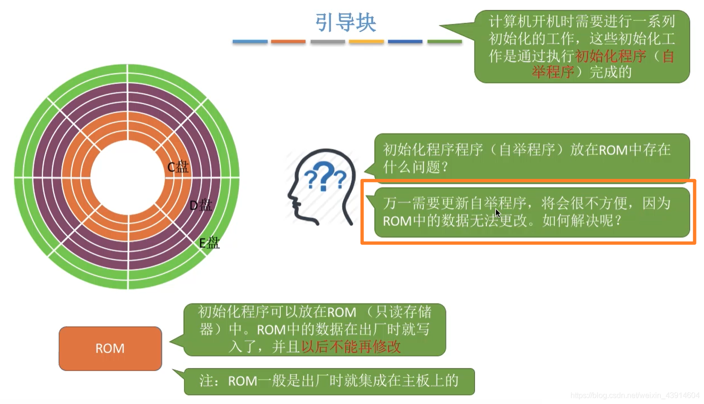
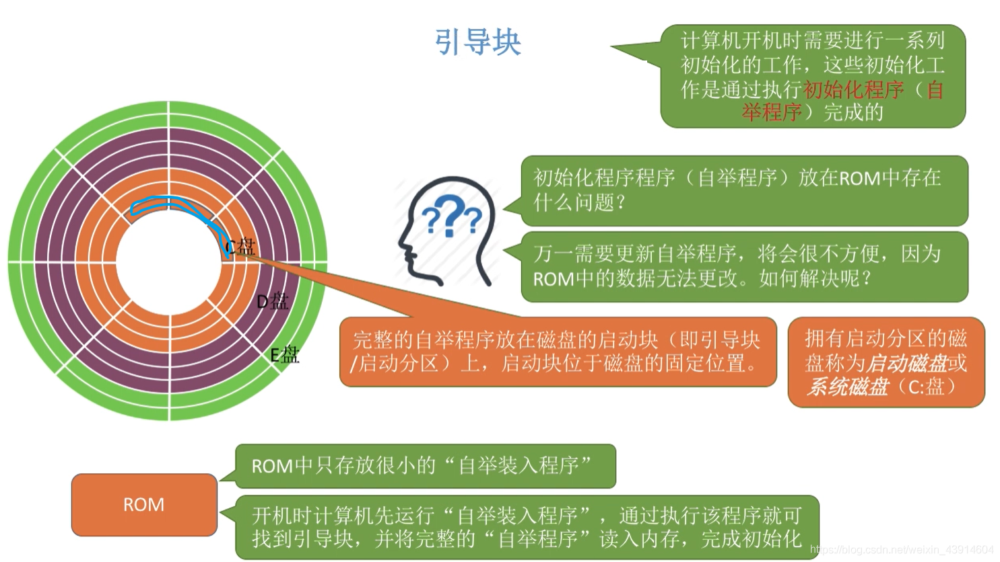
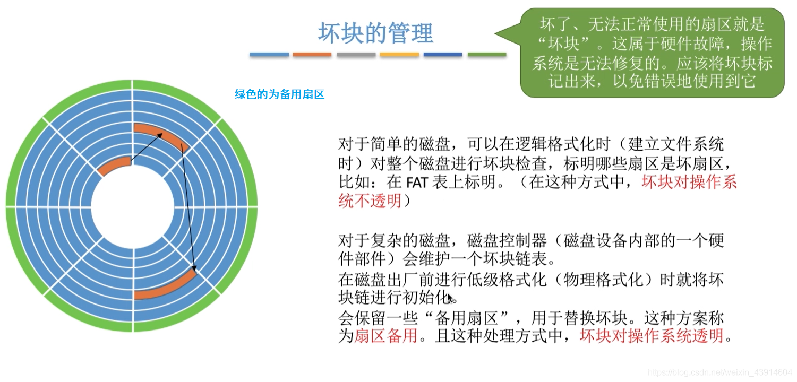
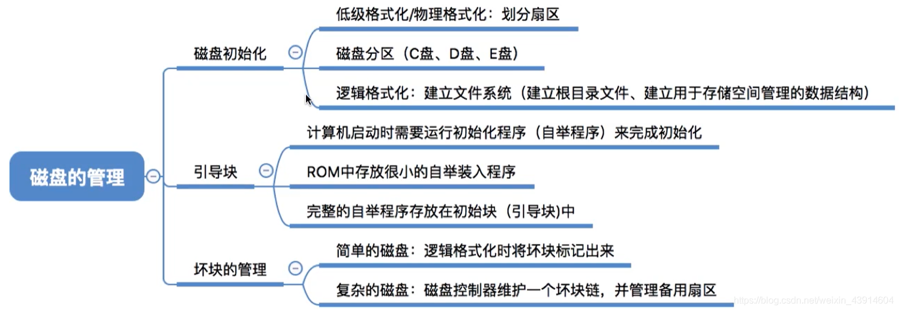

# 磁盘的管理

图1.本节总览

## 一. 磁盘初始化

图2.磁盘的初始化

磁盘初始化：

1. 第一步：

   进行**低级格式化（物理格式化）**，将磁盘的各个磁道划分为扇区。

   （因为刚开始的磁盘就是一个啥都没有的磁盘。）

   一个扇区通常可分为头、数据区域、尾，三个部分字组成。管理扇区所需要的各种数据结构一般存放在头、尾两个部分，包括扇区校验码。

2. 第二步：

   将磁盘进行分区，每个分区由若干柱面组成，即分为我们常见的C、D、E盘。

   （为啥是以柱面来分区呢，我猜就是上节讲的，先切换盘面，不切换柱面，读取速度快点。）

3. 第三步：

   进行**逻辑格式化**，创建文件系统。包括创建文件系统的根目录、初始化存储空间管理所用的数据结构，如位示图、空闲分区表。

## 二. 引导块

图3.ROM

计算机开机，需要进行一系列初始化的工作，这些初始化的工作是通过执行**初始化程序（自举程序）**来完成的。

（虽然我记得<计算机组成原理>里也讲过，但我忘了在哪了）

初始化程序，当然可以放在只读存储器ROM中，每次开机时，计算机先运行ROM里的出厂时就写好的程序。

但是这样ROM里的内容是写好了的，如果需要改动，那么非常麻烦。

图4.引导块

自然，可以想到，ROM里存储的内容改为到外存的取指，所以每次开机，计算机先运行ROM里**自举装入程序**，从而找到外存中的自举程序，调入内存执行。

这样ROM里的只需要放入很小的自举装入程序，而如果要修改启动块中的自举程序，就能比较方便的修改了。

完整的自举程序放在磁盘的**启动块**（引导块/启动分区）上，**启动块位于磁盘的固定位置**。
拥有启动块的磁盘称为**启动磁盘**或**系统磁盘**（C:盘）

## 三. 坏块的管理

图5.坏块的管理

坏了的扇区，属于硬件故障，无法再使用，所以需要将坏块标记出来，避免使用到了坏块。

对于简单的磁盘，在逻辑格式化时（建立文件系统时），对整个系统进行坏块检查，表明哪些扇区是坏扇区，不使用。
比如在文件分配表FAT中标明。
这种方式，坏块对操作系统不透明，是可见。

对于复杂的磁盘，设有磁盘控制器（磁盘设备内部的一个硬件部件）维护一个坏块链表。
在磁盘出厂前进行低级格式化（物理格式化）时，就将坏块链表进行初始化。
会保留一些备用扇区，用于替换坏块。这种方案成为**扇区备用**。
这种处理方式中，坏块对操作系统透明，不可见。

## 四. 本节回顾

图6.本节回顾

2020.10.22

