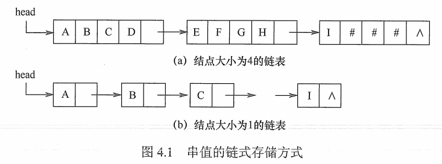

# 串的定义与实现

## 一. 串的定义

串（string）是由零个或多个字符组成的有限序列。一般记为：
$$
S='a_1a_2...a_n'(n\geq 0)
$$
$n=0$​​ 时称为空串，用 $\empty$​​ 表示。

## 二. 串的顺序结构

### 2.1 定长顺序存储表达

使用一组地址连续的存储单元存储字符串。

~~~C
#define MAXLEN 255		//预定义最大串长
typedef struc{
    char ch[MAXLEN];	//每个分量存储一个字符
    int length;			//串的实际长度
} SString;
~~~

这样，串的实际长度只能小于等于 MAXLEN，超过预定义长度的串值会被舍去，称为截断。

串长有两种表示方法，一是如上述定义，使用 length 变量来记录串长；另一种是在最后加入一个不计入串长的结束标记字符 " \0 "，此时串长也就为隐含值。

一点小问题，如果对串的操作（插入、联接等）

### 2.2 堆分配存储表达

仍然使用一组地址连续的存储单元存储字符串，不同在于是在程序执行过程中动态分配的。

~~~c
typedef struc{
    char * ch;	//按串长分配存储器，ch 指向串的起始地址
    int length;	//串的实际长度
} HString;
~~~

简而言之，在 C 语言中，存在一个称为 " 堆 " 的内存空间，并通过 malooc() 和 free() 函数来完成动态存储管理。

### 2.3 块链存储表示

图1.串的块链式存储表示

类似链表，每个结点存储 n 个字符，结点依次链接。

如果最后一个结点存不满，通常用 "#" 填充。

## 三. 串的基本操作

~~~c
StrAssign(&T,chars)：赋值操作。把串 T 赋值为 chars。

StrCopy(&T,S)：复制操作。由串 S 复制得到串 T。

StrEmpty(S)：判空操作。若 S 为空串，则返回 TRUE，否则返回 FALSE。

StrCompare(S,T)：比较操作。若 S>T，则返回值 >0；若 S=T，则返回值 =0；若 S<T，则返回值 <0。

StrLength(S)：求串长。返回串 S 的元素个数。

SubString(&Sub,S,pos,len)：求字串。用 Sub 返回串 S 的第 pos 个字符起长度为 len 的字串。

Concat(&T,S1,S2)：串联接。用 T 返回由 S1 和 S2 联接而成的新串。

Index(S,T)：定位操作。若主串 S 中存在与串 T 值相同的字串，则返回它在主串 S 中第一次出现的位置；否则函数值为 0。

ClearString(&S)：清空操作。将 S 清为空串。

DestroyString(&S)：销毁串。将串 S 销毁。
~~~

2021.07.30
