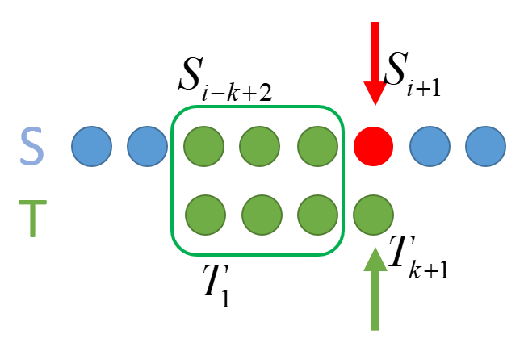
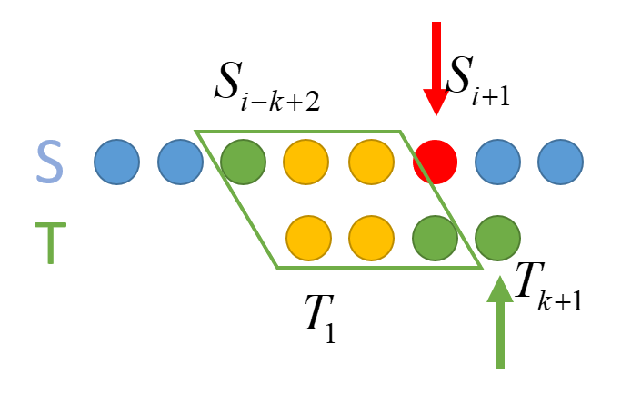
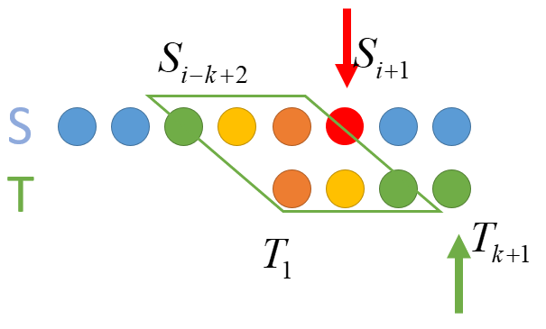

# 串的模式匹配

子串的定位操作通常称为串的模式匹配，它求得是子串（常称为**模式串**）在主串中的位置。

## 一. 简单的模式匹配算法

简单的模式匹配算法，这里以串的定长顺序存储结构为例，写个暴力搜索：

~~~c
int Index(SString S, SString T){			//在主串 S 中匹配模式串 T
    int i = 1;
    int j = 1;
    while( i<=S.length && j<=T.length ){
        if( S.ch[i] == T.ch[j] ){			//若相同，
            i++;							//则 i++; j++;继续对比下去
            j++;
        }
        else{								//若不同，
            i = i-j+2;						// i 返回一开始相同的位置的下一位
            j = 1;							// j 返回模式串 T 的第一位
        }
    }
	if( j>T.length )	return i-T.length;	//返回第一个与模式串 T 相同的字串的起始位置
    else	return 0;						//查找没有，返回 0
}
~~~

假定主串、模式串长度为 m，n，最坏时间复杂度为 $O(nm)$ 。

## 二. KMP 算法

### 2.1 个人理解

 $S$​ ：主串。 T ：模式串。 

**注意**：这里的字符串 $S,T$​​ ，包括后面伪代码里的字符串数组 $T.ch[],S.ch[]$​​都是从 $1$​​ 开始的，也就是第一个字符为 $S_1,T_1,T.ch[1],S.ch[1]$​​。

图1.前 3 位相同，第 4 位不同

当 $S_{i+1} 与 T_{k+1}$ 处字符不相等时， 说明已知 $T_1\sim T_{k}$ 与 $S_{i-k+2}\sim S_{i}$ 是相等的，为了后面叙述方便，将相等的这段字串称为串 $R$ 。

因为 $S_{i+1}\ne T_{k+1}$ ，所以下一步是将 $T$​ 右移。

图2.

暂且假设右移 $1$ 位。

如果右移后，$ R(T_1\sim T_{k})$​ 的最长前缀 $p_1$​ 与 $R(S_{i-k+2}\sim S_{i})$​ 的最长后缀 $q_1$​ 相等，那么就进入下一次判断： $S_{i+1}$ 与 $T_k$​ 是否相等，如果不等，继续右移。

但如果 $R$ 最长前缀 $p_1$与 $R$ 最长后缀 $q_1$不相等，那么就再右移 $1$​ 位。

图3.看最长前缀的最长前缀 与 最长后缀的最长后缀 是否相同

再一次右移 $1$ 位后，也就变成了：判断 $R$ 最长前缀 $p_1$ 的最长前缀 $p_2$ 与 $R$ 最长后缀 $q_1$ 的最长后缀 $q_1$ 是否相等。

（开始套娃，如果还不相等，那么就会对比 最长前缀的最长前缀的最长前缀 和 最长后缀的最长后缀的最长后缀 是否相等了。当然我这图里的字符数量画少了。）

但真这样 $1$ 位 $1$ 位地右移—判断—右移—判断......，太麻烦啦。

可以注意到，当 $S_{i+1}\ne T_{k+1}$ ，需要右移时，本质就是从相同串 $R$ ，也就是模式串 $T$ 的子串 $T_1\sim T_{k}$ 中，从最长到最短依次判断前缀、后缀是否相等。 这是无关主串 $S$ 的。 

所以我们可以在 $T$ 与 $S$ 匹配前，直接对假设 $T$ 在 $T_j$ 处匹配不相等的情况，事先来 $1$ 位 $1$ 位地右移，找出在此处匹配失败应右移几位，做出一个表。

这样，只用进行一次麻烦地操作。

当 $T$​ 与 $S$​ 匹配，每次不相等时，都可以通过查表，直接移动到指定位置。

当然说是右移，实际上是通过 $j=next[j]$​ 来修改 $j$​ 的位序来实现的。
比如 $n$​ 为 $T_j$​ 匹配失败时的右移位数，其实就是 $next[j]=j-n$​ 。

 $j$ 已知，也就求右移位数 $n$ 。

显然， $\underbrace n_{右移位数}=\underbrace{(j-1)}_{串R长度}-\underbrace{l}_{串R最长相等前/后缀长度}$​ ， 所以， $next[j]=l+1$​ ，即只需要求串 $R$​ 最长相等前/后缀长度 $l$​ 。 

### 2.2 求 $next[j]$​​​ 的算法实现：

注意：这里的字符串 $S,T$​​ ，包括后面伪代码里的字符串数组 $T.ch[],S.ch[]$​​都是从 $1$​​ 开始的，也就是第一个字符为 $S_1,T_1,T.ch[1],S.ch[1]$​​。

~~~c
void get_next(String, int next[]){
    int i = 1;
    int j = 0;
    next[1] = 0;
    while( i < T.length ){
        if ( j==0 || T.ch[i] == T.ch[j]){
            i++;
            j++;
            next[i] = j;					//next[j+1] = next[j] + 1
        }
        else{
            j = next[j]
        }
    }
}
~~~

顺带**注意到**：$next[1]$ 必然为 $0$ 。

### 2.3 KMP 算法实现：

注意：这里的字符串 $S,T$ ，包括后面伪代码里的字符串数组 $T.ch[],S.ch[]$都是从 $1$ 开始的，也就是第一个字符为 $S_1,T_1,T.ch[1],S.ch[1]$ 。

~~~c
int Index_KMP(String S, String T, int next[]){
    int i = 1;
    int j = 1;
    while( i<=S.length && j<=T.length){
        if( j==0 || S.ch[i] == T.ch[j]){
            i++;
            j++;
        }
        else{
            j = next[j];
        }
    }
    if( j>T.length)
        return i-T.length;
    else
        return 0;
}
~~~

KMP 算法的时间复杂度为： $O(m+n)$ ，m、n 为主串 S、模式串 T 的长度。

### 2.4 改进的 next 数组—nextval

当对比字符不匹配时， $j$ 指针回退，但可能回退的到的位置的字符与回退前的字符是相同的字符，显然这也是不与 $i$ 指向的字符相匹配的，所以 $j$ 需要再次回退。

既然如此，那么在求 next 数组时，就在对这种情况优化一下，如果 $j$ 回退后的字符与 $j$ 回退前的字符相同，则继续回退，直到 $j$ 回退到第一个不同的字符，然后才修改 $next[i]=j$ 。

这样获得的数组称为 nextval 数组.

求 nextavl 算法实现：

~~~c
void get_nextval(String T, int nextval[]){
    int i = 1;
    int j = 0;
    nextval[1] = 0;
    while( i < T.length ){
        if ( j==0 || T.ch[i] == T.ch[j]){
            i++;
            j++;
            if(T.ch[i] != T.ch[j])
                nextval[i] = j;
            else
                nextval[i] = nextval[j];
        }
        else{
            j = next[j]
        }
    }
}
}
~~~

显然， $nextval[1]$ 也恒为 0。

2021.07.30