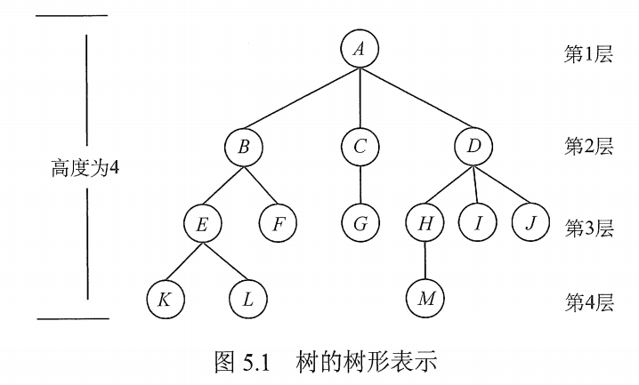

# 树的基本概念

## 一. 树的定义

树是 $n(n\geq 0)$​ 个结点的有限集。当 $n=0$ 时，称为空树。

任意一棵非空树应当满足：

1. 有且仅有一个特定的称为**根**的结点。
2. 当 n>1 时，其余结点可分为 $m(m>0)$​ 个互不相交的有限集合 $T_1,T_2,...,T_m$​ ，其中每个集合本身又是一棵树，并且称为根的**子树**。

显然，树的定义是递归的，其定义中又用到了自身，树是一种递归的数据结构，同时也是一种分层结构。

树具有以下两个特点：

1. 树的根结点没有前驱，除根结点外的所有结点有且只有一个前驱。
2. 树中所有结点可以有零个或多个后继。

显然，在 n 个结点的树中，有 n-1 条边。

树中每个结点（根结点除外），与上一层最多一个结点（父结点）有直接关系；与下一层零个或多个结点（子女结点）有直接关系。

## 二. 基本术语

图1.树

基本术语：

1. 祖先：从根节点 A，到结点 K 的唯一路径上的任意结点，都是结点 K 的祖先。
2. 子孙：相对的，K 结点就是 A、B、E 的子孙。
3. 双亲：结点 K 直接相连的上一层的结点 E 为 K 的双亲。
4. 孩子：结点 K 为直接相连的上一层的结点 E 的孩子。
5. 兄弟：结点 K 与结点 L 具有相同的双亲，所以 K 与 L 为兄弟。
6. 结点的度：该结点的孩子个数，为该结点的度。
7. 树的度：该树中的所有结点中，最大的结点的度，为该树的度。
8. 分支结点：度大于 0 的结点。又称非终端结点。
9. 叶子结点：度为 0 的结点。
10. 结点的层次：以根节点为第一层，依次自顶向下累加。
11. 结点的深度：以根节点层次为 1 ，依次自顶向下累加。
12. 结点的高度：以最底层为 1 ，依次自下向顶累加。
13. 有序树：树中各子树的左右顺序不能交换。
14. 无序树：树中各子树的左右顺序可以交换。
15. 路径：树中从一个结点出发，到另一个结束，之间所经过的结点序列（带起点和终点）。
16. 路径长度：路径上经过的边的个数。
17. 森林：森林是 $m(m\geq 0)$ 棵互不相交的树的集合。

## 三. 树的性质

树具有以下最基本的性质：

1. 树中的结点数等于所有结点的度数加 1。
2. 度为 m 的树中第 i 层上至多有 $m^{i-1}$​ 个结点 $(i\geq 1)$​ 。
3. 高度为 h 的 m 叉树至多有 $\frac{m^h-1}{m-1}$​​​ 个结点。
4. 具有 n 个结点的 m 叉树的最小高度为 $\lceil\log_m[n(m-1)+1]\rceil$​ 。

2021.07.30