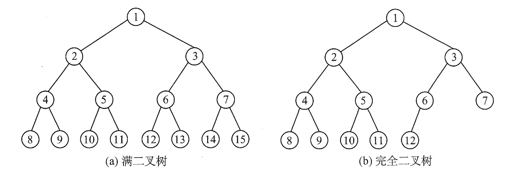

# 二叉树BT

## 一. 二叉树的定义

二叉树：
每个结点最多只有两颗子树，并且**二叉树的子树有左右之分**，不能调换次序。
即便二叉树中的结点**只有一棵子树**，也要求区分是左子树还是右子树。
即便二叉树中的结点**只有一棵子树**，其为左子树，与其为右子树，这是两种不同的二叉树。

区别二叉树与度为 2 的树：

1. 度为 2 的树至少有 3 个结点，而二叉树可以为空。

2. 度为 2 的树有序树，其有序只是相对概念，当有两个孩子时，区分左右，而当只有一个孩子时，并不区分其左右次序。

   但二叉树即便只有一个孩子，也区分其为左孩子还是右孩子。

## 二. 几个特殊的二叉树

几个特殊的二叉树：

1. 满二叉树：树中每层都含有最多的结点。
2. 完全二叉树：树中每个结点从 1,2,...,n 编号，都与满二叉树中的结点从 1,2,...,n 编号，一一对应。
3. 二叉排序树：左子树上的所有结点的值小于根结点的值，右子树上的所有结点的值大于根节点的值。
4. 平衡二叉树：树上任一结点的左子树和右子树的深度之差不超过 1。

图1.满二叉树、完全二叉树

## 三. 二叉树的性质

二叉树的性质：

1. 非空二叉树上的叶子结点数等于度为 2 的结点数加 1，即 $n_0=n_2+1$ 。

2. 非空二叉树上的第 $k$ 层至多有 $2^{k-1}$ 个结点 $(k\geq 1)$ 。 

3. 高度为 $h$ 的二叉树至多有 $2^h-1$ 个结点 $(h\geq 1)$ 。 

4. 对完全二叉树按从上到下、从左到右的顺序依次编号 $1,2,...,n$ ，则有以下关系：

   4.1 当 $i>1$ 时，结点 $i$ 的双亲编号为 $\lfloor i/2\rfloor$，即当 $i$ 为偶数时，双亲编号为 $i/2$ ；当 $i$ 为奇数时，双亲编号为 $(i-1)/2$ ；

   4.2 当 $2i\leq n$ 时，结点 $i$ 的左孩子编号为 $2i$，否则无左孩子。

   4.3 当 $2i+1\leq n$ 时，结点 $i$ 的右孩子编号为 $2i+1$，否则无右孩子。

   4.4 结点 $i$ 所在的层次（深度）为 $\lfloor\log_2 i\rfloor+1$ 。

5. 具有 $n$ 个结点的完全二叉树的高度为 $\lceil\log_2(n+1)\rceil$ 或 $\lfloor\log_2n\rfloor$ 。

## 四. 二叉树的存储结构

### 4.1 顺序存储结构：

使用数组来存储，通过数组下标来访问。

不过显然还是完全二叉树和满二叉树用顺序存储比较合适。

通常使用顺序存储结构，二叉树的结点编号从 1 开始，存入数组也从 array[1] 开始存，这样才方便对应上面二叉树的性质的第 4 条。
当然也可以二叉树的结点编号从 1 开始，存入数组也从 array[0] 开始存，这样就需要通过性质 4 计算出来的编号减 1 得到数组下标。

为了使得编号与数组下标对应，所以很可能存在很多结点（数组元素）是空的，导致利用率低。

### 4.2 链式存储结构：

~~~c
typedef struct BiTNode{
    ElemType data;				//数据域
    struct BiTNode * lchild;	//左孩子指针
    struct BiTNode * rchild;	//右孩子指针
}BiTNode, *BiTree
~~~

空链域：指没有被利用的指针域。

容易得出：**在 $n$ 个结点的二叉链表中，含有 $n+1$ 个空链域。**

推导：
除了根节点，每新增 1 个结点，则会减少双亲结点的 1 个空链域，增加新增结点的 2 个空链域，即空链域总体增加 1。
而最开始的根节点是增加 2 个空链域。
所以为 $2+(n-1)=n+1$​​ 。

2021.07.30

