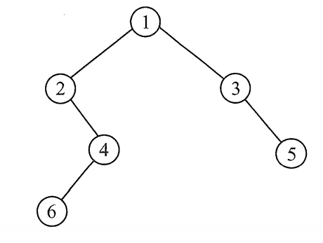
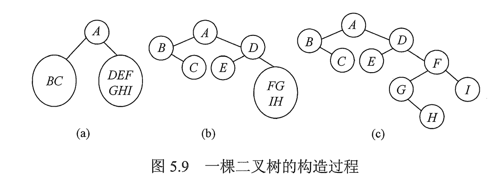

# 二叉树的遍历

二叉树的遍历指按某条搜索路径访问树中的每个结点，使得每个结点有且仅有被访问一次。

图1.用作遍历的简单例子

## 一. 先序遍历PreOrder

若二叉树为空，则无事发生；否则：

1. 访问根节点；
2. 先序遍历左子树；
3. 先序遍历右子树。

~~~c
void PreOrder(BiTree T){
    if( T != NULL){
        visit(T);				\\ 访问根节点
        PreOrder( T->lchild );	\\ 递归，先序遍历左子树
        PreOrder( T->rchild );	\\ 递归，先序遍历右子树
    }
}
~~~

对图 1 的先序遍历序列为：1 2 4 6 3 5。

## 二. 中序遍历InOrder

若二叉树为空，则无事发生；否则：

1. 中序遍历左子树；
2. 访问根节点；
3. 中序遍历右子树。

~~~c
void InOrder(BiTree){
    if( T != NULL){
        InOrder( T->lchild );	\\ 递归，中序遍历左子树
        visit(T);				\\ 访问根节点
        InOrder( T->rchild );	\\ 递归，中序遍历右子树
    }
}
~~~

对图 1 的中序遍历序列为：2 6 4 1 3 5。

## 三. 后序遍历PostOrder

若二叉树为空，则无事发生；否则：

1. 后序遍历左子树；
2. 后序遍历右子树。
3. 访问根节点；

~~~c
void PostOrder(BiTree){
    if( T != NULL){
        PostOrder( T->lchild );	\\ 递归，后序遍历左子树
		PostOrder( T->rchild );	\\ 递归，后序遍历右子树
        visit(T);				\\ 访问根节点
    }
}
~~~

对图 1 的后序遍历序列为：6 4 2 5 3 1。

## 四. 递归算法与非递归算法的转换

先序遍历与中序遍历的非递归算法类似。

### 4.1 先序遍历的非递归算法

算法：

1. 沿着根的左孩子，依次**访问并入栈**，直到左孩子为空。
2. 栈顶元素出栈，判断，若其右孩子为空，继续执行 2；若其右孩子不空，对其右子树执行 1。

~~~c
void PreOrder2(BiTree T){
    IniStack(S);				//初始化栈 S
    BiTree p = T;				//p 作为遍历指针
    while( p || !IsEmpty(S) ){	//p 不空 或 栈不空 时进入循环
        if(p){					//一直向左
            visit(p);			//访问当前结点
            Push(S,p);			//将当前结点入栈
            p = p->lchild;		//p 向左
        }
        else{					//当 p 某次向左走到 NULL
            Pop(S,p);			//出栈一个元素，赋值给 p
            p = p->rchild;		//p 向右，
        }
    }
}
~~~

### 4.2 中序遍历的非递归算法

算法：

1. 沿着根的左孩子，依次入栈，直到左孩子为空。
2. 栈顶元素**出栈并访问**，判断，若其右孩子为空，继续执行 2；若其右孩子不空，对其右子树执行 1。

~~~c
void InOrder2(BiTree T){
    IniStack(S);				//初始化栈 S
    BiTree p = T;				//p 作为遍历指针
    while( p || !IsEmpty(S) ){	//p 不空 或 栈不空 时进入循环
        if(p){					//一直向左
            Push(S,p);			//将当前结点入栈
            p = p->lchild;		//p 向左
        }
        else{					//当 p 某次向左走到 NULL
            Pop(S,p);			//出栈一个元素，赋值给 p
            visit(p);			//访问当前结点
            p = p->rchild;		//p 向右走一个结点，
        }
    }
}
~~~

### 4.3 后序遍历的非递归算法

后续遍历的非递归算法相比略微复杂一些。

算法：

1. 沿着根的左孩子，依次入栈，直到左孩子为空。
2. **读栈顶元素而不出栈**，判断，若其右孩子不空且未被访问过，对其右子树执行 1；若其右孩子为空，则栈顶元素**出栈并访问**，然后继续执行 2。

由于第 2 步中需要分清返回时（读栈顶元素时），p 指针是从左子树还是右子树返回的，所以多设置了一个 r 指针指向最近访问过的结点。

其实就是需要区分该结点的右子树是否已经处理了。
如果是已经处理了，我是正在往回出栈输出，那么 r 就会指向 p 结点的右孩子。

~~~c
void PostOrder2(BiTree T){
    IniStack(S);				//初始化栈 S
    BiTree p = T;				//p 作为遍历指针
    BiTree r = NULL;			//p 作为遍历指针
    while( p || !IsEmpty(S) ){	//p 不空 或 栈不空 时进入循环
        if(p){					//一直向左
            Push(S,p);			//将当前结点入栈
            p = p->lchild;		//p 向左
        }
        else{					//当 p 某次向左走到 NULL
            GetTop(S,p);		//读栈顶元素，赋值给 p。是读而非出栈
            if( p->rchild && p->rchile != r){	//若右子树存在且未被访问过
                p = p->rchild;	//p向右走一个结点
                push(S,p);		//入栈
                p = p->lchild;	//p继续向左
            }
            else{								//否则，出栈结点，并访问
             	Pop(S,p);			//出栈一个元素，赋值给 p
    	        visit(p);			//访问当前结点
				r = p;				//记录最近访问过的结点
                p = NULL;			//重置 p 为 NULL
            }
        }
    }
}
~~~

#### 应用：求树的深度

~~~C++
int treeDepth(BiTree T){
    if(T == NULL) return 0;
    else{
        int l = treeDepth(T->lchild);
        int r = treeDepth(T->rchild);
        return l>r ? l+1 : r+1;
    }
}
~~~

## 五. 层次遍历

使用队列来实现层次遍历。

~~~c
void LevelOrder(BiTree T){
    InitQueue(Q);					//初始化队列
    BiTree p;						//遍历指针 p
    EnQueue(Q,T);					//将根节点入队
    while( !IsEmpty(Q) ){			//队列不空，则一直循环
        Dequeue(Q,p);				//队头结点出队
        visit(p);					//并访问队头结点
        if( p->lchile != NULL)		//如果队头结点左孩子不空
            EnQueue(Q,p->lchild);	//则将其左孩子加入队列
        if( p->rchile != NULL)		//如果队头结点右孩子不空
            EnQueue(Q,p->rchild);	//则将其右孩子加入队列
    }
}
~~~

## 六. 由遍历序列构造二叉树

给出二叉树的（先序遍历+中序遍历）或（后序遍历+中序遍历），就可以唯一确定一棵二叉树。
（先序+后序）不行，不能确定。

因为先序遍历的第一个结点一定是根节点。
此外中序遍历中的根节点，将中序遍历序列分为了左子树和右子树。

而中序遍历的左子树和右子树，又可在先序遍历序列中找到其根节点，又由其根节点再分为左右子树......

而后序遍历，无法就是最后一个结点一定是根节点，和先序遍历倒着来的罢了。

图2.由遍历序列构造二叉树例子

图 2 为，给出先序遍历序列：ABCDEFGH，中序遍历序列：BCAEDGHFI，而推导出的唯一确定的二叉树的结构。

2021.07.31

