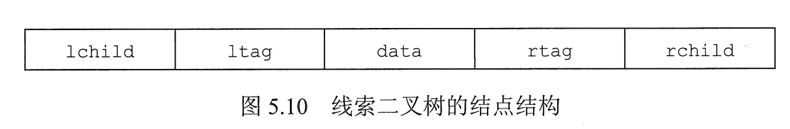

# 线索二叉树

前面说过，对于 n 个结点的二叉树，空链域就有 n+1 个。

线索二叉树则是将这些空链域利用起来，用于方便遍历。

## 一. 线索二叉树的概念

在前面二叉树的遍历中，之所以略显麻烦，是因为当遍历指针沿着一条路径往下后，到达尽头就遇到了单链表的非常讨厌的情况，需要返回。

而注意到，当遍历指针到达尽头时，刚巧这些尽头的结点，有着空链域。

于是，我们将空链域利用起来，使之指向该节点的后继或前驱，这样遍历指针就能够像遍历单链表那样流畅地遍历完二叉树。

线索二叉树规定：

- 若无左子树，令 lchild 指向其前驱结点；
- 若无右子树，令 rchild 指向其后继结点；
- 同时，还需增加两个标志域，用于标识该节点指针域是指向孩子还是前驱/后继。

图1.线索二叉树的结点结构

线索二叉树的存储结构描述如下

~~~c
typedef struct ThreadNode{
	ElemType data;				//数据元素
	struct ThreadNode * lchild;	//左孩子指针
	struct ThreadNode * rchild;	//右孩子指针
	int ltag;					//左线索标志
	int rtag;					//右线索标志
} ThreadNode， *ThreadTree;
~~~

以这种结点结构构成的**二叉链表**作为二叉树的存储结构，称为**线索链表**，其中指向结点前驱和后继的指针称为**线索**。

加上线索的二叉树称为**线索二叉树**。

## 二. 线索化

### 2.1 中序线索化

以中序线索二叉树为例。

对二叉树进行中序线索化的递归算法如下：

~~~c
void InThread(ThreadTree &p, ThreadTree &pre){
    if( p != NULL ){
        InThread( p->lchild, pre);			//递归，p 指向 p 的左孩子
    	if( p->lchild == NULL ){			//p 结点左孩子为空时，使该结点左孩子指向前驱
            p->lchild = pre;
            p->ltag = 1;					//修改 ltag 为 1
        }
    	if( pre != NULL && pre->rchild == NULL ){
        //当pre 不为空且 pre结点右孩子为空时，使之指向后继
            pre->rchild = p;
            pre->rtag = 1;
        }
    	pre = p;
    	InThread( p->rchild, pre);			//递归，p 指向 p 的右孩子
    }
}
~~~

本质上中序线索化就是中序遍历二叉树，将 visit(); 变为中序线索化的操作：

~~~c
void visit(ThreadTree &p, ThreadTree &pre){
        if( p->lchild == NULL ){			//p 结点左孩子为空时，使该结点左孩子指向前驱
            p->lchild = pre;
            p->ltag = 1;					//修改 ltag 为 1
        }
    	if( pre != NULL && pre->rchild == NULL ){
        //当pre 不为空且 pre结点右孩子为空时，使之指向后继
            pre->rchild = p;
            pre->rtag = 1;
        }
    	pre = p;
}
void InThread(ThreadTree p, ThreadTree &pre){
    if( p != NULL ){
        InThread( p->lchild, pre);			//递归，处理左孩子
		visit(p,pre)
    	InThread( p->rchild, pre);			//递归，处理右孩子
    }
}
~~~

### 2.2 先序线索化

类似的，也就是把先序遍历中的 visit(); 改为先序线索化的操作。

但需要注意，由于先处理根结点，其中无左孩子的根节点会被线索化，其左孩子指针指向前驱；然后进行左孩子的线索化时，会误将原本无左孩子的但被线索化了的根节点，判为有左孩子的根节点，从而陷入循环。

所以需要进行判断，处理左孩子时，仅处理确实有左孩子的结点。

~~~c
void visit(ThreadTree &p, ThreadTree &pre){
        if( p->lchild == NULL ){			//p 结点左孩子为空时，使该结点左孩子指向前驱
            p->lchild = pre;
            p->ltag = 1;					//修改 ltag 为 1
        }
    	if( pre != NULL && pre->rchild == NULL ){
        //当pre 不为空且 pre结点右孩子为空时，使之指向后继
            pre->rchild = p;
            pre->rtag = 1;
        }
    	pre = p;
}
void PreThread(ThreadTree p, ThreadTree &pre){
    if( p != NULL ){
		visit(p,pre)	
        if(p->ltag == 0){
		//由于根节点先线索化，没有左孩子的根结点，其左孩子指针指向前驱，
		//不设置判断条件的话，PreThread( p->lchild, pre);进行处理时，会顺着左孩子指针对其前驱进行处理，p->lchild 导致无限绕圈。
            PreThread( p->lchild, pre);		//递归，处理左孩子
        }
        //而右孩子不用担心。
    	PreThread( p->rchild, pre);			//递归，处理右孩子
    }
}
~~~

### 2.3 后序线索化

~~~c
void visit(ThreadTree &p, ThreadTree &pre){
        if( p->lchild == NULL ){			//p 结点左孩子为空时，使该结点左孩子指向前驱
            p->lchild = pre;
            p->ltag = 1;					//修改 ltag 为 1
        }
    	if( pre != NULL && pre->rchild == NULL ){
        //当pre 不为空且 pre结点右孩子为空时，使之指向后继
            pre->rchild = p;
            pre->rtag = 1;
        }
    	pre = p;
}
void PostThread(ThreadTree p, ThreadTree &pre){
    if( p != NULL ){	
        PostThread( p->lchild, pre);			//递归，处理左孩子
    	PostThread( p->rchild, pre);			//递归，处理右孩子
        visit(p,pre)
    }
}
~~~

## 三. 线索二叉树的构造

### 3.1 中序线索二叉树的构造

通过中序遍历建立中序线索二叉树的主过程算法如下：

~~~C
void CreateInThread(ThreadTree T){
    ThreadTree pre = NULL;
    if( T!=NULL ){
        InThread(T,pre);
        //在 InThread() 中，当 p==NULL 时就推出了循环，而未对最后一个结点的右孩子指针进行处理
        //所以需要处理遍历的最后一个结点，使之 pre->rchild = NULL; pre->rtag = 1;
        pre->rchild = NULL;
        pre->rtag = 1;
    }
}
~~~

### 3.2 先序线索化二叉树的构造

~~~c
void CreatePreThread(ThreadTree T){
    ThreadTree pre = NULL;
    if( T!=NULL ){
        PreThread(T,pre);
        //与中序遍历类似地，
        //在 PostThread() 中，当 p==NULL 时就推出了循环。而未对最后一个结点右孩子进行处理
        //所以需要处理遍历的最后一个结点，使之 pre->rchild = NULL; pre->rtag = 1 ;
        pre->rchild = NULL;
        pre->rtag = 1;
    }
}
~~~

### 3.3 后序线索化二叉树的构造

~~~c
void CreatePostThread(ThreadTree T){
    ThreadTree pre = NULL;
    if( T!=NULL ){
        PostThread(T,pre);
        //类似地，只不过对最后一个结点处理不同。
        //在 PostThread() 中，当 p==NULL 时就推出了循环。而未对最后一个结点右孩子进行处理
        //而最后一个结点为根节点，于是只有当其没有右孩子,为 NULL 时才进行处理
        if(pre->rchild == NULL)
	        pre->rtag = 1;
    }
}
~~~

## 四. 线索二叉树的遍历

对二叉树线索化后，如何对线索二叉树进行遍历。

显然，对于线索二叉树，只需要像单链表一样，直到最后其后继指向 NULL，遍历就结束了。

这里主要掌握如何自己脑子里找到一个结点的前驱或后继。

### 4.1 中序线索二叉树的遍历

中序遍历，根结点是在中间被访问，能够快速地找到**前驱，后继**。
其前驱，就在其左子树或其左孩子指针中，所以能够找到前驱。
其后继，就在其右子树或其右孩子指针中，所以能够找到后继。

求中序线索二叉树中中序序列的第一个结点：

~~~c
ThreadNode * Firstnode(ThreadNode * p){
    while( p->ltag == 0){//一直向左直到找到无左孩子的第一个结点
        p = p->lchild
    }
        return p;
}
~~~

求中序线索二叉树中结点 p 在中序序列下的后继结点：

~~~c
ThreadNode * Nextnode(ThreadNode * p){
    if( p->rtag == 0 )	// rtag == 0，直接返回右孩子的中序遍历的第一个结点
        return Firstnode(p->rchild);
    else
        return p->rchild;	//rtag == 1 直接返回后继线索
}
~~~

利用上面两个算法，则可以写出不含头结点的中序线索二叉树的中序遍历算法：

~~~c
ThreadNode * Inorder(ThreadNode * T){
    for( ThreadNode *p = Firstnode(T); p != NULL; p = Nextnode(p) ){
        visit(p);//这里就是访问 p 啊，不是前面线索化里面的 visit 了= =
    }
}
~~~

顺带，

求中序线索二叉树中中序序列的最后一个结点：

~~~c
//只需要把 Firasnode() 中 l 改为 r
ThreadNode * Lastnode(ThreadNode * p){
    while( p->rtag == 0){//一直向右直到找到无右孩子的第一个结点
        p = p->rchild
    }
        return p;
}
~~~

求中序线索二叉树中结点 p 在中序序列下的前驱结点：

~~~c
//只需要把 Nextnode() 中 l 改为 r
ThreadNode * Prenode(ThreadNode * p){
    if( p->ltag == 0 )	// rtag == 0，直接返回左孩子的中序遍历的第一个结点
        return Firstnode(p->lchild);
    else
        return p->lchild;	//rtag == 1 直接返回前驱线索
}
~~~

### 4.2 先序线索二叉树的遍历

如前面所说，主要掌握，题目给出一个结点，如何确定该结点的前驱、后继。
至于代码就省了。

**注意**的是：
先序线索二叉树，仅仅是**二叉链表**的话，对于有左孩子的结点，只能快速地找到后继，而无法快速找到前驱。
对于无左孩子的结点，那其左线索就是前驱。
（当然从头开始遍历来找前驱肯定是能找到的。）

先序遍历，根结点是最先被访问，**不能**够快速地找到前驱，**可以**快速找到后继。
结点的前驱的信息只会在其左孩子指针中，所以当结点具有左孩子，左孩子指针无法作为线索，就意味着无法快速地找该结点的前驱。

我们只能够快速地获得其后继。

如果想要获得前驱，方法一是从头开始进行依次先序遍历来找到前驱。
除此之外，我们还可以使用**三叉链表**来实现先序线索二叉树快速查找前驱，即结点中新增一个指针指向其**父节点**。

至于三叉链表先序线索二叉树找前驱，我就不写了，自己想一想。

### 4.3 后序线索二叉树的遍历

如前面所说，主要掌握，题目给出一个结点，如何确定该结点的前驱、后继。
至于代码就省了。

**注意**的是：
后序线索二叉树，仅仅是**二叉链表**的话，对于有左孩子的结点，只能快速地找到前驱，而无法快速找到后继。
对于无右孩子的结点，那其右线索就是前驱。
（当然从头开始遍历来找前驱肯定是能找到的。）

类似先序遍历的原因。
后序遍历，根结点是最后被访问，**不能**够快速地找到后继，**可以**快速找到前驱。
结点的后继的信息只会在其右孩子指针中，所以当结点具有右孩子，右孩子指针无法作为线索，就意味着无法快速地找该结点的后继。

我们只能够快速地获得其后继。

如果想要获得后继，方法一是从头开始进行依次先序遍历来找到后继。
同样的，我们也可以使用**三叉链表**来实现先序线索二叉树快速查找前驱，即结点中新增一个指针指向其**父节点**。

至于三叉链表后续序线索二叉树找后继，我也不写了，自己想一想。

### 4.4 简单对比

使用二叉链表：

| 快速找到 | 中序线索 | 先序线索 | 后序线索 |
| -------- | -------- | -------- | -------- |
| 前驱     | 可以     | NO       | 可以     |
| 后继     | 可以     | 可以     | NO       |

2021.08.01
