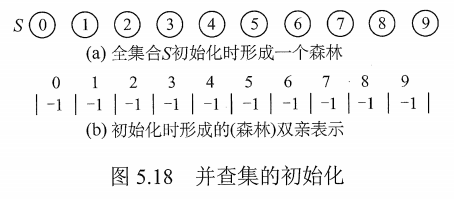

# 树、森林

前面讲的都是逻辑结构，现在讲树的存储结构。

## 一. 树的存储结构

### 1.1 双亲表示法

图1.双亲表示法

使用类似二维数组进行存储，每个结点，存储数据和其**双亲的**的下标。

~~~c
#define MAX_TREE_SIZE 100		//树中最多结点数
typedef struct{					//树中结点定义
    ElemType data;				//数据
    int parent;					//双亲位置域
} PTNode;
typedef struct{					//树的定义
    PTNode nodes[MAX_TREE_SIZE];
    int n;						//结点数
} PTree;
~~~

### 1.2 孩子表示法

图2.孩子表示法

每个结点都有一个指针，指向一个单链表，该单链表存储该结点所有孩子的地址。

### 1.3 孩子兄弟表示法

又称**二叉树表示法**。

图3.孩子兄弟表示法

~~~c
typedef struct CSTNode{
    ElemType data;				//数据域
    struct CSTNode * firstchild;	//指向该结点第一个孩子的指针
    struct CSTNode * nextsibling;	//指向该节点第一个孩子的右兄弟的指针
}CSTNode, *CSTree
~~~

## 二. 树、森林、二叉树的转换

图5.树、森林、二叉树的转换示意

### 2.1 树转换为二叉树

树转换为二叉树：
每个结点的左指针指向该结点的第一个孩子，右指针指向该结点在树中相连的右兄弟，这个规则称为 " **左孩子右兄弟** " 。由于根结点没有兄弟，所以树转换成的对应的二叉树是没有右子树的。

树转换为二叉树的画法（人算）：

1. 在兄弟结点之间加一根连线；
2. 对每个结点，只保留它与第一个孩子的连线，而抹除与其他孩子的连线
3. 以树根为轴心，顺时针旋转 45 度。

### 2.2 森林转换为二叉树

森林转换为二叉树：
先讲每棵树都转换为二叉树，由于每棵树转换为二叉树后右子树都为空，于是将树 B 视为树 A 的右子树进行连接，然后又将树 C 视为树 B 的右子树进行连接......，以此类推。

森林转换为二叉树的画法（人算）：

1. 将森林中的每棵树转换成相应的二叉树；
2. 每棵树的树结点视为兄弟关系，在每个树的树结点之间加上一根连线。
3. 以第一棵树的根为轴心顺时针旋转 45 度。

### 2.3 二叉树转换为森林

二叉树转换为森林：
若二叉树非空，则二叉树的根节点以及其左子树为森林中第一棵树的二叉树形式，断开根节点与右子树的连接；然后对右子树进行同样的操作，直到最后只有一个没有右子树的二叉树为止。这样就得到了森林所有树的二叉树形式。最后将这些二叉树转换回树就好了。

**二叉树转换为树或森林是唯一的**。

## 三. 树的遍历

个人理解：
在二叉树中，限制了孩子的个数，有（根-左-右，左-根-右，左-右-根）三种次序，所以称为先序，中序，后序遍历。
而树的孩子数是不定的，也就只存在（先根后孩子，先孩子后根）两种次序，所以称为先根，后根遍历。
自然没有中根的说法。

### 3.1 先根遍历

先根遍历：
若树非空，先访问根结点，再依次访问根结点的每颗子树。遍历子树时仍然遵循**先根后子树**的规则。
其遍历序列与这棵树相应的二叉树的**先序序列**相同。

### 3.2 后根遍历

后根遍历：
若树非空，先依次访问根结点的每颗子树，再访问根结点。遍历子树时仍然遵循**先子树后根**的规则。
其遍历序列与这棵树相应的二叉树的**中序序列**相同。

### 3.3 层次遍历

与二叉树的层次遍历思想相同，按层次依次访问各结点。

思想相同，不是遍历序列相同啊，这个树的层次遍历和二叉树的遍历是没有对应的遍历序列的。

## 四. 森林的遍历

在森林的遍历中，想法是对于每一个结点，其子树就构成了一个子树森林。

类似的树的遍历，森林的遍历也只存在（先根节点后子树森林，先子树森林后根节点）两种次序，也就是先序，中序遍历森林。

奇怪的是，为什么叫中序遍历森林，而不叫后序遍历森林。下面讲。

### 4.1 森林的先序遍历

若森林非空，先序遍历森林：

1. 访问森林中第一棵树的根节点。
2. 先序遍历第一棵树中的根节点的子树森林（即把根节点的子树视作多个树，称为子树森林）。
3. 先序遍历除去第一棵树后剩余树构成的森林。

其遍历序列等同于依次对森林中的进行**树的先根遍历**，
也等同于对森林中转换为二叉树后进行**先序遍历**。

### 4.2 森林的中序遍历

若森林非空，中序遍历森林：

1. 中序遍历森林中第一棵树的根节点的子树森林（即把根节点的子树视作多个树，称为子树森林）。
2. 访问第一颗树中的根节点。
3. 中序遍历除去第一棵树后剩余树构成的森林。

其遍历序列等同于依次对森林中的进行**树的后根遍历**，
也等同于对森林中转换为二叉树后进行**中序遍历**。

为什么叫中序遍历森林，而不叫后序遍历森林。

只在网上找到了网友的一些信息，而没有找到书上的比较可信的信息。

说法一是，森林存在多个树，所以森林的中序遍历，只在一棵树中确实是后序遍历，但在多个树中，一棵后被遍历的树的结点，是在已被遍历的树的根节点之后的，所以称为后序遍历森林有点不妥。

说法二是，森林的中序遍历，是借用了二叉树的遍历来命名，因为森林的先序、中序遍历都与将森林转换为二叉树后进行先序、中序遍历的结果相同。

但我感觉，解释得不是很完美。

## 五. 树、森林、二叉树的遍历关系

| 树       | 森林     | 二叉树   |
| -------- | -------- | -------- |
| 先根遍历 | 先序遍历 | 先序遍历 |
| 后根遍历 | 中序遍历 | 中序遍历 |

## 四. 树的应用-并查集

并查集是一种简单的集合表示，它支持以下三种操作：

~~~c
Union(S,Root1,Root2)：把集合 S 中的子集合 Root2 并入子集合 Root1。要求 Root1 和 Root2 互不相交，否则不执行合并。

Find(S,x)：查找集合 S 中单元素 x 所在的子集合，并返回子集合的名字。

Initial(S)：将集合 S 中的每个元素都初始化为只有一个单元素的子集合。
~~~

通常用树（森林）的**双亲表示法**作为并查集的存储结构。

每个子集合用一棵树来表示。
所以代表子集合的树，构成全集合的森林。

图5.并查集的初始化

通常，用数组元素的下标表示元素名，用根节点的下标表示子集合名字，根节点的双亲结点设为负数。

如图 5，设一个全集合为 $S=\{0,1,2,3,4,5,6,7,8,9\}$ ，则初始化后，每个元素自成 1 个单元素子集合，其数组值都为 -1。

图6. 经过一些运算后的并查集

经过一些运算后的并查集如图 6 所示。

变为了三个子集合 $S_1=\{0,6,7,8\},S_2=\{1,4,9\},S_3=\{2,3,5\}$ 。

可看出，S[6]，S[7]，S[8] 都为 0，表示 6，7，8 属于 0 这个集合；S[0] 为 -4，表示该集合中有 4 个元素。

图7.实现两个子集合的合并

为了得到两个子集合的合并，非常简单，只需要把一个子集合的根节点的双亲指针指向另一个集合的根节点就好啦。

如图 7。

下面是并查集的主要运算的实现：

并查集的结构定义：

~~~c
#define SIZE 100
int UFSets[SIZE]; 	//集合元素数组（双亲指针数组）
~~~

并查集的初始化操作：

~~~c
void Initial(int S[]){
    for( int i = 0; i<size; i++){
        S[i] = -1;
    }
}
~~~

Find 操作：

~~~c
//查找集合 S 中单元素 x 所在的子集合，并返回子集合的名字
void Find(int S[], int x){
    while( S[x] >= 0)	//循环寻找 x 的根
        x = S[x];
    }
	return x
}
~~~

Union 操作：

~~~c
//把集合 S 中的子集合 Root2 并入子集合 Root1。要求 Root1 和 Root2 互不相交，否则不执行合并
void Find(int S[], int Root1， int Root2){
	S[Root2] = Root1;	//将根 Root2 的双亲指针指向 Root1
	return x
}
~~~

2021.08.04
