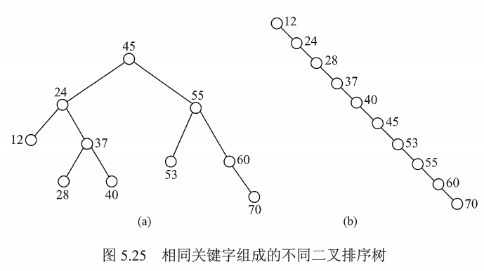

 # 二叉排序树BST

又称**二叉查找树**。

## 一. 二叉排序树的定义

二叉排序树，可以是一棵空树，若不为空则：

1. 若左子树非空，则左子树上所有结点的值均小于根节点的值。
2. 若右子树非空，则右子树上所有结点的值均大于根节点的值。
3. 左、右子树也分别是一棵二叉排序树。

## 二. 二叉排序树的查找

二叉排序树的非递归查找算法：

~~~c
BSTNode * BST_Search( BiTree T, ElemType key){
    while( T != NULL && key != T->data){
        if( key < T->data)
            T = T->lchild;
        else
            T = t->rchild;
    }
    return T;
}

~~~

当然也可以用递归的算法实现，不过递归的算法虽然简单，但执行效率较低。

## 三. 二叉排序树的插入

二叉排序树的插入操作的算法：

~~~c
int BST_Insert( BiTree &T, KeyType k){
    if( T == NULL ){
        T = (BiTree)malloc( sizeof(BSTree) );
        T->data = k;
        T->lchilde = NULL;
        T->rchilde = NULL;
        return 1;			//返回 1 表示插入成功
    }
    else if( k == T->data )
        return 0;			//返回 0 表示插入失败
    else if( k < T->data)
        return BST_Insert(T->lchild,k);	//尝试在左孩子结点插入
    else
        return BST_Insert(T->rchild,k);	//尝试在右孩子结点插入
}
~~~

## 四. 二叉排序树的构造

依次的将元素按照二叉排序树的规则进行插入，就构造成了二叉排序树。

构造二叉排序树的算法：

~~~c
void Creat_BST(BiTree &T, KeyType str[], int n){
    T = NULL;
    int i = 0;
    while( i < n ){
        BST_Insert(T,Str[i]);
        i++;
    }
}
~~~

元素插入顺序不同，可能生成不同的二叉排序树。

## 五. 二叉排序树的删除

二叉排序树删除一个结点，当结点为有子树的结点时，需要将其父结点与其子树连接起来，同时还需确保二叉排序树的性质不变。

删除的三种情况：

1. 若被删除结点 z 是叶结点，直接删除。

2. 若被删除结点 z 只有一棵左子树或右子树，则让其子树成为其父节点的子树，删除结点。

3. 若被删除结点 z 有左子树和右子树，

   则让被删除结点 z 的直接后继代替被删除结点 z，然后删除其直接后继。

   则让被删除结点 z 的直接前驱代替被删除结点 z，然后删除其直接前驱。

   这样就**转变**为了第一种或第二种情况。

## 六. 二叉排序树的查找效率分析

图1.二叉树的查找效率分析

二叉排序树的查找效率，主要取决于树的高度 $n$ 。

对于平衡二叉树，即二叉排序树的左、右子树高度之差的绝对值小于等于 1，其平均查找长度为 $O(\log_2n)$​ 。
若输入的元素有序，则构造成的二叉排序树是一个只有左子树（或只有右子树）的单支树，其平均查找长度为 $O(n)$​​​ 。

对图 1(a) 来说，查找成功的平均查找长度为：
$$
ASL_a = \frac{(1+2\times 2+4\times 3+3\times 4)}{10}=2.9
$$
对图 1(b) 来说，查找成功的平均查找长度为：
$$
ASL_b = \frac{(1+2+3+4+5+6+7+8+9+10)}{10}=5.5
$$
2021.08.04

