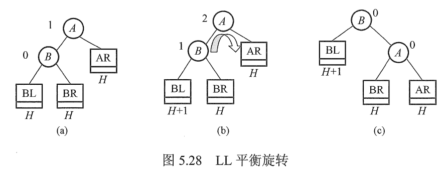
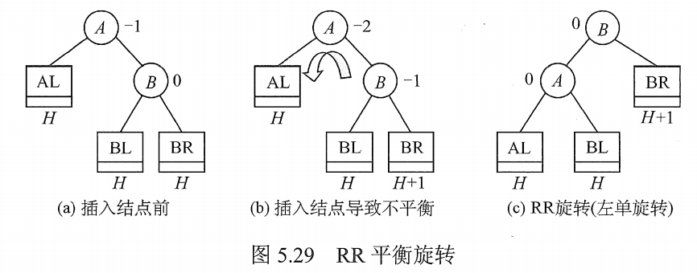
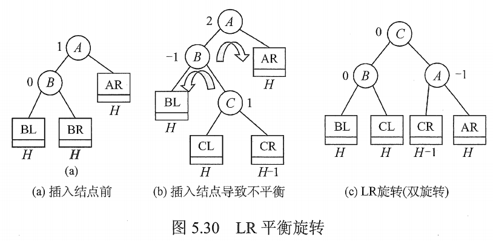
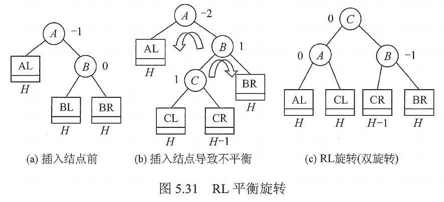

# 平衡二叉树AVL

平衡二叉树（Balanced Binary Tree），又称为 AVL 树。

## 一. 平衡二叉树的定义

为了避免树的高度增长过快，导致二叉排序树的性能降低，于是规定：在插入和删除二叉树结点时，需要保证任意结点的左子树、右子树高度差的绝对值不超过 1，即 $|h_{\text{左子树}}-h_{\text{右子树}}|\leq 1$ 。

这样的二叉树称为平衡二叉树，简称平衡树。

定义结点左子树与右子树的高度差为该结点的**平衡因子**，则平衡二叉树的平衡因子只可能是 -1，0，1。

## 二. 平衡二叉树的插入

二叉排序树保证平衡的基本思想如下：

每当在二叉排序树种插入（或删除）一个结点时，首先检查其插入路径上的结点是否因为此次操作而导致了不平衡。

若导致了不平衡，则先找到插入路径上离插入结点**最近的**平衡因子的绝对值大于 1 的结点 A，在对以 A 为根节点的子树，在保持二叉排序树的特性的前提下，调整各结点的位置关系，使之重新达到平衡。

注意一下，每次调整的都是**最小不平衡子树**。
因为只要最小不平衡子树，平衡了，自然其上的不平衡树也就平衡了。

平衡二叉树地插入过程的前半部分与二叉排序树相同，只是需要处理新结点插入导致不平衡的情况。
总共可以归纳为 4 种情况。

以下，仅以**插入**操作引起的不平衡为例。
实际上，删除引起不平衡也是类似的原理。

### 2.1 LL平衡旋转（右单旋转）

图1. LL平衡旋转

由于对结点 A 的左孩子（L）的左子树（L）上插入了结点导致的不平衡。

显然，应该使这最小不平衡树的左子树高度降低，右子树高度增加。

于是，只需要将左孩子结点 B 来代替 A 作为根结点，那么，这颗最小不平衡树就平衡了。

所以，将结点 B 向右上旋转一次，以代替 A 的位置。

接着，处理新的根结点 B 此时连接着 3 个孩子结点 BL，BR，A 的情况。
自然，当 B 作为新的根节点时，A 也就缺少了左子树，而 B 则多了 A 这个在右侧的子树。

所以将 B 的右子树 BR，作为 A 的左子树。

### 2.2 RR平衡旋转（左单旋转）

图2. RR平衡旋转

由于对结点 A 的右孩子（R）的右子树（R）上插入了结点导致的不平衡。

显然，应该使这最小不平衡树的右子树高度降低，左子树高度增加。

于是，只需要将右孩子结点 B 来代替 A 作为根结点，那么，这颗最小不平衡树就平衡了。

所以，将结点 B 向左上旋转一次，以代替 A 的位置。

接着，处理新的根结点 B 此时连接着 3 个孩子结点 BL，BR，A 的情况。
自然，当 B 作为新的根节点时，A 也就缺少了右子树，而 B 则多了 A 这个在左侧的子树。

所以将 B 的左子树 BR，作为 A 的左子树。

### 2.3 LR平衡旋转（先左后右双旋转）

图3. LR平衡旋转

由于对结点 A 的左孩子（L）的右子树（R）上插入了结点导致的不平衡。

显然，应该使这最小不平衡树的左子树高度降低，右子树高度增加。

如果按照之前的操作，将左孩子结点 B 来代替 A 作为根结点，那么，这颗最小不平衡树就平衡了。

接着，处理新的根结点 B 此时连接着 3 个孩子结点 BL，BR，A 的情况。
但是，按之前的操作，当将 B 的左子树 BR，作为 A 的左子树时，就不对了。
又变回了不平衡的状态。

原因在于 BR 连接在 B 上，和之后连接在 A 上并没有改变这最小不平衡树的高度。

所以，先对 B 为根节点的子树进行处理。
将结点 C 向左上旋转一次，以代替 B 的位置。

接着，处理新的根结点 C 此时连接着 3 个孩子结点 CL，CR，B 的情况。
自然，当 C 作为新的根节点时，B 也就缺少了右子树，而 C 则多了 B 这个在左侧的子树。

所以将 C 的左子树 CL，作为 B 的右子树。

然后，才对 A 为根节点的子树进行处理。
将结点 C 向右上旋转一次，以代替 A 的位置。

接着，处理新的根结点 C 此时连接着 3 个孩子结点 B，CR，A 的情况。
自然，当 C 作为新的根节点时，A 也就缺少了左子树，而 C 则多了 A 这个在右侧的子树。

所以将 C 的右子树 CR，作为 A 的左子树。

### 2.4 RL平衡旋转（先右边后左双旋转）

图4. RL平衡旋转

由于对结点 A 的右孩子（R）的左子树（L）上插入了结点导致的不平衡。

同理地，先对 B 为根节点的子树进行处理。
将结点 C 向右上旋转一次，以代替 B 的位置。

接着，处理新的根结点 C 此时连接着 3 个孩子结点 CL，CR，B 的情况。
自然，当 C 作为新的根节点时，B 也就缺少了左子树，而 C 则多了 B 这个在右侧的子树。

所以将 C 的右子树 CR，作为 B 的左子树。

然后，才对 A 为根节点的子树进行处理。
将结点 C 向左上旋转一次，以代替 A 的位置。

接着，处理新的根结点 C 此时连接着 3 个孩子结点 A，CL，B 的情况。
自然，当 C 作为新的根节点时，A 也就缺少了右子树，而 C 则多了 A 这个在右左侧的子树。

所以将 C 的左子树 CL，作为 A 的右子树。

## 三. 平衡二叉树的查找

平衡二叉树的查找与二叉排序树相同。

由于平衡二叉树的特点，含有 $n$ 个结点的平衡二叉树的最大深度必为 $O(\log_2 n)$ 。
因此，平衡二叉树的平均查找长度也就为 $O(\log_2 n)$ 。

2021.08.04

