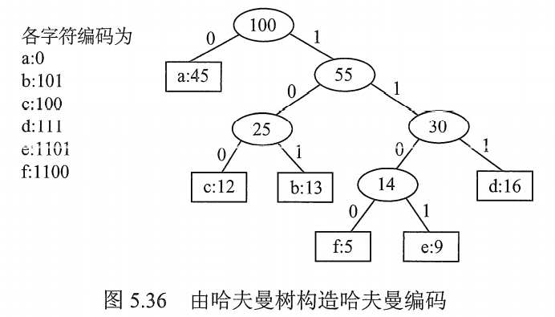

# 哈夫曼树

在很多情况下，树的结点常常被赋予一个表示某种意义的值，称为该结点的**权**。

从树根到任意结点的路径长度（经过的边数）与该结点上权值的乘积，称为该结点的**带权路径长度**。

树中所有**叶结点**的带权路径长度之和称为该树的**带权路径长度WPL**，记为：
$$
WPL = \sum_{i=1}^n w_il_i
$$
其中，$w_i$ 是第 i 个叶结点所带的权值， $l_i$ 是该叶结点到根结点的路径长度。

## 一. 哈夫曼树的定义

在含有 n 个带权叶结点的二叉树中，其中带权路径长度 WPL 最小的二叉树称为**哈夫曼树**，也成为**最优二叉树**。

## 二. 哈夫曼树的构造

给定 n 个权值分别为 $w_1,w_2,...,w_n$ 的结点，构造哈夫曼树的算法描述如下：

1. 将这 n 个结点视为作为 n 棵仅含一个结点的二叉树，构成森林 F；
2. 构造一个新结点 A，从森林 F 中选取两个根节点权值最小的树 B、C，作为新结点 A 的左、右子树，并且将新节点 A 的权值设置为左、右子树上根节点 B、C 的权值之和。
3. 从森林 F 中删除刚才选出的 B、C，将新得到的树 A 加入森林 F 中。
4. 重复 2、3 步，直到森林 F 中仅剩下一棵树为止。

可见，哈夫曼树具有以下特点：

1. 每个初始结点最终都成为叶结点，且权值越小的结点到根节点的路径长度越大。
2. 构造过程中共新建了 n-1 个结点，因此哈夫曼树的结点总数为 2n-1。
3. 每次构造都选择 2 棵树作为新结点的孩子，因此哈夫曼树中不存在度为 1 的结点。

图1.哈夫曼树构造示意

## 三. 哈夫曼编码

在数据通信中，
若对每个字符使用相等长度的二进制位表示，则称为**固定长度编码**。
若允许对每个字符使用不等长的的二进制位表示，则称为**可变长度编码**。

使用可变长度编码时，对使用频度高的字符，赋以短编码；对使用频度低的字符，赋以长编码。从而使字符平均编码长度缩短，起到压缩数据的效果。

若没有一个编码是另一个编码的前缀，则称为**前缀编码**。
例如 a=0，b=101，c=100，就是前缀编码。
而若还有 d=00，a=0，b=101，c=100，就会导致对于 00 无法分辨是 2 个 a，还是 1 个 d 的情况，不是前缀编码。

### 3.1 由哈夫曼树得出哈夫曼编码

图2.由字符频度构造哈夫曼树得出哈夫曼编码

对每个字符都作为一个结点。

以字符出现频度（或次数）作为权值，构造出哈夫曼树。

规定边标记为 0 表示 " 转向左孩子 "，为 1 表示 " 转向右孩子 "。
也可以向左为 1，向右为 0，并非强制规定。况且构造哈夫曼树时的左、右孩子顺序本身也是任意的。

显然，所有字符都处于叶子结点上，而到达每个叶子结点的路径唯一，且每个叶子结点的路径不会为路径更长的叶子结点的路径的前缀。

于是字符的编码也就是从根到该字符的路径上边标记的序列。

所以如图 5 所示，得出各字符的编码为 a=0，b=101，...

图 5 的哈夫曼树的带权路径长度 $WPL = 1\times 45+3\times (12+13+16)+4\times(5+9)=224$ 。

**哈夫曼树，虽然构造出的哈夫曼树可能不同，各个字符的编码可能不同，但 WPL 一定是相同且最优的**。

2021.08.05

