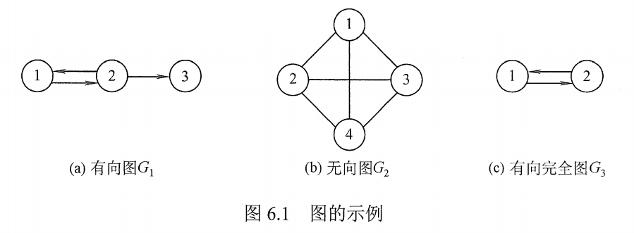
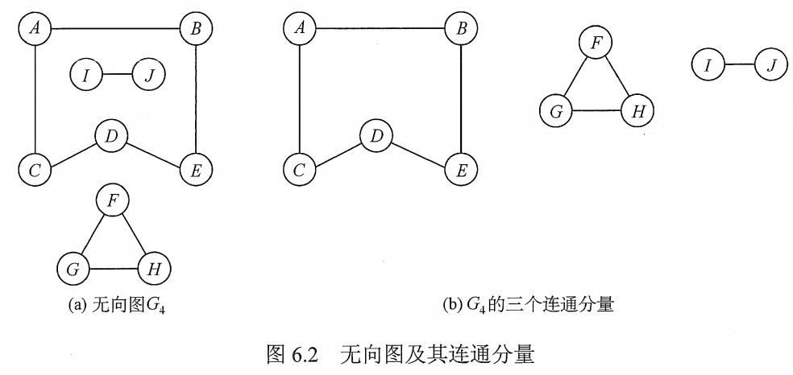
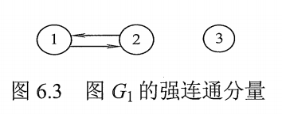
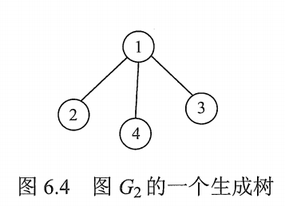

# 图的基本概念

## 一. 图的定义

图 G 由顶点集 V 和边集 E 组成，记为 $G=(V,E)$​ ，其中 $V(G)$​ 表示图 G 中顶点的有限**非空**集；其中 $E(G)$​ 表示图 G 中顶点之间的关系（边）的集合。

若 $V=\{v_1,v_2,...,v_n\}$​​ ，则用 $|V|$​​ 表示图 G 中顶点的个数，也称图 G 的**阶**， $E=\{(u,v)|u\in V,v\in V\}$​ ，用 $|E|$​ 表示图 G 中边的个数。

注意：
线性表可以是空表，树可以是空树。
但图的顶点集 V 限制了是有限非空集，所以图不能没有一个顶点，但边集 E 可以是空的。

## 二. 图的基本概念及术语

图1.有向图G1，无向图G2，有向完全图G3

#### 2.1 有向图

若 E 是有向边（也称**弧**）的有限集合时，则图 G 为有向图。

弧是顶点的有序对，记为 <v,w>。
其中 v，w 是顶点，v 称为**弧尾**，w 称为**弧头**，<v,w> 称为从顶点 v 到顶点 w 的弧，也称 v 邻接到 w，或 w 邻接自 v。

图 1(a) 为有向图。

#### 2.2 无向图

若 E 是无向边（也称**边**）的有限集合时，则图 G 为无向图。

边是顶点的无序对，记为 (v,w) 或 (w,v)。
因为 (v,w) = (w,v) ，其中 v，w 是顶点。
可以说顶点 v 和顶点 w 互为邻接点。边 (v,w) 依附于顶点 v 和 w，或者说边 (v,w) 和顶点 v、w 相关联。

图 1(b) 为无向图。

#### 2.3 简单图

一个图 G 若满足：

1. 不存在重复边。
2. 不存在顶点到自身的边。

则称图 G 为**简单图**。

数据结构中仅讨论简单图。

#### 2.4 多重图

若图 G 中某两个结点之间的边数多于一条，又允许顶点通过同一条边和自己关联，则图 G 为**多重图**。

多重图的定义与简单图是相对的。

#### 2.5 完全图（简单完全图）

对于无向图， $|E|$ 的取值范围是 0 到 $\frac{n(n-1)}{2}$ 。则有 $\frac{n(n-1)}{2}$​ 条边的无向图称为**完全图**。
在完全图中，任意两个顶点之间都存在边。

对于有向图， $|E|$​​​ 的取值范围是 0 到 $n(n-1)$​​​ 。则有 $n(n-1)$​​​​ 条边的无向图称为**有向完全图**。
在有向完全图中，任意两个顶点之间都存在方向相反的两条弧。

图 1(b) 为无向完全图。
图 1(c) 为有向完全图。

#### 2.6 子图、生成子图

设有两个子图 $G=(V,E)$​ 和 $G'=(V',E')$​ ，若 $V'$​ 是 $V$​ 的子集，且 $E'$​ 是 $E$​ 的子集，则称 $G'$​ 是 $G$​ 的**子图**。

若有满足 $V(G')=V(G)$​ 的子图 $G'$​ ，则称改 $G'$ 为 $G$​ 的**生成子图**。

#### 2.7 连通、连通图、连通分量

图2. 无向图及其连通分量

在无向图中，若从顶点 v 到顶点 w 有**路径**存在，则称 v 和 w 是**连通的**。

若图 G 中任意两个顶点都是连通的，则称图 G 为**连通图**，否则称为**非连通图**。

无向图中的**极大连通子图**称为**连通分量**。

若一个图有 n 个顶点，且边数小于 n-1，则此图必为非连通图。

#### 2.8 强连通图、强连通分量

图3.图1(a)的强连通分量

在有向图中，若从顶点 v 到顶点 w 和顶点 w 到顶点 v 之间都有**路径**存在，则称这两个顶点是**强连通的**。

若图 G 中任意一对顶点都是强连通的，则称图 G 为**强连通图**。

有向图中的**极大强连通子图**称为有向图的**强连通分量**。

#### 2.9 极大连通子图、极小连通子图

极大连通子图：该连通子图包含连通 该连通子图中的顶点的所有边。

极小连通子图：该连通子图仅包含保持该连通子图连通性的最少的边。

#### 2.10 生成树、生成森林

图4.图1(b)的一个生成树

连通图的生成树是包含图中全部顶点的一个**极小连通子图**。

若图中顶点数为 n，则它的生成树含有 n-1 条边。

对生成树而言，若砍去它的一条边，则会变成非连通图；若加上一条边，则会形成回路。

#### 2.11 顶点的度、入度、出度

图中每个**顶点的度**定义为以该顶点为一个端点的边的数目。

对于无向图，顶点 v 的度是指依附于该顶点的边的条数，记为 $TD(v)$​ 。
在具有 n 个顶点、e 条边的无向图中， $\sum\limits_{i=1}^nTD(v_i)=2e$​​ ，即无向图的全部顶点的度之和，等于，边数的两倍。因为每条边与两个顶点相关联。

对于有向图，顶点 v 的度分为入度和出度，
**入度**是以顶点 v 为终点的有向边的数目，记为 $ID(v)$ ；
**出度**是以顶点 v 为起点的有向边的数目，记为 $OD(v)$ 。
**顶点 v 的度**等于其入度和出度之和，即 $TD(v)=ID(v)+OD(v)$​ 。

在具有 n 个顶点、e 条边的有向图中， $\sum\limits_{i=1}^n ID(v_i)=\sum\limits_{i=1}^n OD(v_i)=e$ ，即有向图的全部顶点的入度之和，或出度之和，都等于，边数。因为每条有向边都有且只有一个起点和一个终点。

#### 2.12 边的权、网

在一个图中，每条边都可以标上具有某种含义的数值，该数值称为该边的**权值**。这种变上带有权值的图称为**带权图**，也称为**网**。

#### 2.13 稠密图、稀疏图

边数很少的图称为**稀疏图**，反之称为**稠密图**。

稀疏和稠密本身是相对的，模糊的概念。
一般而言，当图 G 满足 $|E|<|V|\log |V|$ 时，可以将 G 视为稀疏图。

#### 2.14 路径、路径长度、回路

顶点 $v_p$ 到顶点 $v_q$ 之间的**一条路径**是指顶点序列 $v_p,v_{i_1},v_{i_2},...,v_{i_m},v_q$ ，当然，关联的边也可以理解为路径的构成要素。

路径上的边的数目称为**路径长度**。

第一个顶点和最后一个顶点相同的路径称为**回路**或**环**。

若一个图有 n 个顶点，并且有大于 n-1 条边，则此图一定有环。

#### 2.15 简单路径、简单回路

在路径序列中，顶点不重复出现的路径简称为**简单路径**。

除第一个顶点和最后一个定点外，其余顶点不重复出现的回路为**简单回路**。

#### 2.16 距离

从顶点 u 出发到顶点 v 的最短路径若存在，则此路径的长度为从 u 到 v 的**距离**。

若从顶点 u 出发到顶点 v 根本不存在路径，则记该距离为无穷 $\infty$ 。

#### 2.17 有向树

一个顶点的入度为 0，其余顶点的入度均为 1 的有向图，称为**有向树**。

2021.08.05