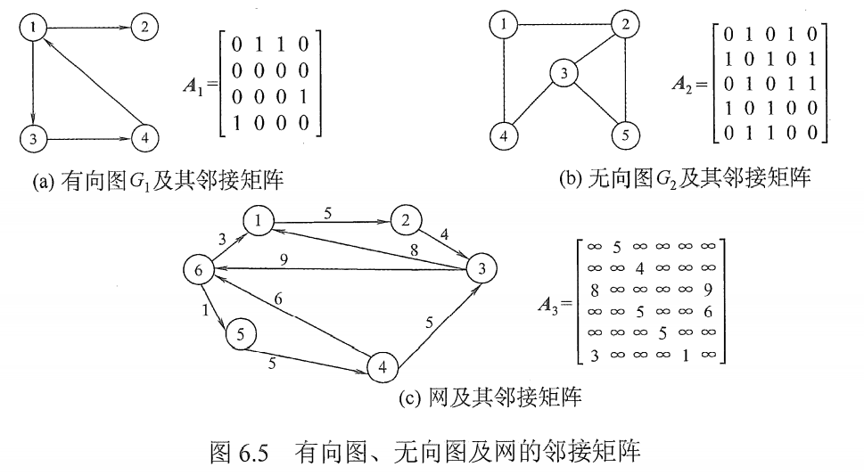
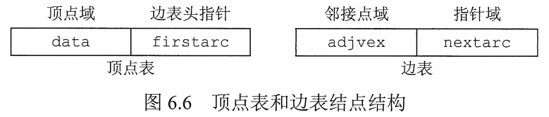
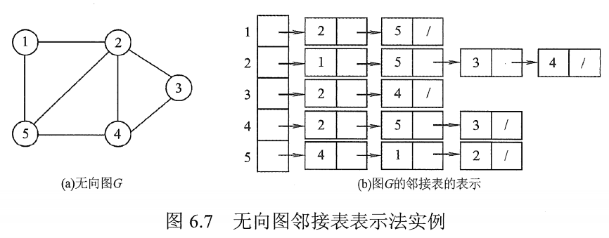
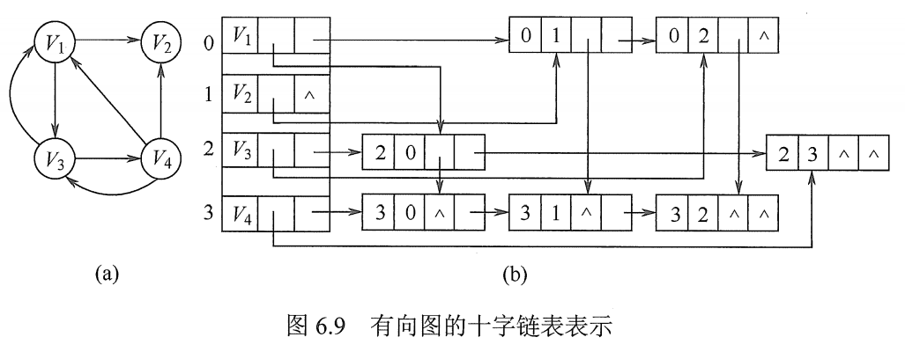
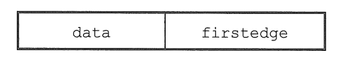
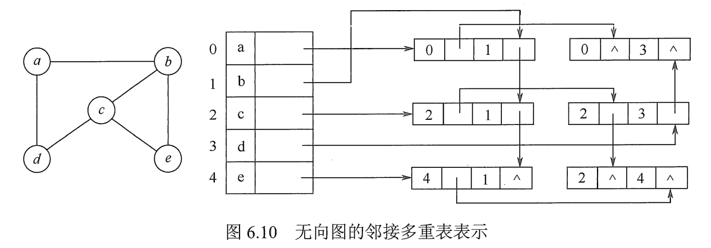

# 图的存储及基本操作

vertex：顶点
edge：边
arc：弧
adjacent：邻近的

## 一. 邻接矩阵法

图1. 有向图、无向图、网的邻接矩阵

使用二维数组存储图中边的信息，则存储顶点之间邻接关系的二维数组称为**邻接矩阵**。

图的邻接矩阵存储结构定义：

~~~c
#define MaxVertexNum 100	//顶点数目的最大值
typedef char VertexType;	//顶点的数据类型
typedef int EdgeType;		//边上权值的数据类型
typedef struct{
    VertexType Vex[MaxVertexNum];				//顶点表
    EdgeType Edge[MaxVertexNum][MaxVertexNum];	//邻接矩阵，边表
    int vexnum;									//图的当前顶点数
    int arcnum;									//图的当前弧数
}Mgraph;
~~~

注意：

1. 在简单应用中，可直接用二维数组作为图的邻接矩阵（顶点信息等均可省略）
2. 当邻接矩阵中的元素仅表示相应的边是否存在是，EdgeTyep 可定义为值仅为 0 和 1 的枚举类型。
3. 无向图的邻接矩阵是对称矩阵，对规模特大的邻接矩阵可采用压缩存储。
4. 邻接矩阵表示法的空间复杂度为 $O(n^2)$ ，n 为图的顶点数 $|V|$ 。

图的邻接矩阵存储表示法具有以下特点：

1. 无向图的邻接矩阵一定是对称矩阵，所以可以用上前面 304 特殊矩阵的压缩里面讲的只存上三角或下三角矩阵。

2. 对于无向图，邻接矩阵的第 i 行（或第 i 列）非零元素（或非无穷 $\infty$ ）个数，就是第 i 个顶点的度 $TD(v_i)$ 。

3. 对于有向图，邻接矩阵的第 i 行（或第 i 列）非零元素（或非无穷 $\infty$ ）个数，就是第 i 个顶点的出度 $OD(v_i)$ ，或入度 $ID(v_i)$​ 。

4. 用邻接矩阵法存储图，很容易确定图中任意两个顶点之间是否有边相连。但确定图中共有多少条边，只能按行、按列扫描过去，则时间开销比较大。

5. 稠密图适合使用邻接矩阵的存储表示。

6. **设图 G 的邻接矩阵为 $A$，$A^n$ 的元素 $A[i][j]$​​ 等于有顶点 i 到顶点 j 的长度为 n 的路径的数目**。

   该结论不证明。但是很重要啊！真题大题考过！

## 二. 邻接表法

邻接表法结合了顺序存储和链式存储方法。

对图 G 中每个顶点 $v_i$​​ 建立一个单链表，第 i 个单链表中的结点表示依附于顶点 $v_i$​​ 的边（对有向图则是以顶点 $v_i$​​ 为尾的弧），这个单链表就称为顶点 $v_i$​​ 的**边表**（对于有向图则称为**出边表**）。

边表的头指针和顶点的数据信息采用顺序存储，称为**顶点表**。

所以在邻接表中，存在两种结点：**顶点表结点**和**边表结点**。

图2.邻接表法中结点的结构

图3. 无向图邻接表法举例

图的邻接表存储结构定义：

~~~c
#define MaxVertexNum 100	//顶点数目的最大值
typedef struct ArcNode{		//边表结点
    int adjvex;				//该弧所指向的顶点的位置
    struct ArcNode * next;	//指向下一条弧的指针
	//InfoType info;		//网的边权值
}ArcNode;

typedef struct VNode{		//顶点表结点
    VertexType data;		//顶点信息
	ArcNode * fitst;		//指向第一条依附于该顶点的弧的指针
}VNode, AdjList[MaxVertexNum];

typedef struct{
    AdjList vertices;		//邻接表
    int vexnum;				//图的当前顶点数
    int arcnum;				//图的当前弧数
}ALGraph;					//ALGraph是以邻接表存储的图类型
~~~

图的邻接表法具有以下特点：

1. 若 G 为无向图，则所需存储空间为 $O(|V|+2|E|)$ ；若 G 为有向图，则所需存储空间为 $O(|V|+|E|)$ 。

2. 对于稀疏图，使用邻接表表示将极大地节省存储空间。

3. 在邻接表中，给定一顶点，能很容易找出它的所有邻边。在邻接矩阵中，相同的操作则需要扫描一行。

   但，若要确定给定的两个顶点之间是否存在边，则在邻接表中可以立即查到，而在邻接表中则需要在相应结点对应的边表中查找另一结点。

4. 在有向图的邻接表表示中，求一个给定结点的出度只需要计算其邻接表中的结点个数；
   但求其顶点的入度时，则需要遍历全部邻接表。

   当然，如果使用逆邻接表，即邻接表记录的是入边表，就能很快得到入度；自然逆邻接表算出度就虚表遍历整个邻接表了。

5. 图的邻接表的表示不唯一。因为每个顶点的边表中的结点次序是任意的，取决于输入顺序。

## 三. 十字链表

十字链表是**有向图**的一种链式存储结构。

图4.十字链表中的结点的结构

顶点结点：
data 存数据；
firstin 指向第一个以该顶点为弧头（终点）的弧结点；
firstout 指向第一个以该顶点为弧尾（起点）的弧结点。

弧结点：
tailvex：存弧尾（起点）
headvex：存弧头（终点）
hlink：指向与弧头（终点）相同的下一条弧
tlink：指向与弧尾（起点）相同的下一条弧
info：存该弧的相关信息，例如权值。

图5.有向图的十字链表举例

在十字链表中，即容易找到 $v_i$ 为尾的弧，有容易找到 $v_i$ 为头的弧，因而容易求得顶点的出度和入度。

图的十字链表的表示是不唯一的。

## 四. 邻接多重表

邻接多重表是**无向图**的另一种链式存储结构。

在邻接表中，但要删除边时，需要分别在两个顶点的边表中遍历，效率较低。

与十字链表类似，在邻接多重表中，每条边只用一个结点表示：

图6.邻接多重表的边结点的结构

边结点：
mark：标志域，可用以标记该条边是否被搜索过；
ivex：该边依附的一个顶点；
ilink：指向下一条依附于顶点 ivex 的边；
jvex：该边依附的另一个顶点；
jlink：指向下一条依附于顶点 jvex 的边；
info：存该边的相关信息。

图7.邻接多重表的顶点结点的结构

顶点结点：
data：存顶点相关信息；
firstedge：指向第一条依附于该顶点的边。

图8.无向图的邻接多重表举例

在邻接多重表中，所以依附于同一顶点的边串联在同一链表中，由于每条边依附与两个顶点，因此每个边结点同时链接在两个链表中。
对于无向图而言，其邻接多重表与邻接表的差别仅在于，同一条边在邻接表中用两个结点表示，而在邻接多重表中只有一个结点。

## 五. 图的基本操作

~~~c
Adjcent(G,x,y)：判断图 G 是否存在边 <x,y>（或 (x,y) ）。

Neighbors(G,x)：列出图 G 中与结点 x 邻接的边。

InsertVertex(G,x)：在图 G 中插入顶点 x。

DeleteVertex(G,x)：在图 G 中删除顶点 x。

AddEdge(G,x,y)：若无向边 (x,y) 或有向边 <x,y> 不存在，则向图 G 中添加该边。

RemoveEdge(G,x,y)：若无向边 (x,y) 或有向边 <x,y> 存在，则向图 G 中删除该边。

FirstNeighour(G,x)：求图 G 中顶点 x 的第一个邻接点，若有则返回顶点号；若 x 没有临界点或图中不存在 x，则返回 -1。

NextNeighbor(G,x,y)：假设图 G 中顶点 y 是顶点 x 的一个邻接点，返回除 y 外的顶点 x 的下一个临界点的顶点号，若 y 是 x 的最后一个临界点，则返回 -1。

Get_edge_value(G,x,y)：获取图 G 中边 (x,y) 或 <x,y>  对应的权值。

Set_edge_value(G,x,y,v)：设置图 G 中边 (x,y) 或 <x,y>  对应的权值为 v。
~~~

2021.08.05
